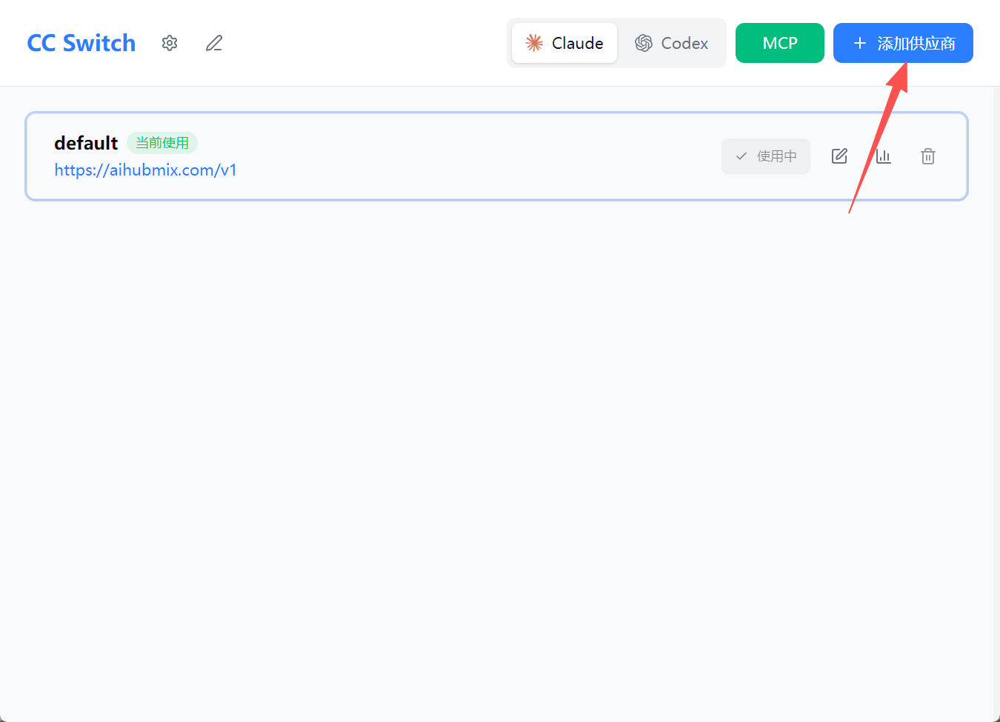
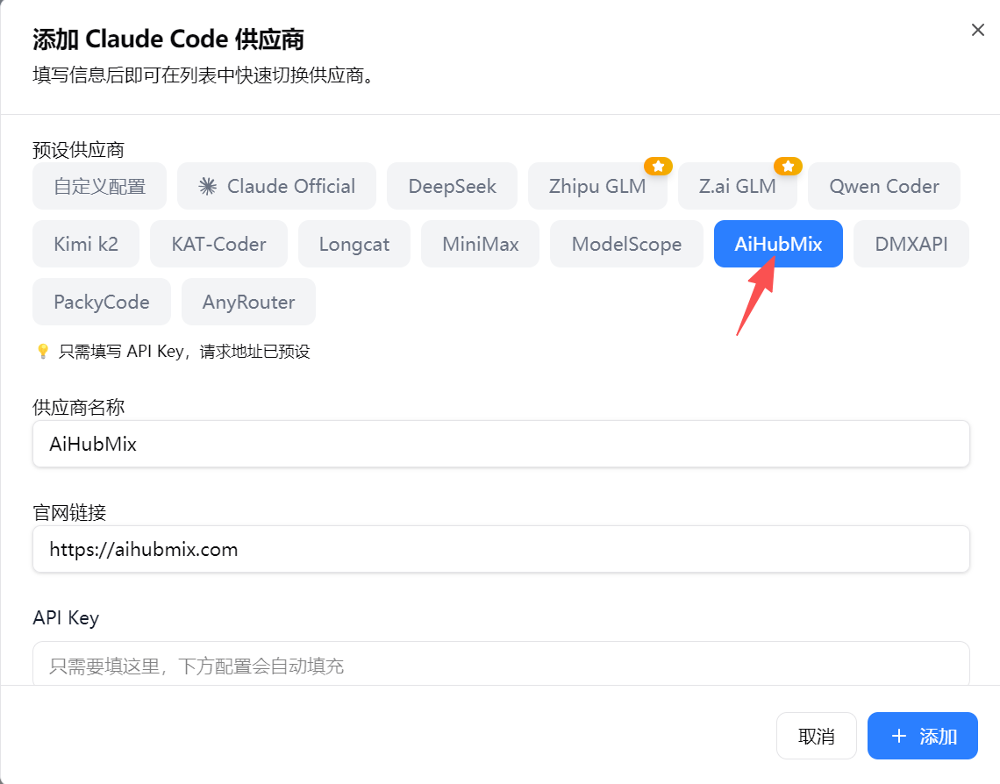
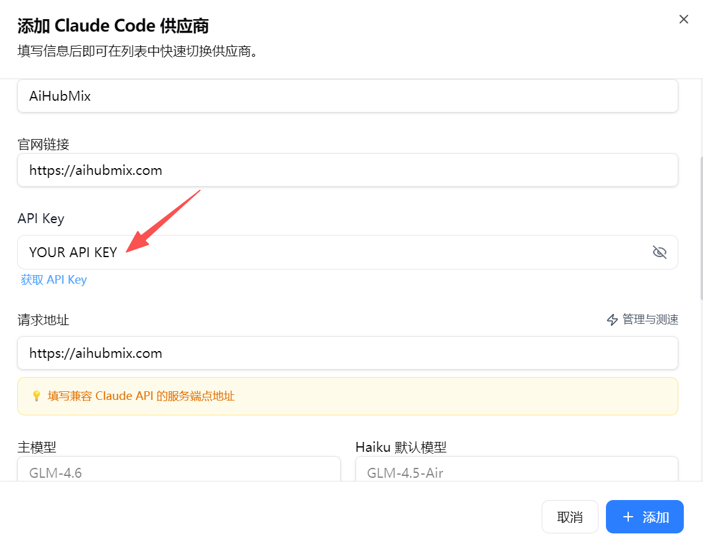
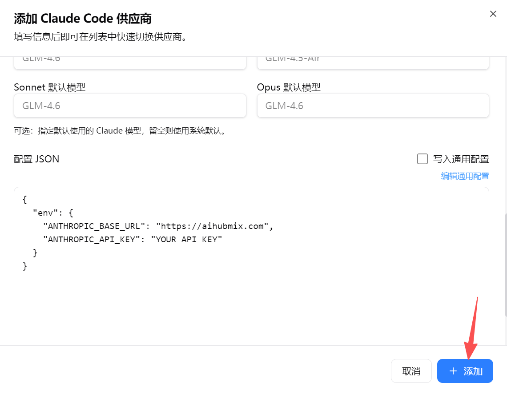
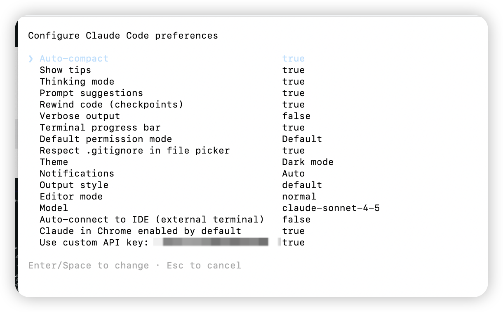

## 快速入门

本指南将帮助您在几分钟内使用由 AIHubMix 提供的 Claude Code.

### 1. 安装Claude Code

#### 使用脚本快速安装（首次使用推荐）

在你的终端或 IDE 中运行以下命令，下载一个帮你自动配置环境变量的 shell 脚本，运行即可。

<CodeGroup>

```shellscript MacOS
curl -LO https://raw.githubusercontent.com/AiHubMix/claude-code/main/claude_code_prod.sh

chmod +x claude_code_prod.sh

./claude_code_prod.sh
```


```powershell Windows
$scriptUrl = "https://raw.githubusercontent.com/AiHubMix/claude-code/main/claude_code_prod.ps1"
$localPath = Join-Path $env:TEMP "claude_code_install_windows.ps1"

$ProgressPreference = 'SilentlyContinue'

Invoke-WebRequest `
  -Uri $scriptUrl `
  -OutFile $localPath `
  -UseBasicParsing

Set-ExecutionPolicy -Scope Process -ExecutionPolicy Bypass -Force

& $localPath
```

</CodeGroup>

#### 本地安装

**macOS、Linux、WSL:**

```shellscript
curl -fsSL https://claude.ai/install.sh | bash
```

**Windows PowerShell：**

```shell
irm https://claude.ai/install.ps1 | iex
```

#### npm

需要 [Node.js 18 或更高版本](https://nodejs.org/en/download/)

```shellscript
npm install -g @anthropic-ai/claude-code
```

### 2. 将 Claude 连接到 AIHubMix

设置环境变量，将 Claude Code 连接到 AIHubMix。注意：不要直接使用 Anthropic 登录。

要求：

1. 使用 `https://aihubmix.com` 作为 base_url
2. 请提供 [AiHubMix API Key](https://aihubmix.com/token) 作为身份验证令牌
3. **提示：请明确删除 Anthropic API Key，以避免冲突。**

**Claude 配置文件：**`.claude/settings.json`

```bash
{
  "env": {
    "ANTHROPIC_API_KEY": "AIHUBMIX_API_KEY",
    "ANTHROPIC_BASE_URL": "https://aihubmix.com",
    "ANTHROPIC_DEFAULT_HAIKU_MODEL": "gpt-5.2",
    "ANTHROPIC_DEFAULT_OPUS_MODEL": "gpt-5.2",
    "ANTHROPIC_DEFAULT_SONNET_MODEL": "gpt-5.2",
    "ANTHROPIC_MODEL": "gpt-5.2"
  },
  "includeCoAuthoredBy": false
}
```

请替换 `AIHUBMIX_API_KEY` 为实际的 AIHUBMIX API 密钥。

<Tip>
  Claude Code 原生安装程序无法读取标准 `.env` 文件，因此请勿将这些内容放置在 `.env` 文件中。
</Tip>

### 3. 开始对话

导航到您的项目目录并启动 Claude Code：

```bash
$ cd /path/your-project
> claude
```

连接成功后，您发送的任何提示都将通过 AIHubMix 路由。

### 4. 验证

您可以通过在 Claude Code 中输入 `/status`  命令来确认您的连接。

```bash
> /status

 API key: ANTHROPIC_API_KEY
 Anthropic base URL: https://aihubmix.com

 Model: claude-sonnet-4-5
```

> 不想手动配置环境变量？可使用图形化工具快速设置：[通过 CC-Switch 可视化配置](https://docs.aihubmix.com/cn/api/Claude-Code#%E9%80%9A%E8%BF%87-cc-switch-%E9%85%8D%E7%BD%AE)。

## 切换模型

### 覆盖默认模型

<Tip>
  如需快速修改默认模型，推荐使用 [CC- Switch](https://docs.aihubmix.com/cn/api/Claude-Code#%E9%80%9A%E8%BF%87-cc-switch-%E9%85%8D%E7%BD%AE) 。
</Tip>

你可以通过环境变量覆盖默认模型别名，将 Claude Code 配置为使用 AIHubMix 上的**任何模型**（包括 OpenAI、Gemini 或 GLM 模型）。

例如，要将默认别名“Sonnet”替换为 gpt-5.2-codex：

```shellscript
export ANTHROPIC_DEFAULT_SONNET_MODEL="gpt-5.2-codex"
```

也可以覆盖其他层级：

```shellscript
export ANTHROPIC_DEFAULT_OPUS_MODEL="gemini-3-flash-preview-search"
export ANTHROPIC_DEFAULT_HAIKU_MODEL="glm-4.7"
```

<Info>
  虽然您可以通过 AIHubMix 使用任何模型，但为了获得最佳体验，我们建议您使用功能强大的模型（例如 Claude Opus 4.5、GPT 5.2 等）
</Info>

### 切换模型

使用 Claude Code 命令：

```shell
/model [model id]
```

## 通过 cc-switch 配置

1. 运行 CC-Switch，点击「添加供应商」。



2. 在预设列表中选择「AiHubMix」。



3. 在「API Key」栏中填写你的密钥。



4. 配置完成后，点击「添加」保存设置。



5. 返回首页，在供应商列表中选择「AiHubMix」，点击「启动」即可使用。


## 常见问题

### Q：在 Claude Code 中使用，提示「401 , No token provided....」

打开 Claude 终端，输入 `/config` ，找到 `Use custom API key` 选项，检查 Token 是否正确配置。



## 更多资源

- [Github](https://github.com/inferera/aihubmix/blob/main/packages/claude-code/README.md)
- [npm 包](https://www.npmjs.com/package/@aihubmix/claude-code)
- [官方最佳实践](https://www.anthropic.com/engineering/claude-code-best-practices)
- [官方配置指引](https://docs.anthropic.com/en/docs/claude-code/settings#settings-files)

祝你使用愉快！