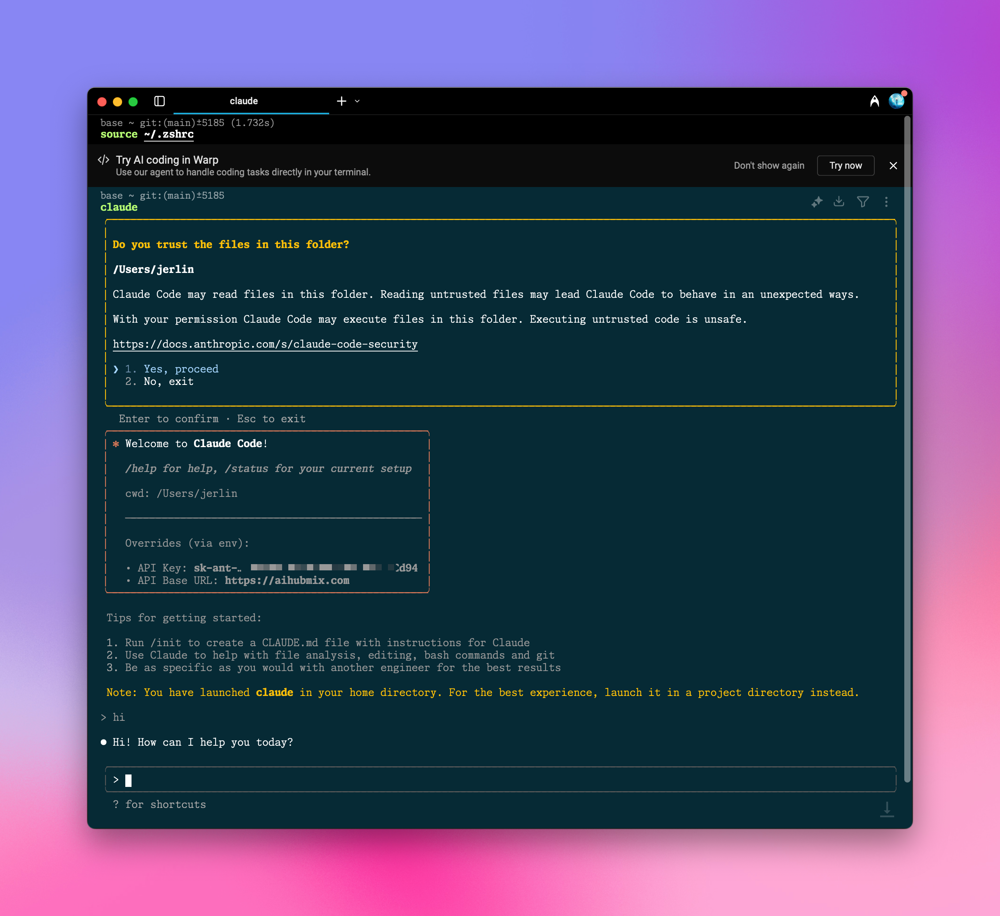

用 Aihubmix 为 Claude Code 提供强劲动力，再也不怕连接不稳定或者无法购买额度。

<Warning>
  由于 Claude Code 的多智能体属性，额度消耗会比较夸张，建议为你的 Key 设置有限额度，防止账单刺客。
</Warning>

## 快速配置指引：

### 1️⃣ 全局安装 npm 包

终端运行

```shell
npm install -g @anthropic-ai/claude-code
```

示例图：


### 2️⃣ 环境变量配置

到 Aihubmix[「Keys」页面](https://aihubmix.com/token) 生成密钥，在系统环境变量中填入这个密钥和转发地址。

比如在 ~/.zshrc 中添加：

```shell
export ANTHROPIC_API_KEY="sk-***"
export ANTHROPIC_BASE_URL="https://aihubmix.com"
```

<Tip>
  对于 Mac 用户，你可以在`用户名`目录通过快捷键 `⌘ + ⇧ + .` 显示隐藏的 .zshrc 文件，用系统的「文本编辑」APP 打开并添加上述内容。
</Tip>

### 3️⃣ 使配置生效

添加配置之后，终端执行 `source ~/.zshrc`，回车即可。

### 4️⃣ 终端启动

定位到目标项目目录，比如 `cd ~/Desktop/my-project`\
输入 `claude` 启动，即可使用。

## 初始化配置

### 授权

如弹出授权页面，点击跳转到 Claude 官网进行确认，授权成功后，返回终端继续。认证不需要付费账号，随便注册有一个免费的 claude 账号就行；


如果你想绕过验证，直接使用 Aihubmix 的转发，只需要在用户名目录下的 .claude.json 中增加一行配置：

```json
  "hasCompletedOnboarding": true,
```

### 启动

启动后，Claude Code 会显示当前配置信息，包括 API Key 和 API Base URL。
需要确认的地方，选择 Yes 回车确认，即可完成所有设置。



比如：Claude 检测到系统环境变量有自定义 KEY，选 `Yes`

```
Detected a custom API key in your environment

ANTHROPIC_API_KEY: sk-***
Do you want to use this API key?

> 1. Yes
2. No(recommended)

Enter to confirm .Esc to cancel
```

### 切换模型

使用 Claude Code 命令：

```shell
/model [model id]
```

默认模型为 `Sonnet 4`，你可以用效果更好的 `Opus 4`：

```shell opus
/model opus
```

或者，换成其他 claude 模型：

<CodeGroup>

```shell sonnet 3.7
/model claude-3-7-sonnet-20250219
```


```shell sonnet 3.5
/model claude-3-5-sonnet-20241022
```

</CodeGroup>

### Kimi K2 支持

启动 Claude Code 之后，只需要运行指令

```shell
/model moonshotai/kimi-k2-instruct
```

## 使用 AiHubMix 平台的任何大模型

### 1️⃣ 全局安装 @aihubmix/claude-code

```shell
npm install -g @aihubmix/claude-code
```

### 2️⃣ 设置系统环境变量（推荐）

```
export AIHUBMIX_API_KEY="your-aihubmix-api-key"
export HOST="127.0.0.1"  # Optional
export PORT="3456"        # Optional
export LOG="true"         # Optional
export API_TIMEOUT_MS="30000"  # Optional
```

### 3️⃣ 生成配置文件

注意 `sk-***` 要换成你在 AiHubMix 生成的密钥，模型意外的配置项会以系统环境变量优先的顺序处理。

```shell
mkdir -p ~/.aihubmix-claude-code && cat > ~/.aihubmix-claude-code/config.json <<EOF
{
  "API_KEY": "sk-***",
  "HOST": "127.0.0.1",
  "PORT": 3456,
  "LOG": true,
  "API_TIMEOUT_MS": 30000,
  "Router": {
    "default": "claude-sonnet-4-20250514",
    "background": "claude-3-5-haiku-20241022",
    "think": "claude-sonnet-4-20250514",
    "longContext": "gpt-4.1",
    "longContextThreshold": 60000,
    "webSearch": "gemini-2.0-flash-search"
  }
}
EOF
```

### 4️⃣ 使用

<CodeGroup>

```shell 启动服务
acc start
```


```shell 停止服务
acc stop
```


```shell 运行 CC
acc code
```


```shell 重启服务（修改配置需要用的）
acc restart
```


```shell 状态检测
acc status
```


```shell 显示帮助
acc help
```


```shell 查看版本
acc version
```

</CodeGroup>

- [更多细节](https://dashboard.mintlify.com/aihubmix/aihubmix/editor/main)
- [npm 包](https://www.npmjs.com/package/@aihubmix/claude-code)

祝你使用愉快！