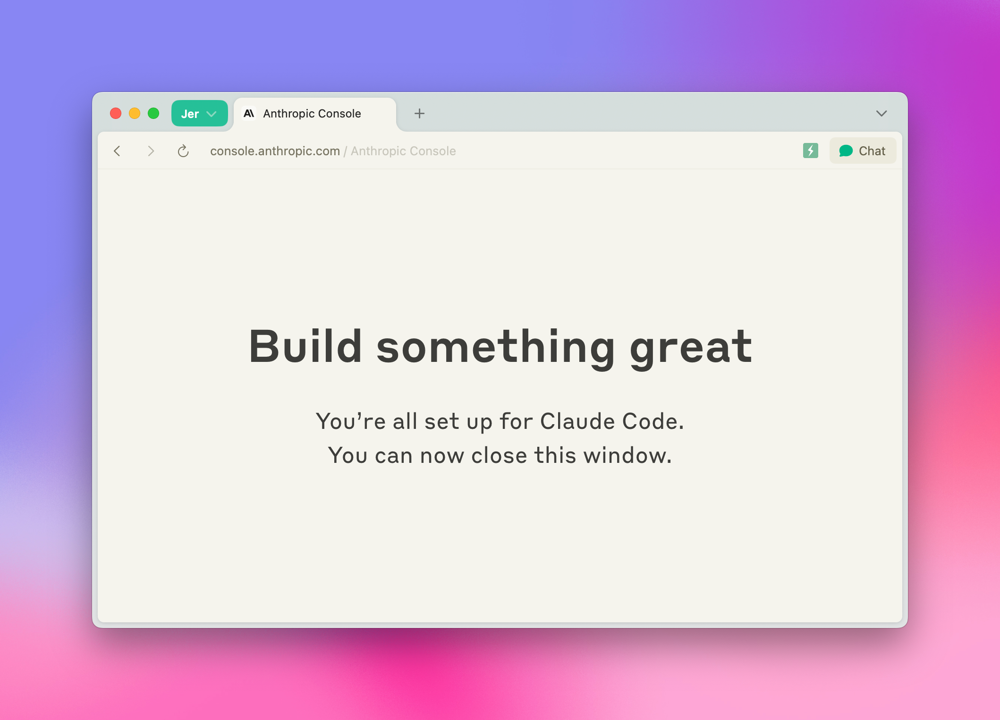
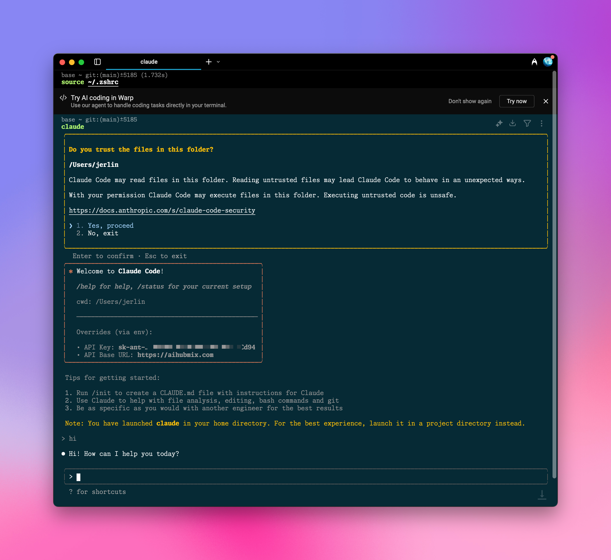

用 Aihubmix 为 Claude Code 提供强劲动力，再也不怕连接不稳定或者无法购买额度。

## 快速配置指引：
### 1️⃣ 全局安装 npm 包

终端运行
```shell
npm install -g @anthropic-ai/claude-code
```
示例图：


### 2️⃣ 环境变量配置

到 Aihubmix[「Keys」页面](https://aihubmix.com/token) 生成密钥，在系统环境变量中填入这个密钥和转发地址。

比如在 ~/.zshrc 中添加：
```shell
export ANTHROPIC_API_KEY="sk-***"
export ANTHROPIC_BASE_URL="https://aihubmix.com"
```
<Tip>
对于 Mac 用户，你可以在`用户名`目录通过快捷键 `⌘ + ⇧ + .` 显示隐藏的 .zshrc 文件，用系统的「文本编辑」APP 打开并添加上述内容。 
</Tip>

### 3️⃣ 使配置生效

添加配置之后，终端执行 `source ~/.zshrc`，回车即可。

### 4️⃣ 终端启动

定位到目标项目目录，比如 `cd ~/Desktop/my-project`  
输入 `claude` 启动，即可使用。

## 初始化配置

如弹出授权页面，点击跳转到 Claude 官网进行确认，授权成功后，返回终端继续


启动后，Claude Code 会显示当前配置信息，包括 API Key 和 API Base URL。
需要确认的地方，选择 Yes 回车确认，即可完成所有设置。
```shell
│ ✻ Welcome to Claude Code!                         │
│                                                   │
│   /help for help, /status for your current setup  │
│                                                   │
│   cwd: /Users/***/                            │
│                                                   │
│   ─────────────────────────────────────────────── │
│                                                   │
│   Overrides (via env):                            │
│                                                   │
│   • API Key: sk-*** │
│   • API Base URL: https://aihubmix.com    
```



🎉 祝你使用愉快！