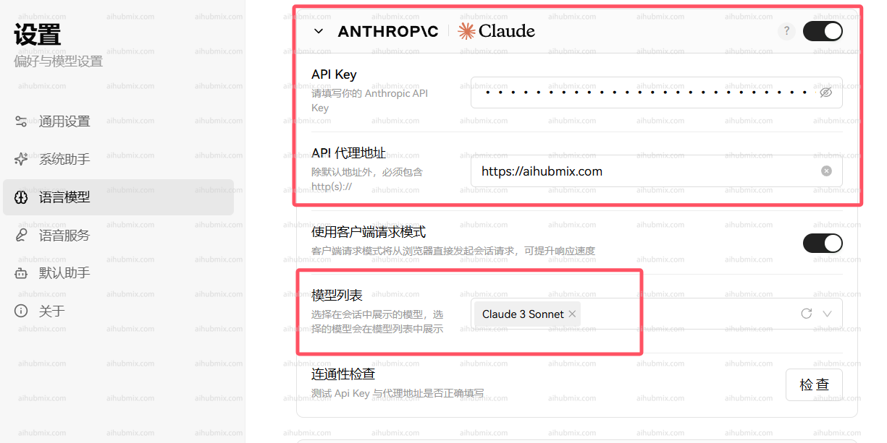

## 说明

Claude 系列模型支持通过官方原生接口调用，使用之前确保安装或升级 anthropic 依赖：

```bash
pip install -U anthropic
```

<Info>
  非 claude 模型请用 openai 的接口格式调用。
</Info>

## 模型信息

| 模型名称     | Claude Opus 4 | Claude Sonnet 4 | Claude Sonnet 3.7 | Claude Sonnet 3.5 | Claude Haiku 3.5 | Claude Opus 3 | Claude Haiku 3 |
| -------- | ------------- | --------------- | ----------------- | ----------------- | ---------------- | ------------- | -------------- |
| 是否支持扩展思考 | 是             | 是               | 是                 | 否                 | 否                | 否             | 否              |
| 上下文窗口大小  | 200K          | 200K            | 200K              | 200K              | 200K             | 200K          | 200K           |
| 最长输出长度   | 32000 tokens  | 64000 tokens    | 64000 tokens      | 8192 tokens       | 8192 tokens      | 4096 tokens   | 4096 tokens    |
| 训练数据截止时间 | 2025年3月       | 2025年3月         | 2024年11月          | 2024年4月           | 2024年7月          | 2023年8月       | 2023年8月        |

<Tip>
  1. 对于 3.5 及以上的模型，如果需要超过 4096 Tokens 的输出，请传入明确的 "max_tokens" 数值，参考上方表格中的`最长输出长度`。
  2. 对于 Sonnet 3.7，你可以通过在请求体中传入 `extra_headers={"anthropic-beta": "output-128k-2025-02-19"}` 来把最大输出从 64K 扩展到 128K，见下方「流式 128K」调用，或者参考 Claude 官方的[Beta headers 说明](https://docs.anthropic.com/en/api/beta-headers)。
</Tip>

## Claude 4 新功能

### 新的拒绝停止原因 (Refusal Stop Reason)

Claude 4 模型引入了新的 `refusal` 停止原因，用于处理模型因安全原因拒绝生成的内容：

```json
{
  "id": "msg_014XEDjypDjFzgKVWdFUXxZP",
  "type": "message",
  "role": "assistant",
  "model": "claude-sonnet-4-20250514",
  "content": [{"type": "text", "text": "I would be happy to assist you. You can "}],
  "stop_reason": "refusal",
  "stop_sequence": null,
  "usage": {
    "input_tokens": 564,
    "cache_creation_input_tokens": 0,
    "cache_read_input_tokens": 0,
    "output_tokens": 22
  }
}
```

在迁移到 Claude 4 时，您应该更新应用程序以处理 `refusal` 停止原因。

### 扩展思考 (Extended Thinking)

启用扩展思考后，Claude 4 模型的 Messages API 会返回 Claude 完整思考过程的摘要。摘要思考提供了扩展思考的全部智能优势，同时防止滥用。

虽然 API 在 Claude 3.7 和 4 模型之间保持一致，但扩展思考的流式响应可能以"块状"传递模式返回，流式事件之间可能存在延迟。

摘要由与您在请求中指定的模型不同的模型处理。思考模型不会看到摘要输出。

### 交错思考 (Interleaved Thinking)

Claude 4 模型支持将工具使用与扩展思考交错，允许更自然的对话，其中工具使用和响应可以与常规消息混合。

交错思考目前处于测试阶段。要启用交错思考，请在 API 请求中添加测试头 `interleaved-thinking-2025-05-14`：

```python
extra_headers={
    "anthropic-beta": "interleaved-thinking-2025-05-14"
}
```

**端点（Endpoint）：** `POST` /v1/messages

## 调用

<CodeGroup>

```shell Curl
curl https://aihubmix.com/v1/messages \
     --header "x-api-key: $ANTHROPIC_API_KEY" \ # 换成你在 AiHubMix 生成的密钥
     --header "anthropic-version: 2023-06-01" \
     --header "content-type: application/json" \
     --data \
'{
    "model": "claude-3-5-sonnet-20241022",
    "max_tokens": 1024,
    "messages": [
        {"role": "user", "content": "Hello, world"}
    ]
}'
```


```py Python 非流式
import anthropic

client = anthropic.Anthropic(
    api_key="sk-***", # 换成你在 AiHubMix 生成的密钥
    base_url="https://aihubmix.com"
)
message = client.messages.create(
    model="claude-3-5-sonnet-20241022",
    max_tokens=1024,
    messages=[
        {"role": "user", "content": "Hello, Claude"}
    ]
)
print(message.content)
```

```py Python 流式 128K
import anthropic

client = anthropic.Anthropic(
    api_key="sk-***", # 换成你在 AiHubMix 生成的密钥
    base_url="https://aihubmix.com"
)

with client.messages.stream(
    model="claude-3-7-sonnet-20250219",  # claude-opus-4-20250514, claude-sonnet-4-20250514
    max_tokens=128000,
    messages=[
        {"role": "user", "content": "请生成一篇 10 万 tokens 的文章，分别用详细的段落讲解查理芒格 100 个思维模型（即每个模型约 1000 tokens），每个模块都包含模型介绍段落、多维思考、应用方法、实操盲区、具体案例。通俗易懂和引人入胜是关键。仅在需要的时候列点。"}
    ],
    extra_headers={
        "anthropic-beta": "output-128k-2025-02-19"
    }
) as stream:
    for text in stream.text_stream:
        print(text, end="", flush=True)
```

```py Python 交错思考
import anthropic

client = anthropic.Anthropic(
    api_key="sk-***", # 换成你在 AiHubMix 生成的密钥
    base_url="https://aihubmix.com"
)

response = client.messages.create(
    model="claude-sonnet-4-20250514",  # 或 claude-opus-4-20250514
    max_tokens=1024,
    messages=[
        {"role": "user", "content": "帮我分析这个数据并生成图表"}
    ],
    tools=[
        {
            "type": "computer_20241022",
            "name": "computer"
        }
    ],
    extra_headers={
        "anthropic-beta": "interleaved-thinking-2025-05-14"
    }
)
print(response.content)
```

</CodeGroup>

### Body 请求结构

```json
{
  "model": "claude-3-5-sonnet-20241022",
  "max_tokens": 1024,
  "messages": [
    {
      "role": "user",
      "content": "What is the meaning of life?"
    }
  ]
}
```

### 请求参数

| 名称           | 位置     | 类型       | 必选 | 说明                      |
| ------------ | ------ | -------- | --- | ----------------------- |
| x-api-key    | header | string   | 否  | Bearer AIHUBMIX_API_KEY |
| Content-Type | header | string   | 否  | none                    |
| body         | body   | object   | 否  | none                    |
| » model      | body   | string   | 是  | none                    |
| » messages   | body   | [object] | 是  | none                    |
| »» role      | body   | string   | 否  | none                    |
| »» content   | body   | string   | 是  | none                    |
| » max_tokens | body   | number   | 是  | none                    |

### 返回示例

```json
200 Response
```

```json
{
  "id": "msg_013Uf6CwwyjSe35n3yVaPbLM",
  "type": "message",
  "role": "assistant",
  "model": "claude-3-5-sonnet-20241022",
  "content": [
    {
      "type": "text",
      "text": "That's one of humanity's most enduring and complex philosophical questions! While there's no universal answer, I aim to explore such questions thoughtfully while acknowledging their complexity. I try to focus on having meaningful conversations and helping where I can. What does meaning in life mean to you?"
    }
  ],
  "stop_reason": "end_turn",
  "stop_sequence": null,
  "usage": {
    "input_tokens": 14,
    "cache_creation_input_tokens": 0,
    "cache_read_input_tokens": 0,
    "output_tokens": 61
  }
}
```

### 返回结果

| 状态码 | 状态码含义 | 说明   | 数据模型   |
| --- | ----- | ---- | ------ |
| 200 | OK    | none | Inline |

## 迁移到 Claude 4

如果您正在从 Claude 3.7 迁移到 Claude 4 模型，请注意以下变化：

### 更新模型名称

```python
# 从 Claude 3.7
model="claude-3-7-sonnet-20250219"

# 迁移到 Claude 4
model="claude-sonnet-4-20250514"  # 或 "claude-opus-4-20250514"
```

### 处理新的停止原因

更新您的应用程序以处理新的 `refusal` 停止原因：

```python
if response.stop_reason == "refusal":
    print("Claude 拒绝生成此内容")
elif response.stop_reason == "end_turn":
    print("正常完成")
```

### 移除不支持的功能

- **令牌高效工具使用**：仅在 Claude Sonnet 3.7 中可用，Claude 4 中不再支持
- **扩展输出**：`output-128k-2025-02-19` 测试头仅在 Claude Sonnet 3.7 中可用

如果您正在从 Claude Sonnet 3.7 迁移，建议从请求中移除这些测试头：

```python
# 移除这些头部（如果存在）
# "token-efficient-tools-2025-02-19"
# "output-128k-2025-02-19"
```

## 在应用中使用（以 Lobe-Chat 为例）

- 进入设置页面选择模型服务商 Claude
- API key 输入[本站的 Key](https://aihubmix.com/token)
- 接口代理地址，直接输入下方的网址：

```
https://aihubmix.com
```

- 建议打开「使用客户端请求模式」
- 最后在模型列表添加自己要使用的模型（建议从我们网站的设置页面复制粘贴模型名后选择）\
  

  