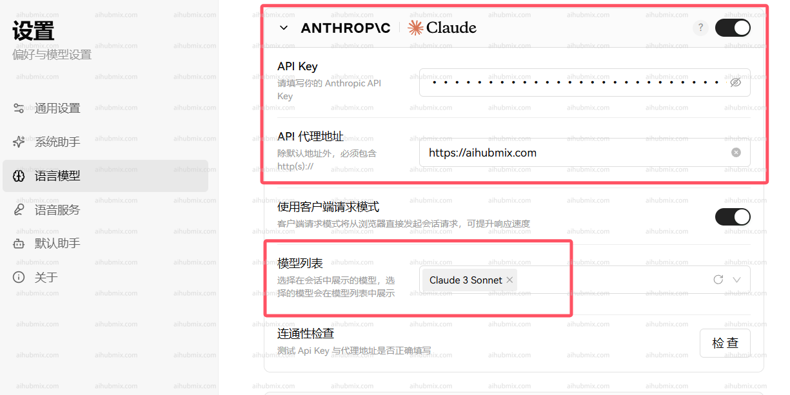
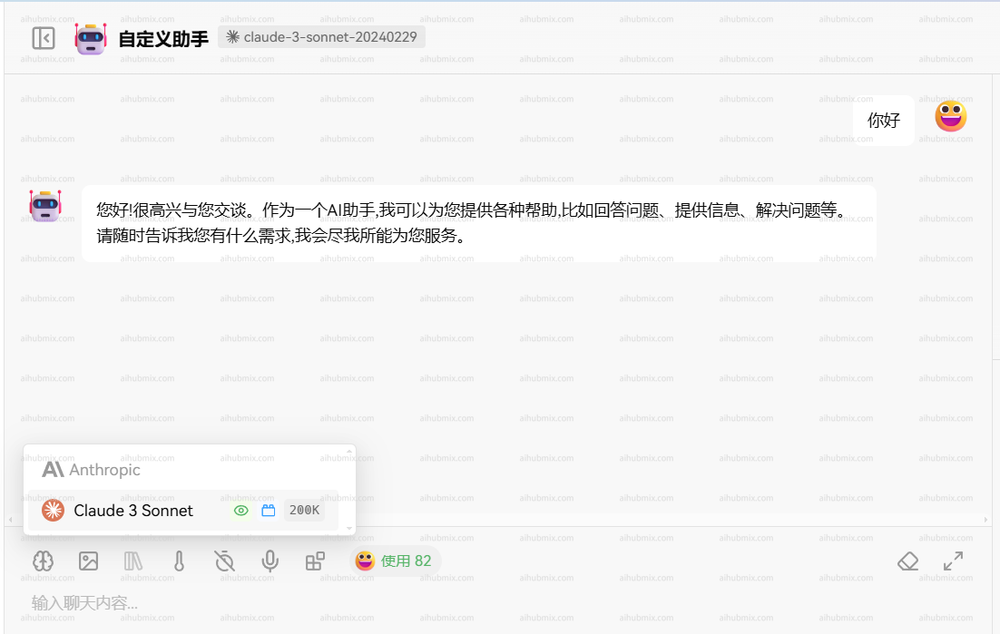

## 说明

Claude 系列模型支持通过官方原生接口调用，使用之前确保安装或升级 anthropic 依赖：

```bash
pip install -U anthropic
```

## 模型信息

| 模型名称     | Claude Opus 4.6                                 | Claude Sonnet 4.6                               | Claude Sonnet 4.5 | Claude Haiku 4.5 |
| -------- | ----------------------------------------------- | ----------------------------------------------- | ----------------- | ---------------- |
| 是否支持扩展思考 | 是                                               | 是                                               | 是                 | 是                |
| 上下文窗口大小  | 200K tokens /<br />1M tokens (beta)<sup>3</sup> | 200K tokens /<br />1M tokens (beta)<sup>3</sup> | 200K              | 200K             |
| 最大输出长度   | 128K tokens                                     | 128K tokens                                     | 64K tokens        | 64K tokens       |
| 训练数据截止时间 | 2025年8月                                         | 2025年8月                                         | 2025年7月           | 2025年7月          |

## Claude 4.6 新功能

### 自适应思考（Adaptive Thinking）

Claude 4.6 推荐使用新的自适应思考模式，该模式下，Claude 会根据问题复杂度自动决定是否进行思考及深度思考：

```python
thinking={"type": "adaptive"}
```

<Warning>
  `thinking: {type: "enabled", budget_tokens: N}` 在 4.6 上已弃用，未来版本将移除。
</Warning>

### 自动上下文压缩（Compaction，Beta）

当对话接近上下文窗口上限时，Claude 4.6 可自动对早期内容进行服务器端摘要压缩。

**优势：**

- 支持超长对话
- 无需客户端自行摘要
- 提高 Agent 连续会话能力

**注意：**

- 自动压缩可能丢失部分细节
- 对强一致性场景建议评估测试

### 弃用与变更

- **移除 **`interleaved-thinking-2025-05-14`**Beta 头：** 在 4.6 中，自适应思考已自动支持交错思考，不需要再添加 `extra_headers` 。如仍添加，该头会被安全忽略。

## Claude 4 新功能

### 新的拒绝停止原因 (Refusal Stop Reason)

Claude 4 模型引入了新的 `refusal` 停止原因，用于处理模型因安全原因拒绝生成的内容：

```json
{
  "id": "msg_014XEDjypDjFzgKVWdFUXxZP",
  "type": "message",
  "role": "assistant",
  "model": "claude-sonnet-4-20250514",
  "content": [{"type": "text", "text": "I would be happy to assist you. You can "}],
  "stop_reason": "refusal",
  "stop_sequence": null,
  "usage": {
    "input_tokens": 564,
    "cache_creation_input_tokens": 0,
    "cache_read_input_tokens": 0,
    "output_tokens": 22
  }
}
```

在迁移到 Claude 4 时，您应该更新应用程序以处理 `refusal` 停止原因。

### 扩展思考 (Extended Thinking)

启用扩展思考后，Claude 4 模型的 Messages API 会返回 Claude 完整思考过程的摘要。摘要思考提供了扩展思考的全部智能优势，同时防止滥用。

虽然 API 在 Claude 3.7 和 4 模型之间保持一致，但扩展思考的流式响应可能以"块状"传递模式返回，流式事件之间可能存在延迟。

摘要由与您在请求中指定的模型不同的模型处理。思考模型不会看到摘要输出。

### 交错思考 (Interleaved Thinking)

Claude 4 模型支持将工具使用与扩展思考交错，允许更自然的对话，其中工具使用和响应可以与常规消息混合。

交错思考目前处于测试阶段。要启用交错思考，请在 API 请求中添加测试头 `interleaved-thinking-2025-05-14`：

```python
extra_headers={
    "anthropic-beta": "interleaved-thinking-2025-05-14"
}
```

**端点（Endpoint）：** `POST` /v1/messages

## 调用

<CodeGroup>

```shell Curl
curl https://aihubmix.com/v1/messages \
     --header "x-api-key: $ANTHROPIC_API_KEY" \ # 换成你在 AiHubMix 生成的密钥
     --header "anthropic-version: 2023-06-01" \
     --header "content-type: application/json" \
     --data \
'{
    "model": "claude-3-5-sonnet-20241022",
    "max_tokens": 1024,
    "messages": [
        {"role": "user", "content": "Hello, world"}
    ]
}'
```


```py Python 非流式
import anthropic

client = anthropic.Anthropic(
    api_key="sk-***", # 换成你在 AiHubMix 生成的密钥
    base_url="https://aihubmix.com"
)
message = client.messages.create(
    model="claude-3-5-sonnet-20241022",
    max_tokens=1024,
    messages=[
        {"role": "user", "content": "Hello, Claude"}
    ]
)
print(message.content)
```


```py Python 流式 128K
import anthropic

client = anthropic.Anthropic(
    api_key="sk-***", # 换成你在 AiHubMix 生成的密钥
    base_url="https://aihubmix.com"
)

with client.messages.stream(
    model="claude-3-7-sonnet-20250219",  # claude-opus-4-20250514, claude-sonnet-4-20250514
    max_tokens=128000,
    messages=[
        {"role": "user", "content": "请生成一篇 10 万 tokens 的文章，分别用详细的段落讲解查理芒格 100 个思维模型（即每个模型约 1000 tokens），每个模块都包含模型介绍段落、多维思考、应用方法、实操盲区、具体案例。通俗易懂和引人入胜是关键。仅在需要的时候列点。"}
    ],
    extra_headers={
        "anthropic-beta": "output-128k-2025-02-19"
    }
) as stream:
    for text in stream.text_stream:
        print(text, end="", flush=True)
```


```py Python 交错思考
import anthropic

client = anthropic.Anthropic(
    api_key="sk-***", # 换成你在 AiHubMix 生成的密钥
    base_url="https://aihubmix.com"
)

response = client.messages.create(
    model="claude-sonnet-4-20250514",  # 或 claude-opus-4-20250514
    max_tokens=1024,
    messages=[
        {"role": "user", "content": "帮我分析这个数据并生成图表"}
    ],
    tools=[
        {
            "type": "computer_20241022",
            "name": "computer"
        }
    ],
    extra_headers={
        "anthropic-beta": "interleaved-thinking-2025-05-14"
    }
)
print(response.content)
```

</CodeGroup>

### Body 请求结构

```json
{
  "model": "claude-3-5-sonnet-20241022",
  "max_tokens": 1024,
  "messages": [
    {
      "role": "user",
      "content": "What is the meaning of life?"
    }
  ]
}
```

### 请求参数

| 名称           | 位置     | 类型       | 必选 | 说明               |
| ------------ | ------ | -------- | --- | ---------------- |
| x-api-key    | header | string   | 否  | AIHUBMIX_API_KEY |
| Content-Type | header | string   | 否  | none             |
| body         | body   | object   | 否  | none             |
| » model      | body   | string   | 是  | none             |
| » messages   | body   | [object] | 是  | none             |
| »» role      | body   | string   | 否  | none             |
| »» content   | body   | string   | 是  | none             |
| » max_tokens | body   | number   | 是  | none             |

### 返回示例

```json
200 Response
```

```json
{
  "id": "msg_013Uf6CwwyjSe35n3yVaPbLM",
  "type": "message",
  "role": "assistant",
  "model": "claude-3-5-sonnet-20241022",
  "content": [
    {
      "type": "text",
      "text": "That's one of humanity's most enduring and complex philosophical questions! While there's no universal answer, I aim to explore such questions thoughtfully while acknowledging their complexity. I try to focus on having meaningful conversations and helping where I can. What does meaning in life mean to you?"
    }
  ],
  "stop_reason": "end_turn",
  "stop_sequence": null,
  "usage": {
    "input_tokens": 14,
    "cache_creation_input_tokens": 0,
    "cache_read_input_tokens": 0,
    "output_tokens": 61
  }
}
```

### 返回结果

| 状态码 | 状态码含义 | 说明   | 数据模型   |
| --- | ----- | ---- | ------ |
| 200 | OK    | none | Inline |

## 迁移到 Claude 4

如果您正在从 Claude 3.7 迁移到 Claude 4 模型，请注意以下变化：

### 更新模型名称

```python
# 从 Claude 3.7
model="claude-3-7-sonnet-20250219"

# 迁移到 Claude 4
model="claude-sonnet-4-20250514"  # 或 "claude-opus-4-20250514"
```

### 处理新的停止原因

更新您的应用程序以处理新的 `refusal` 停止原因：

```python
if response.stop_reason == "refusal":
    print("Claude 拒绝生成此内容")
elif response.stop_reason == "end_turn":
    print("正常完成")
```

### 移除不支持的功能

- **Token 高效工具使用**：仅在 Claude Sonnet 3.7 中可用，Claude 4 中不再支持
- **扩展输出**：`output-128k-2025-02-19` 测试头仅在 Claude Sonnet 3.7 中可用

如果您正在从 Claude Sonnet 3.7 迁移，建议从请求中移除这些测试头：

```python
# 移除这些头部（如果存在）
# "token-efficient-tools-2025-02-19"
# "output-128k-2025-02-19"
```

## 在应用中使用（以 Lobe-Chat 为例）

- 进入设置页面选择模型服务商 Claude
- API key 输入[本站的 Key](https://aihubmix.com/token)
- 接口代理地址，直接输入下方的网址：

```
https://aihubmix.com
```

- 建议打开「使用客户端请求模式」
- 最后在模型列表添加自己要使用的模型（建议从我们网站的设置页面复制粘贴模型名后选择）\\

  

  

## Claude 文本编辑工具

Claude 可以使用 Anthropic 定义的文本编辑工具来查看和修改文本文件，帮助你调试、修复和改进代码或其他文本文档。这使得 Claude 能够直接与你的文件进行交互，提供实际的操作帮助，而不仅仅是提出建议。

### 使用文本编辑工具前的准备

选择兼容的模型 Anthropic 的文本编辑工具支持以下 Claude 模型：

- **Claude 4 系列模型** (`claude-opus-4-20250514`, `claude-sonnet-4-20250514`): `text_editor_20250429`
- **Claude 3.7 Sonnet** (`claude-3-7-sonnet-20250219`): `text_editor_20250124`
- **Claude 3.5 Sonnet** (`claude-3-5-sonnet-20241022`): `text_editor_20241022`

<Warning>
  Claude 4 模型使用了全新的文本编辑工具，与旧版本不兼容。请确保使用正确的工具类型和名称。
</Warning>

### 模型对应的工具配置

| 模型版本                   | 工具类型                   | 工具名称                          | 支持的功能                                |
| ---------------------- | ---------------------- | ----------------------------- | ------------------------------------ |
| Claude 4 (Opus/Sonnet) | `text_editor_20250429` | `str_replace_based_edit_tool` | view, str_replace, create            |
| Claude 3.7 Sonnet      | `text_editor_20250124` | `str_replace_editor`          | view, str_replace, create, undo_edit |
| Claude 3.5 Sonnet      | `text_editor_20241022` | `str_replace_editor`          | view, str_replace, create, undo_edit |

<Tip>
  **重要变化：** Claude 4 模型不再支持 `undo_edit` 命令，请在代码中移除对此功能的依赖。
</Tip>

### 评估使用场景

以下是使用文本编辑工具的一些典型场景：

- 代码调试：帮助识别和修复代码中的问题，从语法错误到逻辑问题。
- 代码重构：通过有针对性的编辑来改进代码结构、可读性和性能。
- 文档生成：为你的代码库添加文档字符串、注释或 README 文件。
- 测试创建：根据对实现的理解创建单元测试。

### 使用文本编辑工具

通过 Messages API 向 Claude 提供文本编辑工具（命名为 `str_replace_editor`）： 需要安装 `anthropic` 包：

```shell
pip install anthropic
```

**调用示例：**

<CodeGroup>

```python Python-Claude 4
import anthropic

client = anthropic.Anthropic(
    api_key="sk-***", # 换成你在 AiHubMix 生成的密钥
    base_url="https://aihubmix.com"
)

response = client.messages.create(
    model="claude-sonnet-4-20250514",  # 或 claude-opus-4-20250514
    max_tokens=1024,
    tools=[
        {
            "type": "text_editor_20250429",
            "name": "str_replace_based_edit_tool"
        }
    ],
    messages=[
        {
            "role": "user", 
            "content": "There's a syntax error in my primes.py file. Can you help me fix it?"
        }
    ]
)

print("Response content:")
for message in response.content:
    print(message.text)
```


```py Python-Claude 3.7
import anthropic

client = anthropic.Anthropic(
    api_key="sk-***", # 换成你在 AiHubMix 生成的密钥
    base_url="https://aihubmix.com"
)

response = client.messages.create(
    model="claude-3-7-sonnet-20250219",
    max_tokens=1024,
    tools=[
        {
            "type": "text_editor_20250124",
            "name": "str_replace_editor"
        }
    ],
    messages=[
        {
            "role": "user", 
            "content": "There's a syntax error in my primes.py file. Can you help me fix it?"
        }
    ]
)

print("Response content:")
for message in response.content:
    print(message.text)
```


```shell Curl-Claude 4
curl -X POST https://aihubmix.com/v1/messages \
  -H "Content-Type: application/json" \
  -H "x-api-key: xxx" \
  -H "anthropic-version: 2023-06-01" \
  -d '{
    "model": "claude-sonnet-4-20250514",
    "max_tokens": 1024,
    "tools": [
      {
        "type": "text_editor_20250429",
        "name": "str_replace_based_edit_tool"
      }
    ],
    "messages": [
      {
        "role": "user",
        "content": "There'\''s a syntax error in my primes.py file. Can you help me fix it?"
      }
    ]
  }'
```


```shell Curl-Claude 3.7
curl -X POST https://aihubmix.com/v1/messages \
  -H "Content-Type: application/json" \
  -H "x-api-key: xxx" \
  -H "anthropic-version: 2023-06-01" \
  -d '{
    "model": "claude-3-7-sonnet-20250219",
    "max_tokens": 1024,
    "tools": [
      {
        "type": "text_editor_20250124",
        "name": "str_replace_editor"
      }
    ],
    "messages": [
      {
        "role": "user",
        "content": "There'\''s a syntax error in my primes.py file. Can you help me fix it?"
      }
    ]
  }'
```

</CodeGroup>

### 迁移到 Claude 4（文本编辑工具）

如果您正在从 Claude 3.7 Sonnet 迁移到 Claude 4 模型，请注意以下变化：

#### 更新工具配置

```py python
# Claude 3.7 Sonnet
tools=[
    {
        "type": "text_editor_20250124",
        "name": "str_replace_editor"
    }
]

# Claude 4 (Opus/Sonnet)
tools=[
    {
        "type": "text_editor_20250429",
        "name": "str_replace_based_edit_tool"
    }
]
```

#### 移除不支持的功能

- **`undo_edit 命令`**：Claude 4 模型不再支持撤销编辑功能
- 请从您的代码中移除任何依赖 `undo_edit` 的逻辑

返回示例：

```json
{
  "id": "msg_bdrk_012xyNaFCQg4zsVcTk5VkDAe",
  "type": "message",
  "role": "assistant",
  "content": [
    {
      "type": "text",
      "text": "I'd be happy to help you fix the syntax error in your `primes.py` file. First, let me take a look at the file to identify the issue."
    },
    {
      "type": "tool_use",
      "text": "",
      "id": "toolu_bdrk_01P6jQG6suDSsDjzugqGVHWC",
      "name": "str_replace_based_edit_tool",
      "input": {
        "command": "view",
        "path": "/repo/primes.py"
      }
    }
  ],
  "model": "claude-sonnet-4-20250514",
  "stop_reason": "tool_use",
  "usage": {
    "input_tokens": 1042,
    "output_tokens": 115
  }
}
```