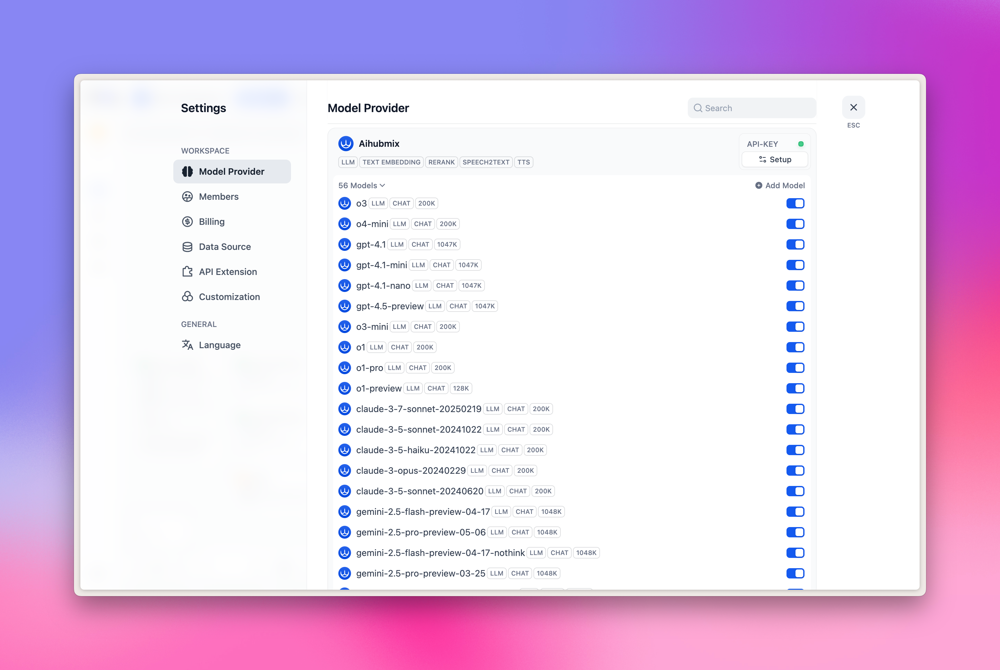

## 安装

1. 点击 [Dify](https://cloud.dify.ai/apps) 页面右上角 「PLUGIN」
2. 点击下方弹出的 「+ Install plugin」按钮
3. 选择「Local Package File」
4. 选择已经下载到本地的 [dify-plugin-aihubmix.difypkg](https://www.resource.nestsound.cn/plugin/dify-plugin-aihubmix.difypkg) 进行安装

**示例图如下：**
  

## 配置
1. 首先点击页面右上角头像 → 选择 Settings 菜单
2. 点击左侧「Model Provider」 Tab
3. 在右侧找到 Aihubmix → 展开 Setup，填入你的 [ API Key](https://aihubmix.com/token)

  

**目前预置的模型有以下 5 大类：**
- LLM：大语言模型
- TEXT EMBEDDING：向量嵌入模型
- RERANK：重排序模型
- SPEECH2TEXT：语音转文本模型
- TTS：文本转语音模型

  

**如何新增更多自定义模型？**

点击「+ Add model」，在弹出面板的 Model Name 选项里：
- 填入模型广场中的任何 [模型 ID](https://aihubmix.com/models)，比如 `gpt-4o-2024-11-20`。
- 填入你的 API Key 后，点击「Save」即可。

需要注意的是，由于 Dify 插件的设计特殊性，目前暂不支持绘图模型，因此像是 `gpt-image-1` 这种绘图模型无法加入。

  

## LLM 选择

在工作流 (Workflow) 节点中，选择「LLM」，即可选择插件中已经配置好的，由 Aihubmix 提供的模型。

**示例图如下：**
  

## Embeddings/Reranker 模型选择

Embeddings/Reranker 模型主要用于知识库问答，你可以在顶部的 Knowledge Tab 快速体验，也可以在工作流节点中选择相应的模型。

**示例图如下：**
  

## TTS/SST 选择

TTS/SST 模型主要用于语音解析与合成，选择工具时，对应的不是常规的「LLM」，而是「Tools」Tab 里面的「Audio」 类型。
对应关系：
1. TTS 文转音：选择「Text to Speech」
2. SST 音转文：选择「Speech to Text」

**示例图如下：**
