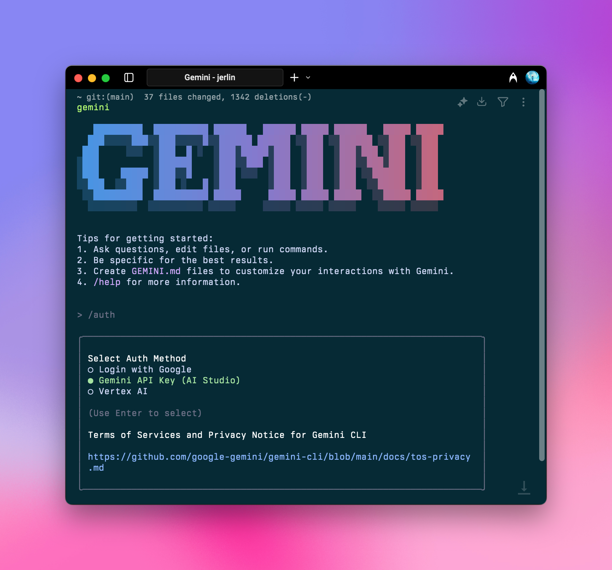

用 Aihubmix 为 Gemini CLI 提供强劲动力，享受稳定高效的 Gemini 模型服务。

## 快速配置指引：

### 1️⃣ 全局安装 npm 包

终端运行：

```shell
npm install -g @google/gemini-cli
```

确保你的 Node.js 版本 \>= 18

更多详细说明可以参考：

1. [官方仓库](https://github.com/google-gemini/gemini-cli)
2. [详细配置](https://github.com/google-gemini/gemini-cli/blob/main/docs/cli/configuration.md)

### 2️⃣ 环境变量配置

在系统环境变量中填入 Aihubmix 密钥和转发地址，密钥可以在 Aihubmix [「Keys」页面](https://aihubmix.com/token) 生成。

比如在 ~/.zshrc 中添加：

```shell
export GOOGLE_GEMINI_BASE_URL="https://aihubmix.com/gemini"
export GEMINI_API_KEY="sk-***"
```

<Tip>
  对于 Mac 用户，你可以在`用户名`目录通过快捷键 `⌘ + ⇧ + .` 显示隐藏的 .zshrc 文件，用系统的「文本编辑」APP 打开并添加上述内容。
</Tip>

### 3️⃣ 使配置生效

添加配置之后，终端执行 `source ~/.zshrc`，回车即可。

### 4️⃣ 终端启动

终端输入

```shell
gemini
```

## 初始化配置

### 选择接入方式



启动之后输入 `/auth`，回车，选择 `Gemini API Key （AI Studio）`

```shell
○ Login with Google
● Gemini API Key (AI Studio)
○ vertex AI
```

<Note>
  你可以随时用 `/auth` 命令来切换授权方式。
</Note>

### 启动成功

完成以上初始化即可正常使用。


祝你使用愉快！