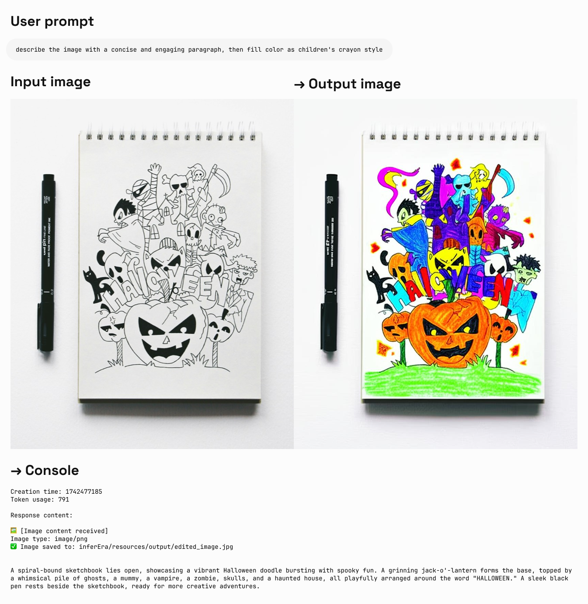
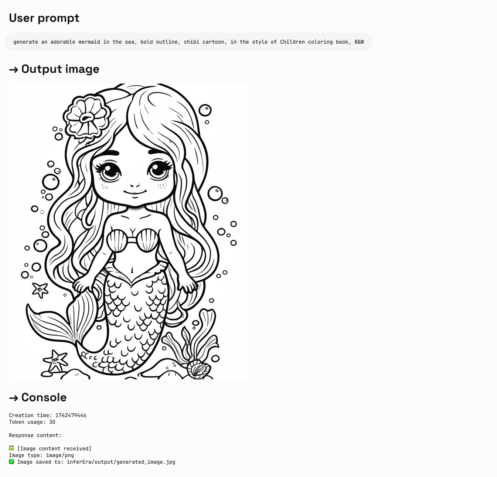

## Imagen 绘图

Imagen 是 Google 推出的先进图像生成 AI 模型系列，能够根据文本提示创建高质量、逼真的图像。本指南将帮助您了解如何使用 Imagen 系列 API 生成图像，包括参数设置、模型选择和代码示例。

可用模型列表：
- gemini-2.0-flash-preview-image-generation
- imagen-4.0-ultra-generate-exp-05-20
- imagen-3.0-generate-002

<Tip>
  1. 目前 Imagen 仅支持英文提示词（prompt），集成时建议增加自动翻译，让用户能够无障碍使用
  2. 绘制大量文本的表现不稳定，建议只绘制重点关键词
</Tip>

### 模型参数

Imagen 目前仅支持英文提示词，并提供以下参数：

- **numberOfImages**: 要生成的图像数量，范围从 1 到 4（含）。默认值为 4。另外注意 `imagen-4.0-ultra-generate-exp-05-20` 单次只能生成 1 张。
- **aspectRatio**: 更改生成图像的宽高比。支持的值有 "1:1"、"3:4"、"4:3"、"9:16" 和 "16:9"。默认值为 "1:1"。
- **personGeneration**: 允许模型生成人物图像。支持以下值：
  - "DONT_ALLOW": 阻止生成人物图像。
  - "ALLOW_ADULT": 生成成人图像，但不生成儿童图像。这是默认值。

### 费率

使用 Imagen API 生成图像的费用为 **\$0.03/张**。请注意，每次调用可以生成 1-4 张图像，费用将按实际生成的图像数量计算。

### 调用示例

以下是使用 Imagen 生成图像的 Python 调用示例：

<CodeGroup>

```py Imagen
import os
import time
from google import genai
from google.genai import types
from PIL import Image
from io import BytesIO

client = genai.Client(
    api_key="sk-***", # 🔑 换成你在 AiHubMix 生成的密钥
    http_options={"base_url": "https://aihubmix.com/gemini"},
)

# 目前只支持英文 prompt，绘制大量文本的表现较差
response = client.models.generate_images(
    model='imagen-3.0-generate-002',
    prompt='A minimalist logo for a LLM router market company on a solid white background. trident in a circle as the main symbol, with ONLY text \'InferEra\' below.',
    config=types.GenerateImagesConfig(
        number_of_images=1,
        aspect_ratio="1:1", # supports "1:1", "9:16", "16:9", "3:4", or "4:3".
    )
)

script_dir = os.path.dirname(os.path.abspath(__file__))
output_dir = os.path.join(script_dir, "output")

os.makedirs(output_dir, exist_ok=True)

# 生成时间戳作为文件名前缀，避免文件名冲突
timestamp = int(time.time())

# 保存并显示生成的图片
for i, generated_image in enumerate(response.generated_images):
  image = Image.open(BytesIO(generated_image.image.image_bytes))
  image.show()
  
  file_name = f"imagen3_{timestamp}_{i+1}.png"
  file_path = os.path.join(output_dir, file_name)
  image.save(file_path)
  
  print(f"图片已保存至：{file_path}")
```

</CodeGroup>

### 提示词技巧

创建有效的提示词对于获得理想的图像至关重要：

- 使用详细的描述，包括主题、风格、光照、角度等。
- 指定艺术风格（如电影感、写实主义、动漫风格等）。
- 包含技术细节（如 DSLR、高清、细节丰富等）。
- 避免负面或违禁内容。
- **避免在提示词中包含大量文本**，仅使用重点关键词以获得更稳定的结果。

## Gemini 2.0 Flash 图像生成

Gemini 也提供了图像生成能力，作为一种替代方案。与 Imagen 3.0 相比，Gemini 的图像生成更适合于需要上下文理解和推理的场景，而非追求极致的艺术表现和视觉质量。

- 更高的视觉质量 → 相比 exp 版，图像更锐利、更丰富、更清晰。
- 更准确的文本呈现 → 生成的视觉中，文本更加精准、干净、易读。
- 显著减少过滤拦截 → 得益于更智能、宽松的过滤机制，创作时几乎不再被打断。

**说明：**
- 模型 id：`gemini-2.0-flash-preview-image-generation`
- 费率（输入→输出）：$0.1→$0.4/M tokens
- 需要新增参数来体验新特性 `"modalities":["text","image"]`
- 图片以 Base64 编码形式传递与输出
- 作为实验模型，建议明确指出 "输出图片"，否则可能只有文本
- 输出图片的默认高度为 1024px
- python 调用需要最新的 openai sdk 支持，请先运行 `pip install -U openai`
- 了解更多请访问 [Gemini 官方文档](https://ai.google.dev/gemini-api/docs/image-generation)

<Tip>
  `gemini-2.0-flash-exp` 已经正式升级为 `gemini-2.0-flash-preview-image-generation`，让你的创作流程更流畅、更精彩。
</Tip>
  
**输入参考结构：**

```json
"modalities": ["text","image"]
{
    "model": "gemini-2.0-flash-preview-image-generation",
    "messages": [
      {
        "role": "user",
        "content": "生成一幅山水画，并给出一首诗词描述"
      }
    ],
    "modalities":["text","image"], //需要添加 image
    "temperature": 0.7
  }'
```

**输出参考结构：**

```json
"choices":
    [
        {
            "index": 0,
            "message":
            {
                "role": "assistant",
                "content": "Hello! How can I assist you today?",
                "refusal": null,
                "multi_mod_content": //📍 新增
                [
                    {
                        "text": "",
                        "inlineData":
                        {
                          "data":"base64 str",
                          "mimeType":"png"
                        }
                    },
                    {
                        "text": "hello",
                        "inlineData":
                        {
                        }
                    }
                ],
                "annotations":
                []
            },
            "logprobs": null,
            "finish_reason": "stop"
        }
    ],
```

### 图文生成

Iuput：text
Output：text \+ image

<CodeGroup>

```shell Curl
IMG_PATH="/your_path/image.jpg"

if [[ "$(base64 --version 2>&1)" = *"FreeBSD"* ]]; then
  B64FLAGS="--input"
else
  B64FLAGS="-w0"
fi

IMG_BASE64=$(base64 "$B64FLAGS" "$IMG_PATH" 2>&1)

curl https://aihubmix.com/v1/chat/completions \
  -H "Content-Type: application/json" \
  -H "Authorization: Bearer sk-***" \
  -d '{
    "model": "gemini-2.0-flash-preview-image-generation",
    "messages": [
      {
        "role": "user",
        "content": [
          {
            "type":"text",
            "text":"describe the image with a concise and engaging paragraph, then fill color as children's crayon style"
          },
          {
            "type": "image_url",
            "image_url": {
              "url": "data:image/jpeg;base64,'$IMG_BASE64'"
            }
          }
        ]
      }
    ],
    "modalities": ["text","image"],
    "temperature": 0.7
}' \
  | grep -o '"data":"[^"]*"' \
  | cut -d'"' -f4 \
  | base64 --decode > /your_path/imageGen.jpg
```


```py Python
import os
from openai import OpenAI
from PIL import Image
from io import BytesIO
import base64

client = OpenAI(
    api_key="sk-***", # 换成你在 AiHubMix 生成的密钥
    base_url="https://aihubmix.com/v1",
)

# Using text-only input
response = client.chat.completions.create(
    model="gemini-2.0-flash-preview-image-generation",
    messages=[
        {
            "role": "user",
            "content": [
                {
                    "type": "text",
                    "text": "generate an adorable mermaid in the sea, bold outline, chibi cartoon, in the style of Children coloring book, B&W, HD",
                }
            ],
        },
    ],
    modalities=["text", "image"],
    temperature=0.7,
)
try:
    # Print basic response information
    print(f"Creation time: {response.created}")
    print(f"Token usage: {response.usage.total_tokens}")
    
    # Check if multi_mod_content field exists
    if (
        hasattr(response.choices[0].message, "multi_mod_content")
        and response.choices[0].message.multi_mod_content is not None
    ):
        print("\nResponse content:")
        for part in response.choices[0].message.multi_mod_content:
            if "text" in part and part["text"] is not None:
                print(part["text"])
            
            # Process image content
            elif "inline_data" in part and part["inline_data"] is not None:
                print("\n🖼️ [Image content received]")
                image_data = base64.b64decode(part["inline_data"]["data"])
                mime_type = part["inline_data"].get("mime_type", "image/png")
                print(f"Image type: {mime_type}")
                
                image = Image.open(BytesIO(image_data))
                image.show()
                
                # Save image
                output_dir = os.path.join(os.path.dirname(os.path.abspath(__file__)), "output")
                os.makedirs(output_dir, exist_ok=True)
                output_path = os.path.join(output_dir, "generated_image.jpg")
                image.save(output_path)
                print(f"✅ Image saved to: {output_path}")
            
    else:
        print("No valid multimodal response received, check response structure")
except Exception as e:
    print(f"Error processing response: {str(e)}")
```

</CodeGroup>

**输出实例：**\


### 图片编辑

Iuput：text \+ image\
Output：text \+ image

<CodeGroup>

```py Python
import os
from openai import OpenAI
from PIL import Image
from io import BytesIO
import base64

client = OpenAI(
    api_key="sk-***", # 换成你在 AiHubMix 生成的密钥
    base_url="https://aihubmix.com/v1",
)

project_root = os.path.dirname(os.path.dirname(os.path.abspath(__file__)))

image_path = os.path.join(os.path.dirname(os.path.abspath(__file__)), "resources", "filled.jpg")
if not os.path.exists(image_path):
    raise FileNotFoundError(f"image {image_path} not exists")

def encode_image(image_path):
    with open(image_path, "rb") as image_file:
        return base64.b64encode(image_file.read()).decode("utf-8")

base64_image = encode_image(image_path)

response = client.chat.completions.create(
    model="gemini-2.0-flash-preview-image-generation",
    messages=[
        {
            "role": "user",
            "content": [
                {
                    "type": "text",
                    "text": "describe the image with a concise and engaging paragraph, then fill color as children's crayon style",
                },
                {
                    "type": "image_url", 
                    "image_url": {"url": f"data:image/jpeg;base64,{base64_image}"},
                },     
            ],
        },
    ],
    modalities=["text", "image"],
    temperature=0.7,
)
try:
    # Print basic response information without base64 data
    print(f"Creation time: {response.created}")
    print(f"Token usage: {response.usage.total_tokens}")
    
    # Check if multi_mod_content field exists
    if (
        hasattr(response.choices[0].message, "multi_mod_content")
        and response.choices[0].message.multi_mod_content is not None
    ):
        print("\nResponse content:")
        for part in response.choices[0].message.multi_mod_content:
            if "text" in part and part["text"] is not None:
                print(part["text"])
            
            # Process image content
            elif "inline_data" in part and part["inline_data"] is not None:
                print("\n🖼️ [Image content received]")
                image_data = base64.b64decode(part["inline_data"]["data"])
                mime_type = part["inline_data"].get("mime_type", "image/png")
                print(f"Image type: {mime_type}")
                
                image = Image.open(BytesIO(image_data))
                image.show()
                
                # Save image
                output_dir = os.path.join(os.path.dirname(image_path), "output")
                os.makedirs(output_dir, exist_ok=True)
                output_path = os.path.join(output_dir, "edited_image.jpg")
                image.save(output_path)
                print(f"✅ Image saved to: {output_path}")
            
    else:
        print("No valid multimodal response received, check response structure")
except Exception as e:
    print(f"Error processing response: {str(e)}")
```

</CodeGroup>

**输出实例：**\


## 选择正确的绘图模型

### 选择 Gemini 的情况：

- 需要利用世界知识和推理能力生成上下文相关的图像。
- 需要无缝混合文本和图像。
- 希望在长文本序列中嵌入准确的视觉内容。
- 希望在保持上下文的同时以对话方式编辑图像。

### 选择 Imagen 的情况：

- 图像质量、照片真实感、艺术细节或特定风格（如印象派、动漫）是首要考虑因素。
- 执行专业编辑任务，如产品背景更新或图像放大。
- 注入品牌、风格或生成标志和产品设计。

### 最佳实践

1. **优化提示词**：精心设计提示词，这是获得高质量输出的关键。
2. **实验参数**：尝试不同的宽高比和设置，找到最适合您需求的配置。
3. **批量生成**：生成多张图像以增加获得理想结果的机会。
4. **保存元数据**：将提示词和时间戳与图像一起保存，以便追踪和复制成功的结果。
5. **遵守使用政策**：确保您的使用符合 Google 的内容政策和使用条款。

---

## Veo 2.0 视频生成

VEO 2.0 是 Google 推出的先进视频生成 AI 模型，能够根据文本提示创建高质量、逼真的短视频。下面的指南将帮助您了解如何使用 VEO 2.0 API 生成视频，包括参数设置、模型选择和代码示例。

<Tip>
1. 目前 VEO 2.0 仅支持英文提示词（prompt），集成时建议增加自动翻译，让用户能够无障碍使用
2. 生成视频需要耗时 2-3 分钟，请耐心等待
</Tip>

### 模型参数

VEO 2.0 提供以下参数：

- **numberOfVideos**: 要生成的视频数量，可选 1 或 2。默认值为 2。
- **aspectRatio**: 生成视频的宽高比。支持的值有 "16:9" 和 "9:16"。
- **durationSeconds**: 视频时长，可选 5 秒或 8 秒。默认值为 8 秒。
- **personGeneration**: 控制是否允许生成含人物的视频。支持以下值：
  - "dont_allow": 阻止生成含人物的视频。
  - "allow_adult": 允许生成含成人的视频，但不生成儿童视频。

### 费率

使用 VEO 2.0 API 的费用是 $0.35/秒

### 调用示例

以下是使用 VEO 2.0 生成视频的 Python 调用示例：

<CodeGroup>

```py 文生视频
import os
import time
from google import genai
from google.genai import types

client = genai.Client(
    api_key="sk-***", # 换成你在 AiHubMix 生成的密钥
    http_options={"base_url": "https://aihubmix.com/gemini"},
)

operation = client.models.generate_videos(
    model="veo-2.0-generate-001",
    prompt="Panning wide shot of a calico kitten sleeping in the sunshine",
    config=types.GenerateVideosConfig(
        person_generation="dont_allow",  # "dont_allow" 或 "allow_adult"
        aspect_ratio="16:9",  # "16:9" 或 "9:16"
        number_of_videos=1, # 整数，可选 1、2，默认 2
        durationSeconds=5, # 整数，可选 5、8，默认 8
    ),
)

# 耗时 2-3 分钟，视频时长 5-8s
while not operation.done:
    time.sleep(20)
    operation = client.operations.get(operation)

for n, generated_video in enumerate(operation.response.generated_videos):
    client.files.download(file=generated_video.video)
    generated_video.video.save(f"video{n}.mp4")  # 保存视频
```

```py 参考图驱动
import os
import time
from google import genai
from google.genai import types

def load_image(path):
    with open(path, "rb") as image_file:
        return image_file.read()
    
client = genai.Client(
    api_key="sk-***", # 换成你在 AiHubMix 生成的密钥
    http_options={"base_url": "https://aihubmix.com/gemini"},
)

operation = client.models.generate_videos(
    model="veo-2.0-generate-001",
    prompt="The waves in the background keep flowing",
    image=types.Image(
        mime_type="image/png", 
        image_bytes=load_image("img/inferbanner.png")  # 使用你的图片路径
    ),
    config=types.GenerateVideosConfig(
        person_generation="dont_allow",
        aspect_ratio="16:9",
        numberOfVideos=1,
        durationSeconds=5,
    ),
)

while not operation.done:
    time.sleep(20)
    operation = client.operations.get(operation)

for n, generated_video in enumerate(operation.response.generated_videos):
    client.files.download(file=generated_video.video)
    generated_video.video.save(f"video{n}.mp4")
```

</CodeGroup>

### 提示词技巧

创建有效的提示词对于获得理想的视频至关重要：

- 描述清晰的场景、动作和氛围
- 指定拍摄风格（如全景、特写、跟踪镜头等）
- 描述光照条件（如阳光明媚、黄昏、室内灯光等）
- 指明主体对象及其动作（如"猫咪在阳光下睡觉"）
- 避免过于复杂的叙事或快速变化的场景
- 避免负面或违禁内容

### 最佳实践

1. **简洁明了的提示词**：使用清晰、具体的描述来指导视频生成。
2. **耐心等待**：视频生成需要 2-3 分钟，请耐心等待完成。
3. **测试不同参数**：尝试不同的宽高比和时长，找到最适合您需求的设置。
4. **保存生成记录**：将提示词与生成的视频一起记录，以便追踪成功的结果。
5. **遵守使用政策**：确保您的使用符合 Google 的内容政策和使用条款。 
