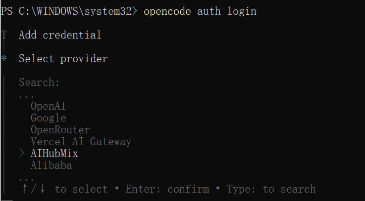
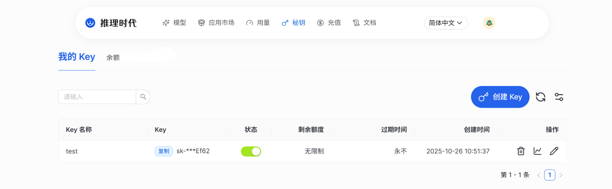
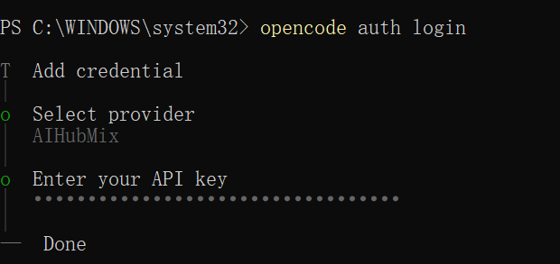
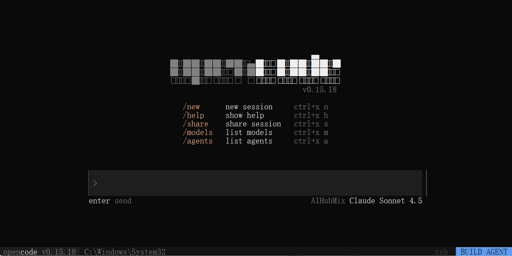
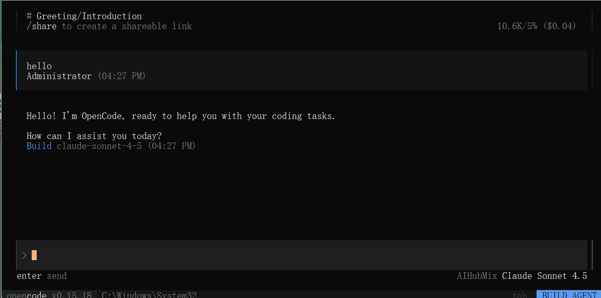

当前已支持 GPT、Claude、DeepSeek、Gemini、Qwen等主流模型系列。在OpenCode使用场景中，推荐以下模型：

- `claude-sonnet-4-5`
- `glm-4.6`
- `gpt-5`
- `gpt-5-codex`

本文档将介绍如何在不同操作系统中安装、配置并启动OpenCode，并完成对AiHubMix API的接入。

---

在开始安装前，请确保系统已满足以下要求：

- **Node.js ≥ 18.0.0**
- 对应系统的包管理工具（可选）：
  - macOS / Linux：`brew`
  - Arch Linux：`paru`
  - Windows：`choco`、`winget` 或 `scoop`

---

## 一、安装 OpenCode

可根据所使用的系统与工具选择任意一种安装方式。

1. 使用 Node.js 安装

```
# 使用 CURL 脚本快速安装
curl -fsSL https://opencode.ai/install | bash

# 使用 NPM
npm install -g opencode-ai

# 使用 Bun
bun install -g opencode-ai

# 使用 PNPM
pnpm install -g opencode-ai

# 使用 Yarn
yarn global add opencode-ai
```

---

2. 使用 Homebrew（macOS / Linux）

```
brew install sst/tap/opencode
```

---

3. 使用 Paru（Arch Linux）

```
paru -S opencode-bin
```

---

4. Windows 安装

Windows 用户可通过以下方式安装 OpenCode：

```
# Chocolatey
choco install opencode

# WinGet
winget install opencode

# Scoop
scoop bucket add extras
scoop install extras/opencode

# 或使用 NPM（需 Node.js 环境）- 注意：需要管理员权限
npm install -g opencode-ai
```

---

## 二、启动与登录 OpenCode

安装完成后，执行以下步骤完成登录与配置。

1. 登录OpenCode

在终端输入以下命令：

```
opencode auth login
```

---

2. 选择AI供应商

在登录界面中选择**AIHubMix**作为模型供应商。



---

3. API Key授权

登录[AIHubMix](https://console.aihubmix.com/token)平台，获取API Key并在OpenCode登录页面中输入该密钥以完成授权。





---

## 三、验证安装

可通过以下命令验证 OpenCode 是否安装并配置成功：

```
opencode
```



若控制台返回模型的响应结果，表示安装与配置已完成。



---

## 四、常见问题与提示

- 若API Key无法通过验证，请重新登录[AIHubMix](https://console.aihubmix.com/token)并检查密钥有效性。
- 查看帮助文档：`opencode` -\>`/help`。
- opencode官方文档：https://opencode.ai/docs/。