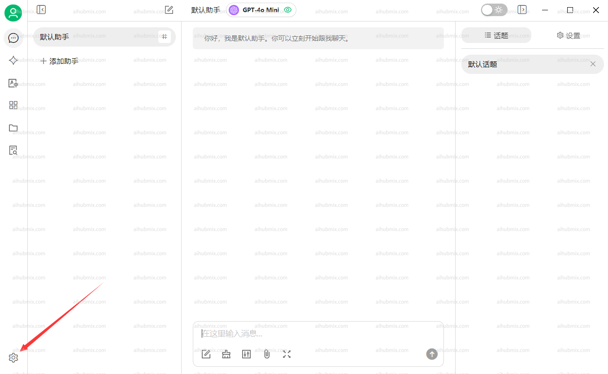
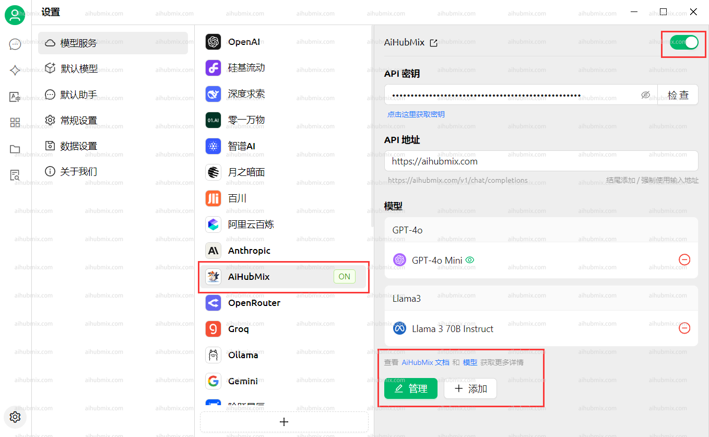
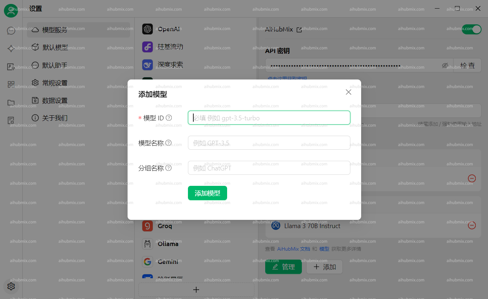
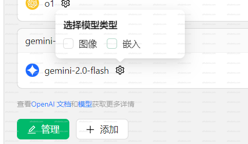
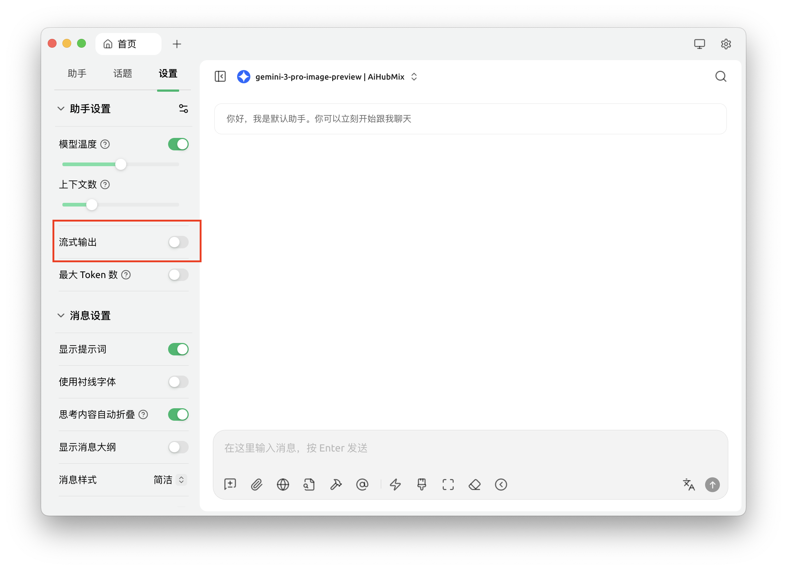
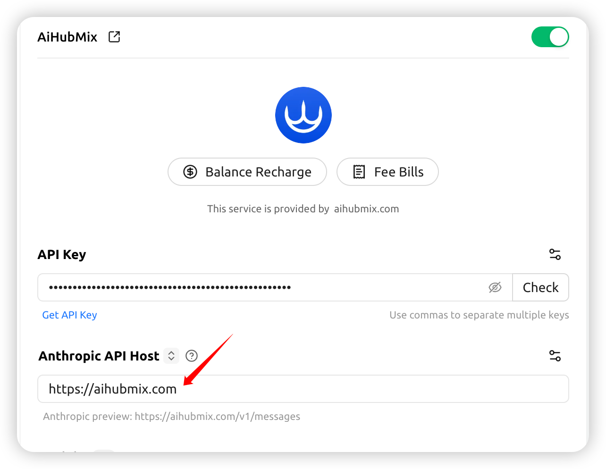

Cherry Studio 是一款**多模型桌面 AI 客户端**，支持同时接入多个 AI 服务商（OpenAI、Claude、Gemini、AIHubMix等），在一个界面里统一管理和使用。

**核心功能：**

- 多模型自由切换，对比不同 AI 的回答
- 支持 MCP 扩展，接入外部工具和服务
- 内置知识库、助手管理、对话历史
- 支持 Markdown 渲染、代码高亮、文件上传

[**Cherry Studio AI 下载地址**](https://easys.run/cherry-studio/)

## 通常使用方法

1. 应用左下角打开设置。
   
2. 在模型供应商界面选择我们的 AiHubMix，点击右上角按钮启用。
3. API 密钥一栏输入[本站的 Key](https://aihubmix.com/token)，API 地址一栏不用修改。\
   **注：如果检查不通过尝试关闭 vpn**
   
4. 下方点击添加模型，模型 ID 从本网站的设置界面选择想要使用的模型复制粘贴名称。
   

## 常见问题

### 模型提示看不到图片

一些新模型可能遇到输入图片后模型看不到的问题。需要在设置页面手动勾选图像选项。

<Tip>
  gemini-3-pro-image-preview 模型在流式输出模式下无法返回图片，使用时请关闭流式输出。

  
</Tip>

### 调用 Claude 模型返回错误 AI\_APICallError

需要检查报错信息中的请求路径是否为`https://aihubmix.com/anthropic/v1/messages`，若是，则在设置中将 Anthropic API Host 修改为`https://aihubmix.com`

