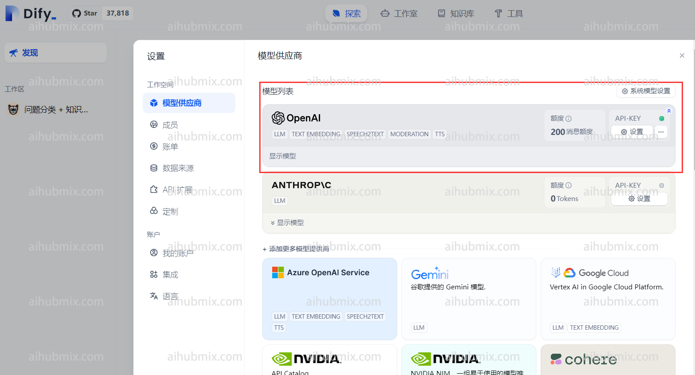
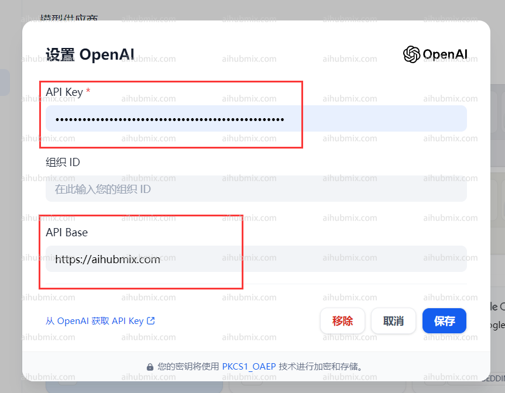

## 大语言模型

### 通常使用情况（使用OpenAI模型）

网页右上角点击自己的用户名，进入设置界面。\
在模型供应商中选择ApenAI并打开设置。



- 在API Key一栏输入[本站的Key](https://aihubmix.com/token)。
- 在API Base一栏输入：

```
https://aihubmix.com
```



### 使用非OpenAI模型方法

在模型供应商下拉找到OpenAI-API-compatible并点击添加模型。\\


- 打开网站后台设置页面，找到模型列表。
- 复制你想要使用的模型名称（如gemini-pro或claude-3-opus-20240229）。
- 在API Key一栏输入[本站的Key](https://aihubmix.com/token)。
- 在API endpoint URL一栏输入：

```
https://aihubmix.com/v1
```


## 生图模型

支持多种生图模型，包括但不限于 Nano Banana Pro、GPT-Image、Google Imagen 4 系列、Flux Kontext。

### 使用步骤

#### 1. 插件安装

搜索并安装插件：[AIHubMix Image](https://marketplace.dify.ai/plugins/langgenius/aihubmix-image?source=https%253A%252F%252Fcloud.dify.ai&theme=system)


#### 2. 配置AIHUBMIX API KEY

在插件配置页面中填入您的 API Key


#### 3. 添加节点

路径：工作区 → 添加节点 → 工具 → aihubmix-image → 选择具体需要使用的模型


#### 4. 模型配置

根据业务需求调整参数（如提示词、分辨率、宽高比等）。

#### 5. 配置完成后运行

工作流运行成功后，即可调用 AIHUBMIX 生图 API 生成图片。

<Tip>
  接口返回**URL** 和 **Base64** 两种图片格式。 在实际使用中请根据场景进行格式转换。
</Tip>