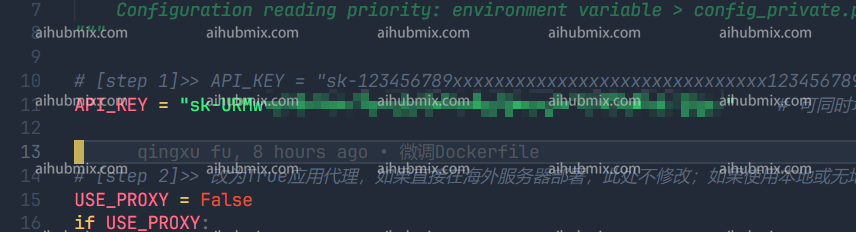
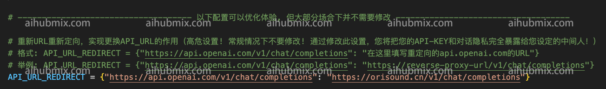

1. 打开 gpt_academic/config.py 文件：  
 
1. 找到 config.py 中的 API_KEY 变量，将[本站的Key](https://aihubmix.com/token)填入，即可：  
 
2. 往下滚动，找到 config.py 中的 API_URL_REDIRECT 变量，修改为（直接复制下面的代码块进去就行）：  
```
API_URL_REDIRECT = {"https://api.openai.com/v1/chat/completions": "https://aihubmix.com/v1/chat/completions"}
```
 
3. 然后就能用了  
 
