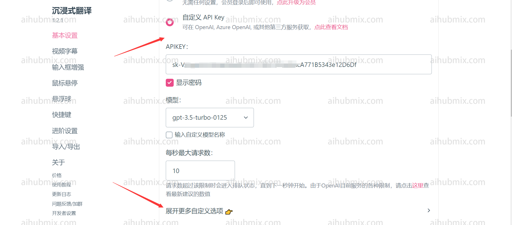
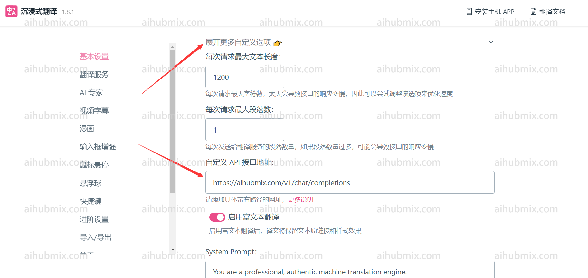

提示：翻译软件建议不要使用openai的o系列和gpt-5系列模型。

进入设置界面之后，选择自定义 API Key，在 APIKEY 那一栏输入[本站的Key](https://aihubmix.com/token)  
 
点开“扩展更多自定义设置”  
 
自定义 API 接口地址填：
```
https://aihubmix.com/v1/chat/completions
```  