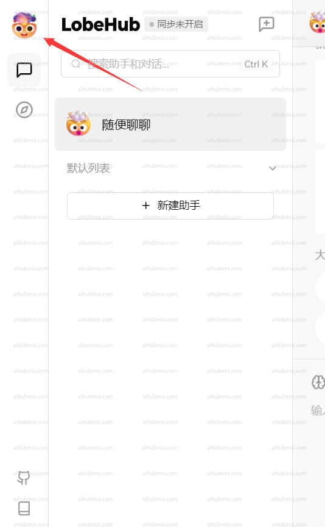
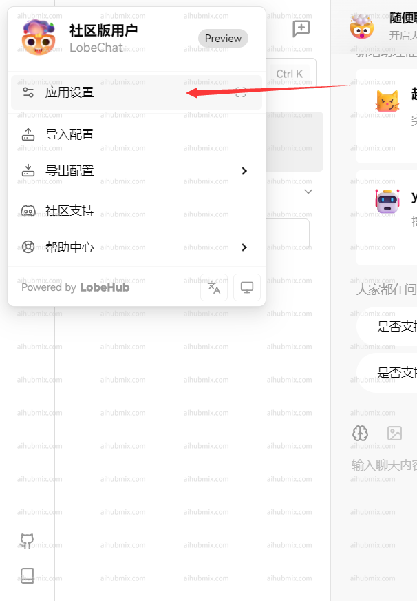
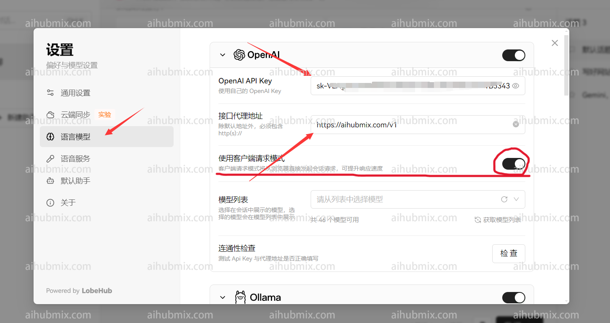
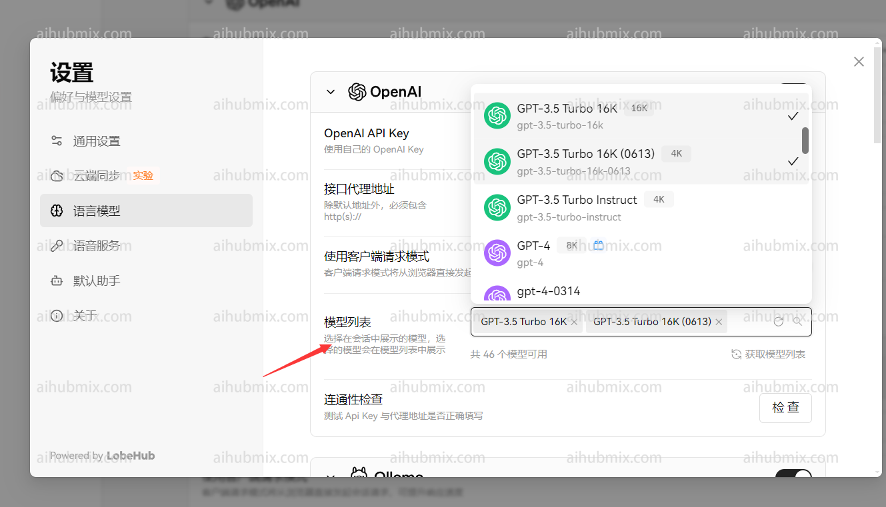

Lobe hub [https://app.lobehub.com/settings/provider/aihubmix](https://app.lobehub.com/settings/provider/aihubmix)

## 通常使用方法

lobe-chat官方网址：[chat-preview.lobehub.com](https://chat-preview.lobehub.com/?utm_source=aihubmix&utm_medium=website&utm_campaign=references)

如下图所示点击进入设置\
 

- API key 输入[本站的Key](https://aihubmix.com/token)
- 接口代理地址，直接输入下方的网址：

```text
https://aihubmix.com/v1
```

（建议打开“使用客户端请求模式”）\
\
最后在模型列表添加自己要使用的模型\


## 非openai模型使用方法

模型服务商选择 openai 不变，在模型列表手动添加所需模型名称即可。\
打开网站模型广场页面即可复制你想要使用的模型名称。