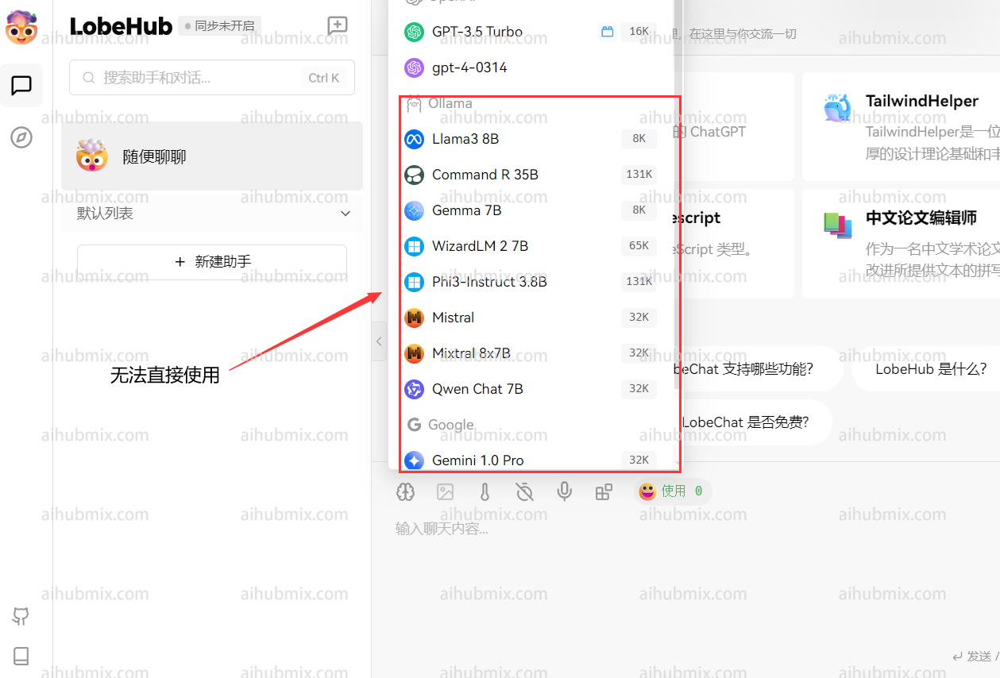
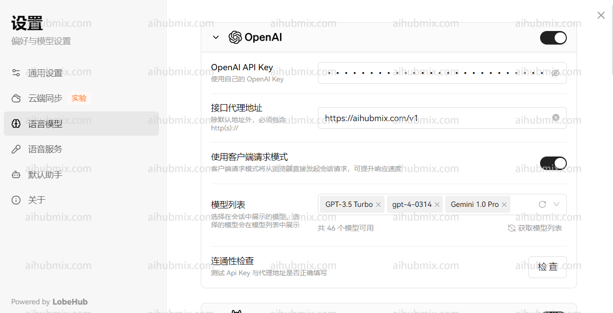
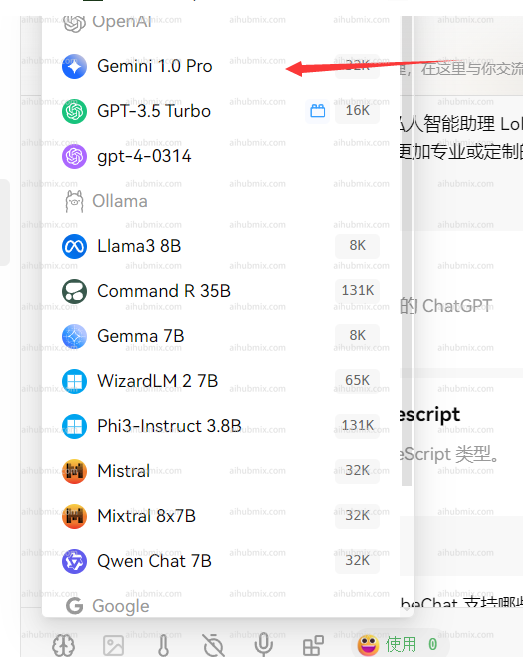

# 调用本站非OpenAI模型

## 原理

本站以OpenAI模型调用接口为标准，聚合了多个非OpenAI模型，包括但不限于谷歌的**gemini-pro**、Claude3等模型。调用非OpenAI模型和调用openAI模型一样，只需要**修改对应模型名字**即可。模型名字见网站后台设置页面；  
  

## 应用中-Lobe-chat为例

通常情况下本网站提供的key仅可调用open ai模型（如GPT-3.5等等）。
  
如果想要调用聚合的模型，可以通过自定义模型名称的方式实现。  
1. 首先打开设置界面，找到模型列表一栏。  
2. - 打开网站模型广场页面。
   - 复制你想要使用的模型名称（如gemini-pro或claude-3-opus-20240229）。  
  
  
3. - 输入你想要使用的模型名称并选择。
   - 确认手动添加的模型出现在open ai一栏的下方。  
   
4. 选择open ai一栏中自己要使用的模型（比如gemini-pro），效果如下。  
   

## 开发调用-以官方库为例子
   - 使用官方库示例代码进行调用。以下是一个Python示例代码：  

```python
from openai import OpenAI

client = OpenAI(
    # #将这里换成你在aihubmix api keys拿到的密钥
    api_key="sk-xxx",
    # 这里将官方的接口访问地址，替换成aihubmix的入口地址
    base_url="https://aihubmix.com/v1"
)

chat_completion = client.chat.completions.create(
    messages=[
        {
            "role": "user",
            "content": "Say this is a test",
        }
    ],
    model="claude-3-opus-20240229",
)

print(chat_completion)
```
## 特殊情况（Next Web客户端）  
如果你使用的是Next Web客户端，确保你已经升级到最新版本（v2.13.0）。在这个版本中，增加了自定义模型的方式：  
1. **输入自定义模型名**：
   - 由于Next Web客户端会根据输入的模型名称自动判断模型服务商，而本网站提供的key只适用于OpenAI接口。   
   - 所以在输入自定义模型名时，格式应为：“+‘想使用的模型名字’@OpenAI”。
   - 例如，若要使用gemini-pro模型，自定义模型名输入：“+gemini-pro@OpenAI”。
   - 通过这种方式，可以把模型服务商手动指向OpenAI。  
2. **确认选择**：
   - 在选择模型界面，确认手动添加的模型（OpenAI）出现在下方。  


