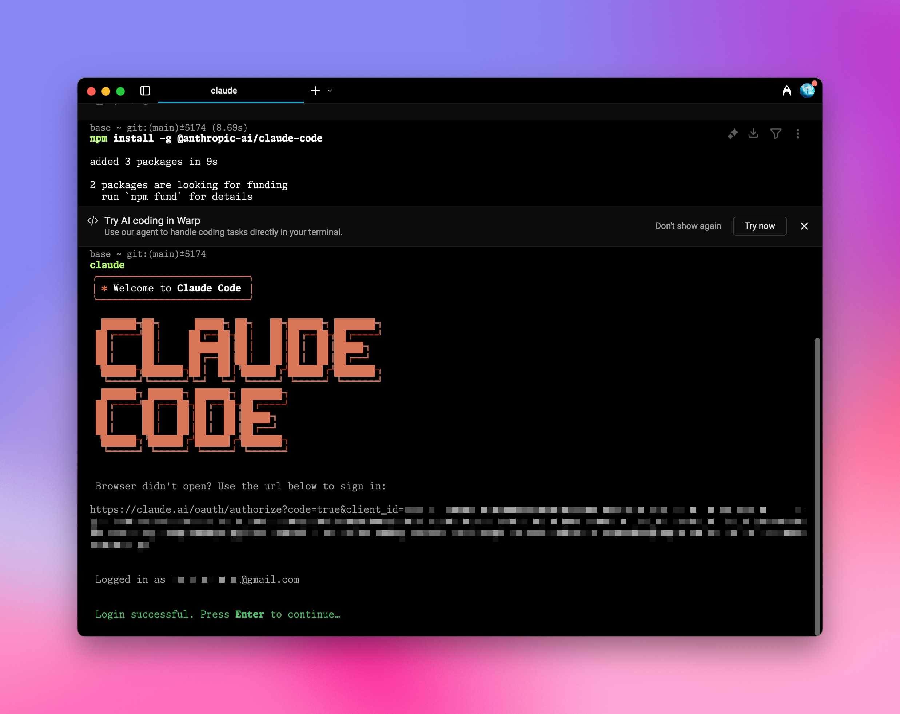
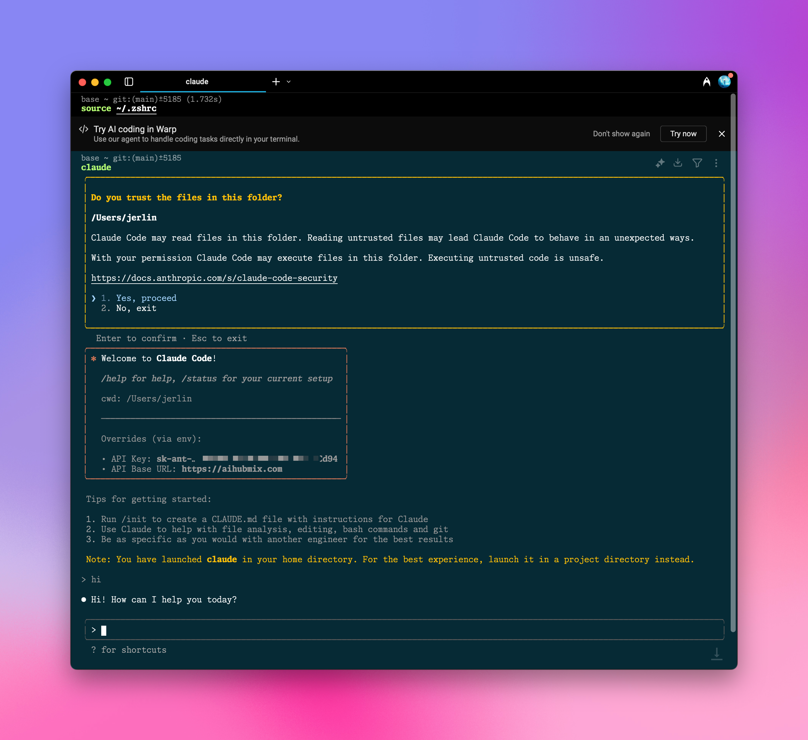

Powered by Aihubmix, Claude Code ensures a stable connection and eliminates worries about purchasing quotas.

<Warning>
  Due to Claude Code’s multi-agent nature, credit consumption can be quite high. It’s recommended to set a limit for your key to avoid unexpected charges.
</Warning>
  
## Quick Setup Guide:

### 1️⃣ Install the npm Package Globally

Run the following command in your terminal:

```shell
npm install -g @anthropic-ai/claude-code
```

Example image:



### 2️⃣ Configure Environment Variables

Go to Aihubmix [Keys page](https://aihubmix.com/token) to generate your API key, then add this key and the forwarding URL to your system environment variables.

For example, add the following lines to your ~/.zshrc file:

```shell
export ANTHROPIC_API_KEY="sk-***"
export ANTHROPIC_BASE_URL="https://aihubmix.com"
```

<Tip>
  For Mac users, you can reveal the hidden .zshrc file in your home directory by pressing `⌘ + ⇧ + .`. Open it with the system’s “TextEdit” app and add the above lines.
</Tip>

### 3️⃣ Apply the Configuration

After adding the configuration, run `source ~/.zshrc` in your terminal and press Enter to apply the changes.

### 4️⃣ Launch in Terminal

Navigate to your project directory, for example `cd ~/Desktop/my-project`\
Then type `claude` to start and begin using Claude Code.

## Initialization Configuration

### Authorization

If you see an authorization page, click to jump to the Claude website for confirmation. After successful authorization, return to the terminal to continue.


If you’d like to skip the verification step and route requests through Aihubmix directly, just open the .claude.json file in your user directory and add this line:

```
  "hasCompletedOnboarding": true,
```

### Launch

After launching, Claude Code will display the current configuration details, including your API Key and API Base URL.\
Confirm the prompts by selecting Yes and pressing Enter to complete the setup.



For example: Claude detects a custom KEY in the system environment variables — select `Yes`.

```
Detected a custom API key in your environment

ANTHROPIC_API_KEY: sk-***
Do you want to use this API key?

> 1. Yes
2. No(recommended)

Enter to confirm .Esc to cancel
```

### Switch Model

Use the Claude Code command:

```shell
/model [model id]
```

The default model is `Sonnet 4`, but you can switch to a more powerful one like `Opus 4`:

```shell opus
/model opus
```

Or, switch to another Claude model:

<CodeGroup>

```shell sonnet 3.7
/model  claude-3-7-sonnet-20250219
```


```shell sonnet 3.5
/model claude-3-5-sonnet-20241022
```

</CodeGroup>

### Kimi K2 Support

After launching Claude Code, simply run the following command:

```shell
/model moonshotai/kimi-k2-instruct
```

## Use Any LLM on the AiHubMix Platform

1️⃣ Install @aihubmix/claude-code globally

```shell
npm install -g @aihubmix/claude-code
```
2️⃣ Set system environment variables (recommended)

```shell
export AIHUBMIX_API_KEY="your-aihubmix-api-key"
export HOST="127.0.0.1"  # Optional
export PORT="3456"       # Optional
export LOG="true"        # Optional
export API_TIMEOUT_MS="30000"  # Optional
```

3️⃣ Generate a configuration file

Note: Replace sk-*** with the key you generated on AiHubMix. Configuration options beyond the model itself will be overridden by system environment variables if present.

```shell
mkdir -p ~/.aihubmix-claude-code && cat > ~/.aihubmix-claude-code/config.json <<EOF
{
  "API_KEY": "sk-***",
  "HOST": "127.0.0.1",
  "PORT": 3456,
  "LOG": true,
  "API_TIMEOUT_MS": 30000,
  "Router": {
    "default": "claude-sonnet-4-20250514",
    "background": "claude-3-5-haiku-20241022",
    "think": "claude-sonnet-4-20250514",
    "longContext": "gpt-4.1",
    "longContextThreshold": 60000,
    "webSearch": "gemini-2.0-flash-search"
  }
}
EOF
```

4️⃣ Usage

<CodeGroup>

```shell
acc start
```

```shell
acc stop
```

```shell
acc code
```

```shell
acc restart
```

```shell
acc status
```

```shell
acc help
```

```shell
acc version
```

</CodeGroup>

-[More details](https://github.com/inferera/aihubmix/blob/main/packages/claude-code/README.md)
-[npm package](https://www.npmjs.com/package/@aihubmix/claude-code)

Enjoy coding with Claude\!