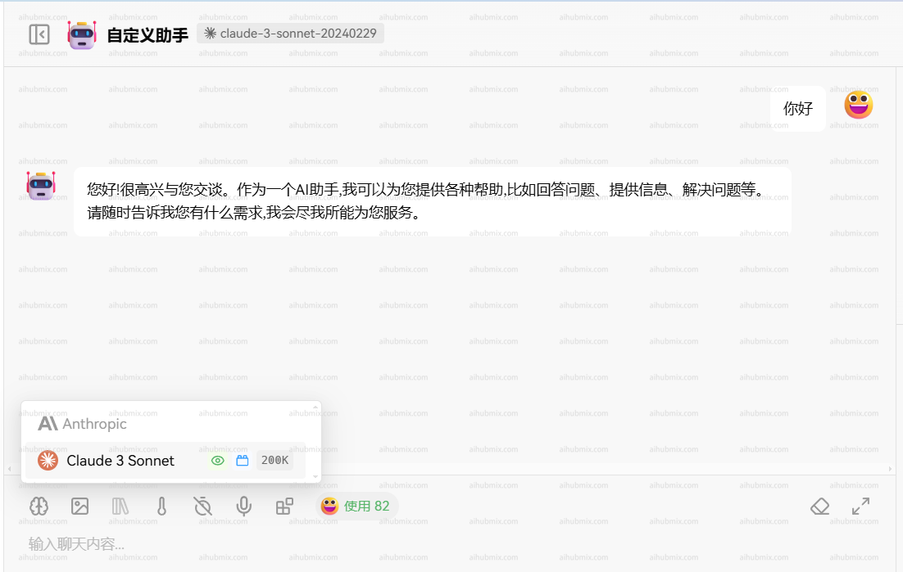

## Instructions

The Claude series models can be accessed via the official native API. Before using, make sure to install or upgrade the anthropic dependency:

```bash
pip install -U anthropic
```

<Info>
  For non-Claude models, please use the OpenAI API format instead.
</Info>

## Models Information

| Model             | Claude Opus 4 | Claude Sonnet 4 | Claude Sonnet 3.7 | Claude Sonnet 3.5 | Claude Haiku 3.5 | Claude Opus 3 | Claude Haiku 3 |
| ----------------- | ------------- | --------------- | ----------------- | ----------------- | ---------------- | ------------- | -------------- |
| Extended Thinking | Yes           | Yes             | Yes               | No                | No               | No            | No             |
| Context Window    | 200K          | 200K            | 200K              | 200K              | 200K             | 200K          | 200K           |
| Max Output        | 32000 tokens  | 64000 tokens    | 64000 tokens      | 8192 tokens       | 8192 tokens      | 4096 tokens   | 4096 tokens    |
| Training Cut-off  | Mar 2025      | Mar 2025        | Nov 2024          | Apr 2024          | July 2024        | Aug 2023      | Aug 2023       |

<Tip>
  1.For models version 3.5 and above, if you need output longer than 4096 tokens, be sure to explicitly specify the `"max_tokens"` parameter, referring to the `Max Output` column in the table above.
  2. For Sonnet 3.7, you can increase the max output from 64K to 128K by passing `default_headers={"anthropic-beta": "output-128k-2025-02-19"}`. See the "Streaming 128K" example below.
</Tip>

**Endpoint:** `POST` /v1/messages

## Usage

<CodeGroup>

```shell Curl
curl https://aihubmix.com/v1/messages \ # Replace the official endpoint with AiHubMix’s API endpoint
     --header "x-api-key: $AIHUBMIX_API_KEY" \ # Replace with the key you generated in AiHubMix
     --header "anthropic-version: 2023-06-01" \
     --header "content-type: application/json" \
     --data \
'{
    "model": "claude-3-5-sonnet-20241022",
    "max_tokens": 1024,
    "messages": [
        {"role": "user", "content": "Hello, world"}
    ]
}'
```


```py Python
import anthropic

# Initialize the Anthropics client
client = anthropic.Anthropic(
    api_key="sk-***", # Replace it by your AiHubMix Key
    base_url="https://aihubmix.com"
)

# Construct your message
message = client.messages.create(
    model="claude-3-7-sonnet-20250219",
    max_tokens=1024,
    messages=[
        {"role": "user", "content": "Hello, Claude"}
    ]
)

# Print the response content
print(message.content)
```

```py Python Streaming 128K
import anthropic

client = anthropic.Anthropic(
    api_key="sk-***", # Replace it by your AiHubMix Key
    base_url="https://aihubmix.com",
    default_headers={
        "anthropic-beta": "output-128k-2025-02-19"
    }
)

with client.messages.stream(
    model="claude-3-7-sonnet-20250219",  # claude-opus-4-20250514, claude-sonnet-4-20250514
    max_tokens=128000,
    messages=[
        {"role": "user", "content": "Please generate the beginning of a novel that will span 100,000 tokens."}
    ],
) as stream:
    for text in stream.text_stream:
        print(text, end="", flush=True)
```

</CodeGroup>

### Request Body

```json
{
  "model": "claude-3-5-sonnet-20241022",
  "max_tokens": 1024,
  "messages": [
    {
      "role": "user",
      "content": "What is the meaning of life?"
    }
  ]
}
```

### Request Parameters

| Name         | Location | Type     | Required | Description             |
| ------------ | -------- | -------- | -------- | ----------------------- |
| x-api-key    | header   | string   | No       | Bearer AIHUBMIX_API_KEY |
| Content-Type | header   | string   | No       | none                    |
| body         | body     | object   | No       | none                    |
| » model      | body     | string   | Yes      | none                    |
| » messages   | body     | [object] | Yes      | none                    |
| »» role      | body     | string   | No       | none                    |
| »» content   | body     | string   | Yes      | none                    |
| » max_tokens | body     | number   | Yes      | none                    |

### Response Example

```json
200 Response
```

```json
{
  "id": "msg_013Uf6CwwyjSe35n3yVaPbLM",
  "type": "message",
  "role": "assistant",
  "model": "claude-3-5-sonnet-20241022",
  "content": [
    {
      "type": "text",
      "text": "That's one of humanity's most enduring and complex philosophical questions! While there's no universal answer, I aim to explore such questions thoughtfully while acknowledging their complexity. I try to focus on having meaningful conversations and helping where I can. What does meaning in life mean to you?"
    }
  ],
  "stop_reason": "end_turn",
  "stop_sequence": null,
  "usage": {
    "input_tokens": 14,
    "cache_creation_input_tokens": 0,
    "cache_read_input_tokens": 0,
    "output_tokens": 61
  }
}
```

### Response Results

| Status Code | Status Description | Description | Data Model |
| ----------- | ------------------ | ----------- | ---------- |
| 200         | OK                 | none        | Inline     |

## Using Claude in Applications (Example: Lobe-Chat)

Here’s how you can configure Claude models in a third-party application like Lobe-Chat:

1. Navigate to the settings page and select **Claude** as your model provider.
2. Enter your [API Key](https://aihubmix.com/token) from AiHubMix.
3. Set the API proxy endpoint to:

   ```
   https://aihubmix.com
   ```
4. (Recommended) Enable the "Client Request Mode" option.
5. Add your chosen model to the model list.
   - It’s recommended to copy the model name from AiHubMix's settings page and paste it in the application.


