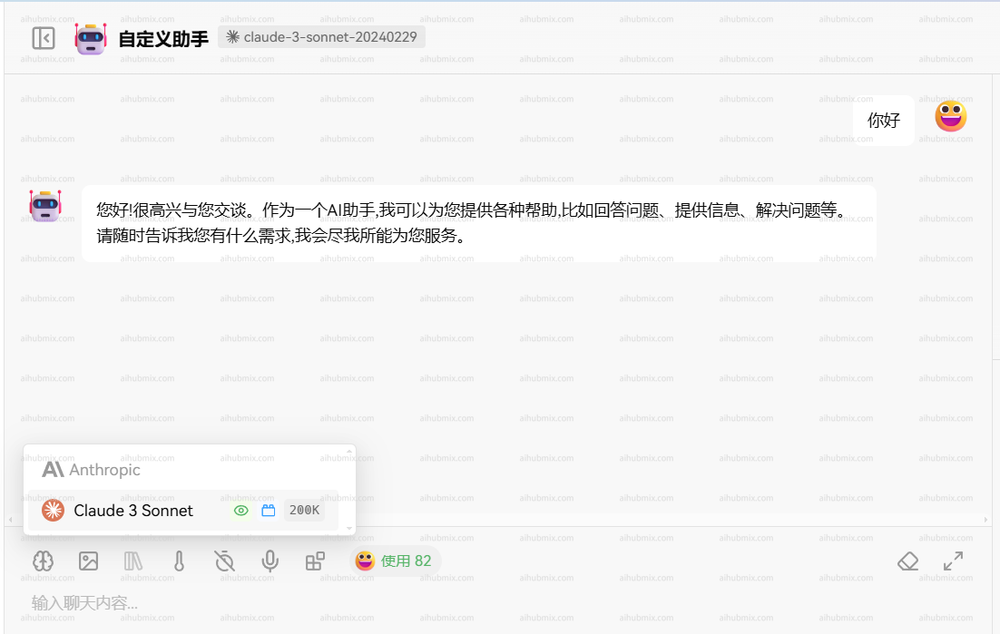

## Instructions

The Claude series models can be accessed via the official native API. Before using, make sure to install or upgrade the anthropic dependency:

```bash
pip install -U anthropic
```

<Info>
  For non-Claude models, please use the OpenAI API format instead.
</Info>

## Models Information

| Model             | Claude Opus 4 | Claude Sonnet 4 | Claude Sonnet 3.7 | Claude Sonnet 3.5 | Claude Haiku 3.5 | Claude Opus 3 | Claude Haiku 3 |
| ----------------- | ------------- | --------------- | ----------------- | ----------------- | ---------------- | ------------- | -------------- |
| Extended Thinking | Yes           | Yes             | Yes               | No                | No               | No            | No             |
| Context Window    | 200K          | 200K            | 200K              | 200K              | 200K             | 200K          | 200K           |
| Max Output        | 32000 tokens  | 64000 tokens    | 64000 tokens      | 8192 tokens       | 8192 tokens      | 4096 tokens   | 4096 tokens    |
| Training Cut-off  | Mar 2025      | Mar 2025        | Nov 2024          | Apr 2024          | July 2024        | Aug 2023      | Aug 2023       |

<Tip>
  1. For models version 3.5 and above, if you need output longer than 4096 tokens, be sure to explicitly specify the `"max_tokens"` parameter, referring to the `Max Output` column in the table above.
  2. For Sonnet 3.7, you can increase the max output from 64K to 128K by passing `extra_headers={"anthropic-beta": "output-128k-2025-02-19"}`. See the "Streaming 128K" example below.
</Tip>

## Claude 4 New Features

### New Refusal Stop Reason

Claude 4 models introduce a new `refusal` stop reason for content that the model declines to generate for safety reasons:

```json
{
  "id": "msg_014XEDjypDjFzgKVWdFUXxZP",
  "type": "message",
  "role": "assistant",
  "model": "claude-sonnet-4-20250514",
  "content": [{"type": "text", "text": "I would be happy to assist you. You can "}],
  "stop_reason": "refusal",
  "stop_sequence": null,
  "usage": {
    "input_tokens": 564,
    "cache_creation_input_tokens": 0,
    "cache_read_input_tokens": 0,
    "output_tokens": 22
  }
}
```

When migrating to Claude 4, you should update your application to handle `refusal` stop reasons.

### Extended Thinking

With extended thinking enabled, the Messages API for Claude 4 models returns a summary of Claude's full thinking process. Summarized thinking provides the full intelligence benefits of extended thinking, while preventing misuse.

While the API is consistent across Claude 3.7 and 4 models, streaming responses for extended thinking might return in a "chunky" delivery pattern, with possible delays between streaming events.

Summarization is processed by a different model than the one you target in your requests. The thinking model does not see the summarized output.

### Interleaved Thinking

Claude 4 models support interleaving tool use with extended thinking, allowing for more natural conversations where tool uses and responses can be mixed with regular messages.

Interleaved thinking is in beta. To enable interleaved thinking, add the beta header `interleaved-thinking-2025-05-14` to your API request:

```python
extra_headers={
    "anthropic-beta": "interleaved-thinking-2025-05-14"
}
```

**Endpoint:** `POST` /v1/messages

## Usage

<CodeGroup>

```shell Curl
curl https://aihubmix.com/v1/messages \ # Replace the official endpoint with AiHubMix's API endpoint
     --header "x-api-key: $AIHUBMIX_API_KEY" \ # Replace with the key you generated in AiHubMix
     --header "anthropic-version: 2023-06-01" \
     --header "content-type: application/json" \
     --data \
'{
    "model": "claude-3-5-sonnet-20241022",
    "max_tokens": 1024,
    "messages": [
        {"role": "user", "content": "Hello, world"}
    ]
}'
```


```py Python
import anthropic

# Initialize the Anthropics client
client = anthropic.Anthropic(
    api_key="sk-***", # Replace it by your AiHubMix Key
    base_url="https://aihubmix.com"
)

# Construct your message
message = client.messages.create(
    model="claude-3-7-sonnet-20250219",
    max_tokens=1024,
    messages=[
        {"role": "user", "content": "Hello, Claude"}
    ]
)

# Print the response content
print(message.content)
```

```py Python Streaming 128K
import anthropic

client = anthropic.Anthropic(
    api_key="sk-***", # Replace it by your AiHubMix Key
    base_url="https://aihubmix.com"
)

with client.messages.stream(
    model="claude-3-7-sonnet-20250219",
    max_tokens=128000,
    messages=[
        {"role": "user", "content": "Please generate the beginning of a novel that will span 100,000 tokens."}
    ],
    extra_headers={
        "anthropic-beta": "output-128k-2025-02-19"
    }
) as stream:
    for text in stream.text_stream:
        print(text, end="", flush=True)
```

```py Python Interleaved Thinking
import anthropic

client = anthropic.Anthropic(
    api_key="sk-***", # Replace it by your AiHubMix Key
    base_url="https://aihubmix.com"
)

response = client.messages.create(
    model="claude-sonnet-4-20250514",  # or claude-opus-4-20250514
    max_tokens=1024,
    messages=[
        {"role": "user", "content": "Help me analyze this data and generate charts"}
    ],
    tools=[
        {
            "type": "computer_20241022",
            "name": "computer"
        }
    ],
    extra_headers={
        "anthropic-beta": "interleaved-thinking-2025-05-14"
    }
)
print(response.content)
```

</CodeGroup>

### Request Body

```json
{
  "model": "claude-3-5-sonnet-20241022",
  "max_tokens": 1024,
  "messages": [
    {
      "role": "user",
      "content": "What is the meaning of life?"
    }
  ]
}
```

### Request Parameters

| Name         | Location | Type     | Required | Description             |
| ------------ | -------- | -------- | -------- | ----------------------- |
| x-api-key    | header   | string   | No       | Bearer AIHUBMIX_API_KEY |
| Content-Type | header   | string   | No       | none                    |
| body         | body     | object   | No       | none                    |
| » model      | body     | string   | Yes      | none                    |
| » messages   | body     | [object] | Yes      | none                    |
| »» role      | body     | string   | No       | none                    |
| »» content   | body     | string   | Yes      | none                    |
| » max_tokens | body     | number   | Yes      | none                    |

### Response Example

```json
200 Response
```

```json
{
  "id": "msg_013Uf6CwwyjSe35n3yVaPbLM",
  "type": "message",
  "role": "assistant",
  "model": "claude-3-5-sonnet-20241022",
  "content": [
    {
      "type": "text",
      "text": "That's one of humanity's most enduring and complex philosophical questions! While there's no universal answer, I aim to explore such questions thoughtfully while acknowledging their complexity. I try to focus on having meaningful conversations and helping where I can. What does meaning in life mean to you?"
    }
  ],
  "stop_reason": "end_turn",
  "stop_sequence": null,
  "usage": {
    "input_tokens": 14,
    "cache_creation_input_tokens": 0,
    "cache_read_input_tokens": 0,
    "output_tokens": 61
  }
}
```

### Response Results

| Status Code | Status Description | Description | Data Model |
| ----------- | ------------------ | ----------- | ---------- |
| 200         | OK                 | none        | Inline     |

## Migrating to Claude 4

If you're migrating from Claude 3.7 to Claude 4 models, please note the following changes:

### Update Model Names

```python
# From Claude 3.7
model="claude-3-7-sonnet-20250219"

# Migrate to Claude 4
model="claude-sonnet-4-20250514"  # or "claude-opus-4-20250514"
```

### Handle New Stop Reasons

Update your application to handle the new `refusal` stop reason:

```python
if response.stop_reason == "refusal":
    print("Claude refused to generate this content")
elif response.stop_reason == "end_turn":
    print("Completed normally")
```

### Remove Unsupported Features

- **Token-efficient tool use**: Only available in Claude Sonnet 3.7, no longer supported in Claude 4
- **Extended output**: The `output-128k-2025-02-19` beta header is only available in Claude Sonnet 3.7

If you're migrating from Claude Sonnet 3.7, we recommend removing these beta headers from your requests:

```python
# Remove these headers (if present)
# "token-efficient-tools-2025-02-19"
# "output-128k-2025-02-19"
```

## Using Claude in Applications (Example: Lobe-Chat)

Here's how you can configure Claude models in a third-party application like Lobe-Chat:

1. Navigate to the settings page and select **Claude** as your model provider.
2. Enter your [API Key](https://aihubmix.com/token) from AiHubMix.
3. Set the API proxy endpoint to:

   ```
   https://aihubmix.com
   ```
4. (Recommended) Enable the "Client Request Mode" option.
5. Add your chosen model to the model list.
   - It's recommended to copy the model name from AiHubMix's settings page and paste it in the application.




## Claude Text Editor Tool

Claude can use Anthropic's text editor tool to view and modify text files, helping you debug, fix, and improve code or other text documents. This enables Claude to interact directly with your files, providing practical assistance rather than just suggestions.

### Preparation Before Using the Text Editor Tool

Select a Compatible Model
Anthropic's text editor tool supports the following Claude models:

- **Claude 4 Models** (`claude-opus-4-20250514`, `claude-sonnet-4-20250514`): `text_editor_20250429`
- **Claude 3.7 Sonnet** (`claude-3-7-sonnet-20250219`): `text_editor_20250124`
- **Claude 3.5 Sonnet** (`claude-3-5-sonnet-20241022`): `text_editor_20241022`

<Warning>
Claude 4 models use a completely new text editor tool that is incompatible with older versions. Make sure to use the correct tool type and name.
</Warning>

### Model-Specific Tool Configuration

| Model Version | Tool Type | Tool Name | Supported Features |
|---------------|-----------|-----------|-------------------|
| Claude 4 (Opus/Sonnet) | `text_editor_20250429` | `str_replace_based_edit_tool` | view, str_replace, create |
| Claude 3.7 Sonnet | `text_editor_20250124` | `str_replace_editor` | view, str_replace, create, undo_edit |
| Claude 3.5 Sonnet | `text_editor_20241022` | `str_replace_editor` | view, str_replace, create, undo_edit |

<Tip>
**Important Change:** Claude 4 models no longer support the `undo_edit` command. Please remove any dependencies on this functionality from your code.
</Tip>

### Evaluating Use Cases
Here are some typical scenarios for using the text editor tool:

- Code Debugging: Help identify and fix issues in code, from syntax errors to logical problems.
- Code Refactoring: Improve code structure, readability, and performance through targeted edits.
- Documentation Generation: Add docstrings, comments, or README files to your codebase.
- Test Creation: Create unit tests based on implementation understanding.

### Using the Text Editor Tool
Provide the text editor tool to Claude through the Messages API:
You need to install the `anthropic` package:
```shell
pip install anthropic
```

**Usage Example:**
<CodeGroup>
  
```py python-Claude 4
import anthropic

client = anthropic.Anthropic(
    api_key="AIHUBMIX_API_KEY", # Replace with the key you generated in AiHubMix
    base_url="https://aihubmix.com"
)

response = client.messages.create(
    model="claude-sonnet-4-20250514",  # or claude-opus-4-20250514
    max_tokens=1024,
    tools=[
        {
            "type": "text_editor_20250429",
            "name": "str_replace_based_edit_tool"
        }
    ],
    messages=[
        {
            "role": "user", 
            "content": "There's a syntax error in my primes.py file. Can you help me fix it?"
        }
    ]
)

print("Response content:")
for message in response.content:
    print(message.text)
```

```py python-Claude 3.7
import anthropic

client = anthropic.Anthropic(
    api_key="AIHUBMIX_API_KEY", # Replace with the key you generated in AiHubMix
    base_url="https://aihubmix.com"
)

response = client.messages.create(
    model="claude-3-7-sonnet-20250219",
    max_tokens=1024,
    tools=[
        {
            "type": "text_editor_20250124",
            "name": "str_replace_editor"
        }
    ],
    messages=[
        {
            "role": "user", 
            "content": "There's a syntax error in my primes.py file. Can you help me fix it?"
        }
    ]
)

print("Response content:")
for message in response.content:
    print(message.text)
```

```shell Curl-Claude 4
curl -X POST https://aihubmix.com/v1/messages \
  -H "Content-Type: application/json" \
  -H "x-api-key: xxx" \
  -H "anthropic-version: 2023-06-01" \
  -d '{
    "model": "claude-sonnet-4-20250514",
    "max_tokens": 1024,
    "tools": [
      {
        "type": "text_editor_20250429",
        "name": "str_replace_based_edit_tool"
      }
    ],
    "messages": [
      {
        "role": "user",
        "content": "There'\''s a syntax error in my primes.py file. Can you help me fix it?"
      }
    ]
  }'
```

```shell Curl-Claude 3.7
curl -X POST https://aihubmix.com/v1/messages \
  -H "Content-Type: application/json" \
  -H "x-api-key: xxx" \
  -H "anthropic-version: 2023-06-01" \
  -d '{
    "model": "claude-3-7-sonnet-20250219",
    "max_tokens": 1024,
    "tools": [
      {
        "type": "text_editor_20250124",
        "name": "str_replace_editor"
      }
    ],
    "messages": [
      {
        "role": "user",
        "content": "There'\''s a syntax error in my primes.py file. Can you help me fix it?"
      }
    ]
  }'
```

</CodeGroup>

### Migrating to Claude 4 (Text Editor Tool)

If you're migrating from Claude 3.7 Sonnet to Claude 4 models, please note the following changes:

#### Update Tool Configuration

```py python
# Claude 3.7 Sonnet
tools=[
    {
        "type": "text_editor_20250124",
        "name": "str_replace_editor"
    }
]

# Claude 4 (Opus/Sonnet)
tools=[
    {
        "type": "text_editor_20250429",
        "name": "str_replace_based_edit_tool"
    }
]
```

#### Remove Unsupported Features

- **`undo_edit` command**: Claude 4 models no longer support the undo edit functionality
- Please remove any logic that depends on `undo_edit` from your code

Response Example:
```json
{
  "id": "msg_bdrk_012xyNaFCQg4zsVcTk5VkDAe",
  "type": "message",
  "role": "assistant",
  "content": [
    {
      "type": "text",
      "text": "I'd be happy to help you fix the syntax error in your `primes.py` file. First, let me take a look at the file to identify the issue."
    },
    {
      "type": "tool_use",
      "text": "",
      "id": "toolu_bdrk_01P6jQG6suDSsDjzugqGVHWC",
      "name": "str_replace_based_edit_tool",
      "input": {
        "command": "view",
        "path": "/repo/primes.py"
      }
    }
  ],
  "model": "claude-sonnet-4-20250514",
  "stop_reason": "tool_use",
  "usage": {
    "input_tokens": 1042,
    "output_tokens": 115
  }
}
```
