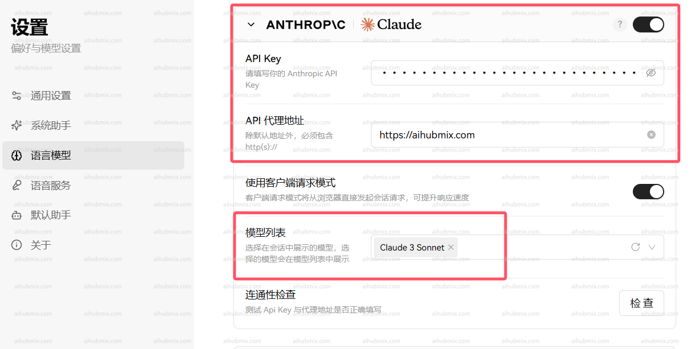

## Description

The Claude series models support official native API calls. Before using, ensure that the `anthropic` dependency is installed or upgraded:

```bash
pip install -U anthropic
```

## Model Information

| Model Name       | Claude Opus 4.6                                 | Claude Sonnet 4.6                               | Claude Sonnet 4.5 | Claude Haiku 4.5 |
| ---------------- | ----------------------------------------------- | ----------------------------------------------- | ----------------- | ---------------- |
| Supports Extended Thinking | Yes                                               | Yes                                               | Yes                 | Yes                |
| Context Window Size | 200K tokens /<br />1M tokens (beta)<sup>3</sup> | 200K tokens /<br />1M tokens (beta)<sup>3</sup> | 200K              | 200K             |
| Maximum Output Length | 128K tokens                                     | 128K tokens                                     | 64K tokens        | 64K tokens       |
| Training Data Cutoff | August 2025                                         | August 2025                                         | July 2025           | July 2025          |

## New Features in Claude 4.6

### Adaptive Thinking

Claude 4.6 recommends using a new adaptive thinking mode, where Claude automatically determines whether to think and the depth of thinking based on the complexity of the question:

```python
thinking={"type": "adaptive"}
```

<Warning>
  `thinking: {type: "enabled", budget_tokens: N}` has been deprecated in 4.6 and will be removed in future versions.
</Warning>

### Automatic Context Compaction (Beta)

When conversations approach the context window limit, Claude 4.6 can automatically perform server-side summary compaction of earlier content.

**Advantages:**

- Supports ultra-long conversations
- No need for client-side summarization
- Enhances agent's ability for continuous dialogues

**Note:**

- Automatic compaction may lose some details
- It is recommended to evaluate tests in scenarios requiring strong consistency

### Deprecations and Changes

- **Removed `interleaved-thinking-2025-05-14` Beta Header:** In 4.6, adaptive thinking now automatically supports interleaved thinking, and there is no need to add `extra_headers`. If still added, this header will be safely ignored.

## New Features in Claude 4

### New Refusal Stop Reason

The Claude 4 model introduces a new `refusal` stop reason to handle cases where the model refuses to generate content for safety reasons:

```json
{
  "id": "msg_014XEDjypDjFzgKVWdFUXxZP",
  "type": "message",
  "role": "assistant",
  "model": "claude-sonnet-4-20250514",
  "content": [{"type": "text", "text": "I would be happy to assist you. You can "}],
  "stop_reason": "refusal",
  "stop_sequence": null,
  "usage": {
    "input_tokens": 564,
    "cache_creation_input_tokens": 0,
    "cache_read_input_tokens": 0,
    "output_tokens": 22
  }
}
```

When migrating to Claude 4, you should update your application to handle the `refusal` stop reason.

### Extended Thinking

Once extended thinking is enabled, the Claude 4 model's Messages API will return a summary of Claude's complete thought process. The summary provides all the intelligent advantages of extended thinking while preventing abuse.

While the API remains consistent between Claude 3.7 and 4 models, the streaming response for extended thinking may return in a "chunked" mode, with possible delays between streaming events.

The summary is processed by a model different from the one specified in your request. The thinking model will not see the summary output.

### Interleaved Thinking

Claude 4 model supports interleaving tool usage with extended thinking, allowing for more natural conversations where tool usage and responses can be mixed with regular messages.

Interleaved thinking is currently in testing. To enable interleaved thinking, add the test header `interleaved-thinking-2025-05-14` in your API request:

```python
extra_headers={
    "anthropic-beta": "interleaved-thinking-2025-05-14"
}
```

**Endpoint:** `POST` /v1/messages

## Invocation

<CodeGroup>

```shell Curl
curl https://aihubmix.com/v1/messages \
     --header "x-api-key: $ANTHROPIC_API_KEY" \ # Replace with the key generated on AiHubMix
     --header "anthropic-version: 2023-06-01" \
     --header "content-type: application/json" \
     --data \
'{
    "model": "claude-3-5-sonnet-20241022",
    "max_tokens": 1024,
    "messages": [
        {"role": "user", "content": "Hello, world"}
    ]
}'
```


```py Python Non-streaming
import anthropic

client = anthropic.Anthropic(
    api_key="sk-***", # Replace with the key generated on AiHubMix
    base_url="https://aihubmix.com"
)
message = client.messages.create(
    model="claude-3-5-sonnet-20241022",
    max_tokens=1024,
    messages=[
        {"role": "user", "content": "Hello, Claude"}
    ]
)
print(message.content)
```


```py Python Streaming 128K
import anthropic

client = anthropic.Anthropic(
    api_key="sk-***", # Replace with the key generated on AiHubMix
    base_url="https://aihubmix.com"
)

with client.messages.stream(
    model="claude-3-7-sonnet-20250219",  # claude-opus-4-20250514, claude-sonnet-4-20250514
    max_tokens=128000,
    messages=[
        {"role": "user", "content": "Please generate a 100,000 token article that elaborates on Charlie Munger's 100 mental models (approximately 1,000 tokens for each model), with each section including an introduction to the model, multidimensional thinking, application methods, practical blind spots, and specific examples. Clarity and engagement are key. Use bullet points only when necessary."}
    ],
    extra_headers={
        "anthropic-beta": "output-128k-2025-02-19"
    }
) as stream:
    for text in stream.text_stream:
        print(text, end="", flush=True)
```


```py Python Interleaved Thinking
import anthropic

client = anthropic.Anthropic(
    api_key="sk-***", # Replace with the key generated on AiHubMix
    base_url="https://aihubmix.com"
)

response = client.messages.create(
    model="claude-sonnet-4-20250514",  # or claude-opus-4-20250514
    max_tokens=1024,
    messages=[
        {"role": "user", "content": "Help me analyze this data and generate a chart"}
    ],
    tools=[
        {
            "type": "computer_20241022",
            "name": "computer"
        }
    ],
    extra_headers={
        "anthropic-beta": "interleaved-thinking-2025-05-14"
    }
)
print(response.content)
```

</CodeGroup>

### Body Request Structure

```json
{
  "model": "claude-3-5-sonnet-20241022",
  "max_tokens": 1024,
  "messages": [
    {
      "role": "user",
      "content": "What is the meaning of life?"
    }
  ]
}
```

### Request Parameters

| Name           | Location | Type     | Required | Description          |
| -------------- | -------- | -------- | -------- | -------------------- |
| x-api-key      | header   | string   | No       | AIHUBMIX_API_KEY     |
| Content-Type   | header   | string   | No       | none                 |
| body           | body     | object   | No       | none                 |
| » model        | body     | string   | Yes      | none                 |
| » messages     | body     | [object] | Yes      | none                 |
| »» role        | body     | string   | No       | none                 |
| »» content     | body     | string   | Yes      | none                 |
| » max_tokens   | body     | number   | Yes      | none                 |

### Response Example

```json
200 Response
```

```json
{
  "id": "msg_013Uf6CwwyjSe35n3yVaPbLM",
  "type": "message",
  "role": "assistant",
  "model": "claude-3-5-sonnet-20241022",
  "content": [
    {
      "type": "text",
      "text": "That's one of humanity's most enduring and complex philosophical questions! While there's no universal answer, I aim to explore such questions thoughtfully while acknowledging their complexity. I try to focus on having meaningful conversations and helping where I can. What does meaning in life mean to you?"
    }
  ],
  "stop_reason": "end_turn",
  "stop_sequence": null,
  "usage": {
    "input_tokens": 14,
    "cache_creation_input_tokens": 0,
    "cache_read_input_tokens": 0,
    "output_tokens": 61
  }
}
```

### Response Results

| Status Code | Status Meaning | Description | Data Model |
| ----------- | -------------- | ----------- | ---------- |
| 200         | OK             | none        | Inline     |

## Migrating to Claude 4

If you are migrating from the Claude 3.7 to Claude 4 models, be aware of the following changes:

### Update Model Name

```python
# From Claude 3.7
model="claude-3-7-sonnet-20250219"

# Migrate to Claude 4
model="claude-sonnet-4-20250514"  # or "claude-opus-4-20250514"
```

### Handle New Stop Reasons

Update your application to handle the new `refusal` stop reason:

```python
if response.stop_reason == "refusal":
    print("Claude refuses to generate this content")
elif response.stop_reason == "end_turn":
    print("Completed normally")
```

### Remove Unsupported Features

- **Token Efficient Tool Usage:** Only available in Claude Sonnet 3.7, no longer supported in Claude 4
- **Extended Output:** The `output-128k-2025-02-19` test header is only available in Claude Sonnet 3.7

If you are migrating from Claude Sonnet 3.7, it is recommended to remove these test headers from your requests:

```python
# Remove these headers (if present)
# "token-efficient-tools-2025-02-19"
# "output-128k-2025-02-19"
```

## Using in Applications (Example with Lobe-Chat)

- Go to the settings page and select the model provider Claude
- Input the API key from [our site](https://aihubmix.com/token)
- Enter the API proxy address directly as follows:

```
https://aihubmix.com
```

- It is recommended to enable "Use Client Request Mode"
- Finally, add the models you wish to use to the model list (it is suggested to copy and paste the model name from our website's settings page)\\

  

  

## Claude Text Editing Tools

Claude can use text editing tools defined by Anthropic to view and modify text files, helping you debug, fix, and improve code or other text documents. This enables Claude to interact directly with your files, providing practical operational assistance rather than just suggestions.

### Preparation Before Using Text Editing Tools

Select compatible models. Anthropic's text editing tools support the following Claude models:

- **Claude 4 Series Models** (`claude-opus-4-20250514`, `claude-sonnet-4-20250514`): `text_editor_20250429`
- **Claude 3.7 Sonnet** (`claude-3-7-sonnet-20250219`): `text_editor_20250124`
- **Claude 3.5 Sonnet** (`claude-3-5-sonnet-20241022`): `text_editor_20241022`

<Warning>
  Claude 4 models use a brand new text editing tool that is not compatible with older versions. Please ensure you are using the correct tool type and name.
</Warning>

### Tool Configuration per Model

| Model Version               | Tool Type                   | Tool Name                          | Supported Features                      |
| --------------------------- | --------------------------- | ---------------------------------- | --------------------------------------- |
| Claude 4 (Opus/Sonnet)      | `text_editor_20250429`     | `str_replace_based_edit_tool`     | view, str_replace, create              |
| Claude 3.7 Sonnet           | `text_editor_20250124`     | `str_replace_editor`              | view, str_replace, create, undo_edit   |
| Claude 3.5 Sonnet           | `text_editor_20241022`     | `str_replace_editor`              | view, str_replace, create, undo_edit   |

<Tip>
  **Important Change:** The Claude 4 model no longer supports the `undo_edit` command. Please remove any dependencies on this functionality from your code.
</Tip>

### Assessment of Use Cases

Here are some typical scenarios for using text editing tools:

- Code Debugging: Helps identify and fix issues in code, ranging from syntax errors to logical problems.
- Code Refactoring: Improves code structure, readability, and performance through targeted edits.
- Documentation Generation: Adds documentation strings, comments, or README files to your codebase.
- Test Creation: Creates unit tests based on an understanding of the implementation.

### Using Text Editing Tools

Provide Claude with text editing tools (named `str_replace_editor`) through the Messages API: You need to install the `anthropic` package:

```shell
pip install anthropic
```

**Invocation Examples:**

<CodeGroup>

```python Python-Claude 4
import anthropic

client = anthropic.Anthropic(
    api_key="sk-***", # Replace with the key generated on AiHubMix
    base_url="https://aihubmix.com"
)

response = client.messages.create(
    model="claude-sonnet-4-20250514",  # or claude-opus-4-20250514
    max_tokens=1024,
    tools=[
        {
            "type": "text_editor_20250429",
            "name": "str_replace_based_edit_tool"
        }
    ],
    messages=[
        {
            "role": "user", 
            "content": "There's a syntax error in my primes.py file. Can you help me fix it?"
        }
    ]
)

print("Response content:")
for message in response.content:
    print(message.text)
```


```py Python-Claude 3.7
import anthropic

client = anthropic.Anthropic(
    api_key="sk-***", # Replace with the key generated on AiHubMix
    base_url="https://aihubmix.com"
)

response = client.messages.create(
    model="claude-3-7-sonnet-20250219",
    max_tokens=1024,
    tools=[
        {
            "type": "text_editor_20250124",
            "name": "str_replace_editor"
        }
    ],
    messages=[
        {
            "role": "user", 
            "content": "There's a syntax error in my primes.py file. Can you help me fix it?"
        }
    ]
)

print("Response content:")
for message in response.content:
    print(message.text)
```


```shell Curl-Claude 4
curl -X POST https://aihubmix.com/v1/messages \
  -H "Content-Type: application/json" \
  -H "x-api-key: xxx" \
  -H "anthropic-version: 2023-06-01" \
  -d '{
    "model": "claude-sonnet-4-20250514",
    "max_tokens": 1024,
    "tools": [
      {
        "type": "text_editor_20250429",
        "name": "str_replace_based_edit_tool"
      }
    ],
    "messages": [
      {
        "role": "user",
        "content": "There'\''s a syntax error in my primes.py file. Can you help me fix it?"
      }
    ]
  }'
```


```shell Curl-Claude 3.7
curl -X POST https://aihubmix.com/v1/messages \
  -H "Content-Type: application/json" \
  -H "x-api-key: xxx" \
  -H "anthropic-version: 2023-06-01" \
  -d '{
    "model": "claude-3-7-sonnet-20250219",
    "max_tokens": 1024,
    "tools": [
      {
        "type": "text_editor_20250124",
        "name": "str_replace_editor"
      }
    ],
    "messages": [
      {
        "role": "user",
        "content": "There'\''s a syntax error in my primes.py file. Can you help me fix it?"
      }
    ]
  }'
```

</CodeGroup>

### Migrating to Claude 4 (Text Editing Tools)

If you are migrating from Claude 3.7 Sonnet to Claude 4 models, be aware of the following changes:

#### Update Tool Configuration

```py python
# Claude 3.7 Sonnet
tools=[
    {
        "type": "text_editor_20250124",
        "name": "str_replace_editor"
    }
]

# Claude 4 (Opus/Sonnet)
tools=[
    {
        "type": "text_editor_20250429",
        "name": "str_replace_based_edit_tool"
    }
]
```

#### Remove Unsupported Features

- **`undo_edit command`**: The Claude 4 model no longer supports the undo edit functionality.
- Please remove any logic that depends on `undo_edit` from your code.

Response Example:

```json
{
  "id": "msg_bdrk_012xyNaFCQg4zsVcTk5VkDAe",
  "type": "message",
  "role": "assistant",
  "content": [
    {
      "type": "text",
      "text": "I'd be happy to help you fix the syntax error in your `primes.py` file. First, let me take a look at the file to identify the issue."
    },
    {
      "type": "tool_use",
      "text": "",
      "id": "toolu_bdrk_01P6jQG6suDSsDjzugqGVHWC",
      "name": "str_replace_based_edit_tool",
      "input": {
        "command": "view",
        "path": "/repo/primes.py"
      }
    }
  ],
  "model": "claude-sonnet-4-20250514",
  "stop_reason": "tool_use",
  "usage": {
    "input_tokens": 1042,
    "output_tokens": 115
  }
}
```