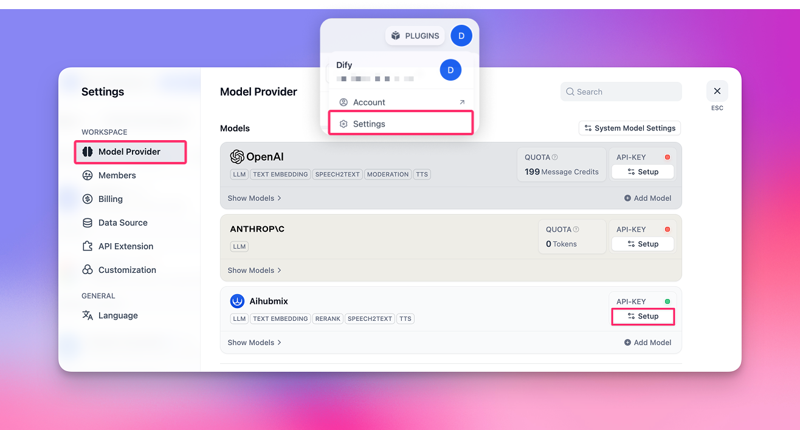

## Installation

1. Click the 'PLUGIN' on the top right of the [Dify page](https://cloud.dify.ai/apps)
2. Click the '+ Install plugin' button
3. Select 'Local Package File'
4. Select the [dify-plugin-aihubmix.difypkg](https://www.resource.nestsound.cn/plugin/dify-plugin-aihubmix.difypkg) that has been downloaded to your local machine for installation

👉 Dify plugin [page](https://marketplace.dify.ai/plugins/langgenius/aihubmix?language=en-US&theme=system)

**Example image:**
  

## Configuration
1. Click the avatar on the top right of the page → Select 'Settings'
2. Click the 'Model Provider' Tab
3. Find Aihubmix in the right side → Expand Setup, and fill in your [API Key](https://aihubmix.com/token)

  

**Currently, the following 5 categories of models are pre-configured:**
- LLM: Large language model
- TEXT EMBEDDING: Vector embedding model
- RERANK: Re-ranking model
- SPEECH2TEXT: Speech-to-text model
- TTS: Text-to-speech model

  

**How to add more custom models?**

Click '+ Add model', and fill in the Model Name option:
- Fill in any [model ID](https://aihubmix.com/models) in the model gallery, such as `gpt-4o-2024-11-20`.
- Fill in your API Key, and click 'Save.

Note: due to the special design of the Dify plugin, it currently does not support image generation models, so models like `gpt-image-1` cannot be added.

  

## LLM selection

In the Workflow node, select 'LLM', and you can select the models provided by Aihubmix.

**Example image:**
  

## Embeddings/Reranker model selection

Embeddings/Reranker models are mainly used for knowledge base question answering, you can quickly experience it in the top Knowledge Tab, and also select the corresponding model in the Workflow node.

**Example image:**
  

## TTS/SST selection

TTS/SST models are mainly used for speech parsing and synthesis, when selecting tools, the corresponding is not the regular 'LLM', but the 'Audio' type in the 'Tools' Tab.
Corresponding relationship:
1. TTS text-to-speech: select 'Text to Speech'
2. SST speech-to-text: select 'Speech to Text'

**Example image:**
