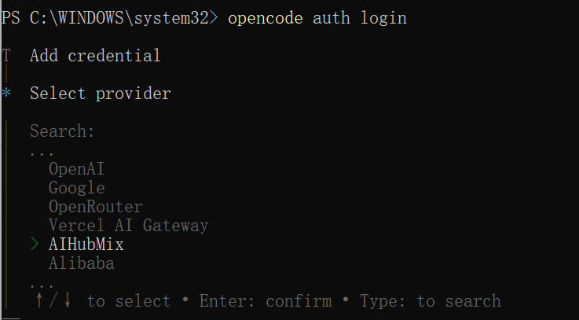
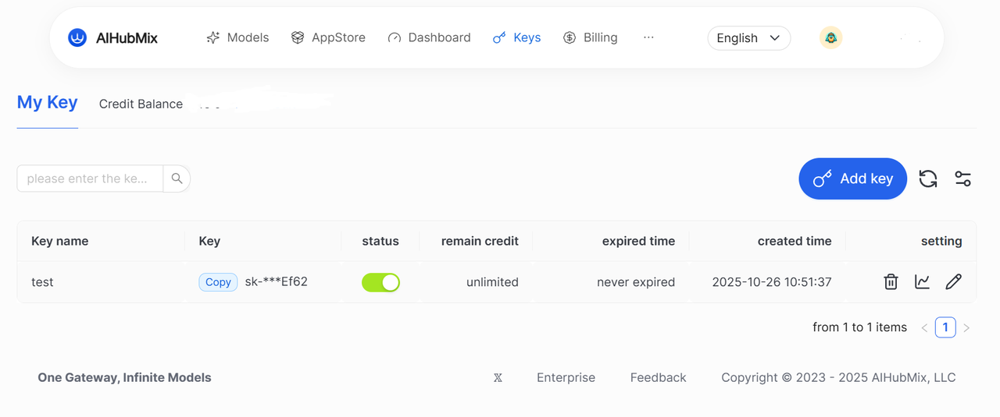
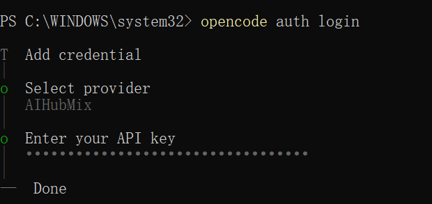
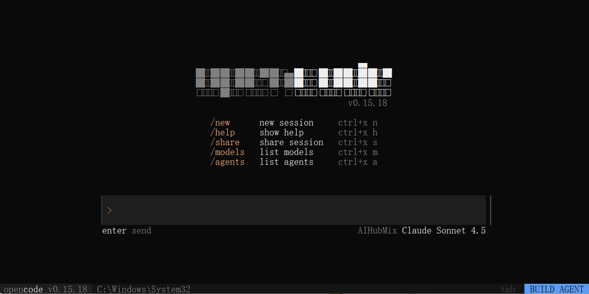
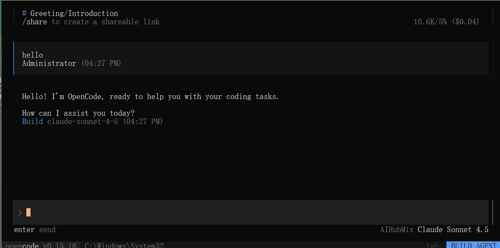

OpenCode now supports AiHubMix as a new model provider. You can use your AiHubMix API key within OpenCode to access its model services.

AiHubMix currently supports major model families, including GPT, Claude, DeepSeek, Gemini, and Qwen.  For optimal performance in OpenCode, the following models are recommended:

- `claude-sonnet-4-5`
- `glm-4.6`
- `gpt-5`
- `gpt-5-codex`

This guide provides step-by-step instructions for installing, configuring, and launching OpenCode across different operating systems, as well as connecting it to the AiHubMix API.

---

## System Requirements

Before installation, ensure your system meets the following requirements:

- Node.js ≥ 18.0.0
- Package manager (optional, depending on OS):
  - macOS / Linux: `brew`
  - Arch Linux: `paru`
  - Windows: `choco`, `winget`, or `scoop`

---

1. Installing OpenCode

You can install OpenCode using any of the following methods:

**Using Node.js**

```
# Using CURL 
curl -fsSL https://opencode.ai/install | bash

# Using NPM
npm install -g opencode-ai

# Using Bun
bun install -g opencode-ai

# Using PNPM
pnpm install -g opencode-ai

# Using Yarn
yarn global add opencode-ai
```

---

**Using Homebrew (macOS / Linux)**

```
brew install sst/tap/opencode
```

---

**Using Paru (Arch Linux)**

```
paru -S opencode-bin
```

---

**On Windows**

```
# Using Chocolatey
choco install opencode

# Using WinGet
winget install opencode

# Using Scoop
scoop bucket add extras
scoop install extras/opencode

# Using NPM (requires Node.js and admin privileges)
npm install -g opencode-ai
```

---

2. Launching and Logging into OpenCode

After installation, follow these steps to log in and configure OpenCode.

### Step 1. Log In

Run the following command in your terminal:

```
opencode auth login
```

---

### Step 2. Select an AI Provider

In the login interface, choose AiHubMix as your model provider.



---

### Step 3. Authorize with API Key

Log in to your AiHubMix account to obtain your API key.  Enter it on the OpenCode login screen to complete authorization.





---

3. Verify the Installation

To confirm that OpenCode has been installed and configured successfully, run:

```
opencode
```

  

If the console returns a valid model response, the setup is complete.



---

4. Issues & Tips

- If your API key fails validation, reauthenticate with AiHubMix and verify the key’s status.
- View in-app help:`opencode` -\> `/help`
- Official documentation: https://opencode.ai/docs/