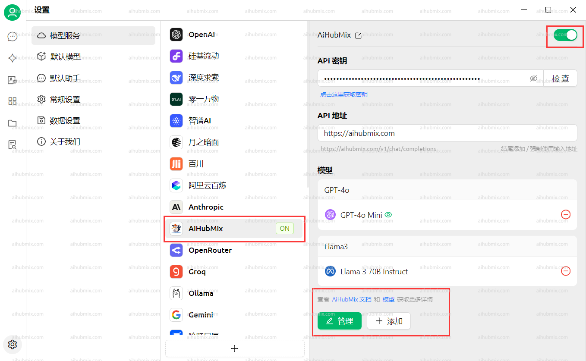

[**Download Cherry Studio AI**](https://easys.run/cherry-studio/)

## General Usage

1. Open **Settings** from the bottom-left corner of the app.

   
2. In the **Model Providers** section, select **AiHubMix** and click the button in the top-right corner to enable it.
3. In the **API Key** field, enter [the Key from this site](https://aihubmix.com/token).\
   Leave the **API Base URL** unchanged.\
   **Note: If the connection check fails, try disabling your VPN.**

   
4. Click **Add Model** at the bottom.\
   For the **Model ID**, go to the settings page on this website, select the model you want to use, and copy-paste its name.

   

## FAQ

### The model indicates it cannot see images

Some newer models may not recognize images after they are uploaded.\
In this case, you need to manually enable the **Image** option on the settings page.

<Tip>
  The `gemini-3-pro-image-preview` model cannot return images when **streaming output** is enabled.\
  Please disable streaming output when using this model.

  
</Tip>

### Calling Claude models returns `AI_APICallError`

Check whether the request URL shown in the error message is\
`https://aihubmix.com/anthropic/v1/messages`.

If so, go to **Settings** and change the **Anthropic API Host** to: `https://aihubmix.com`

