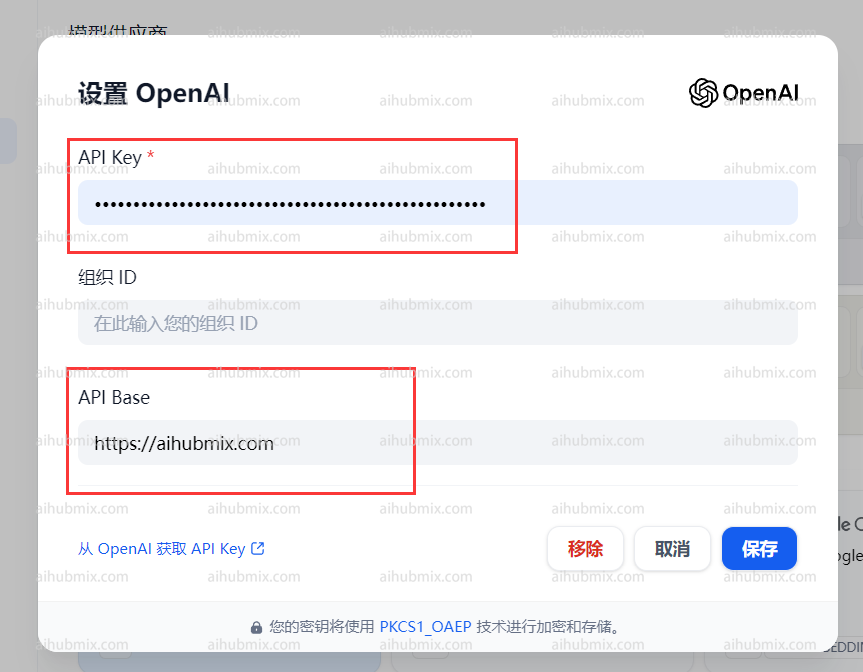
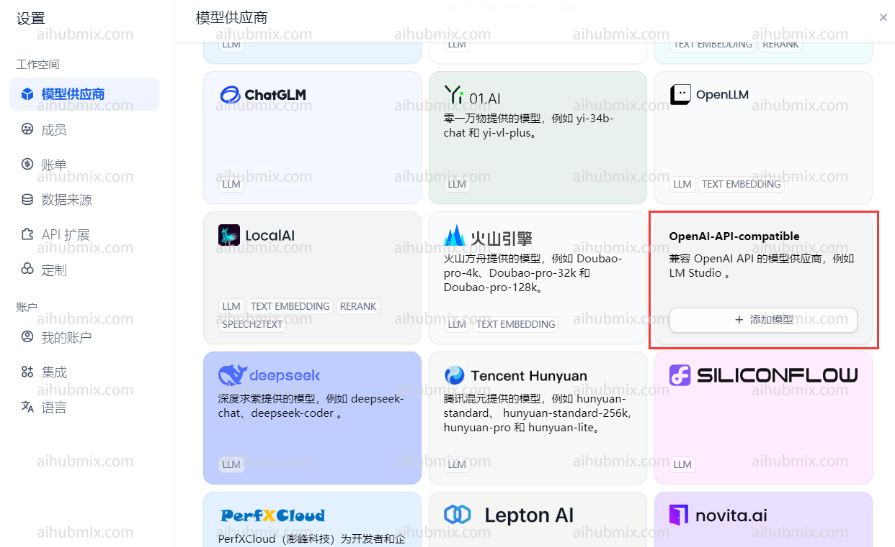
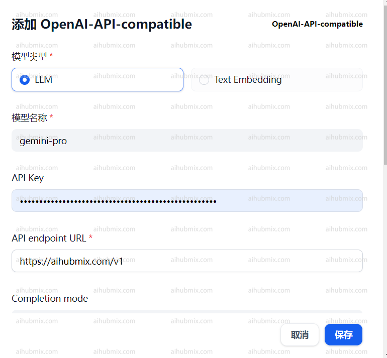
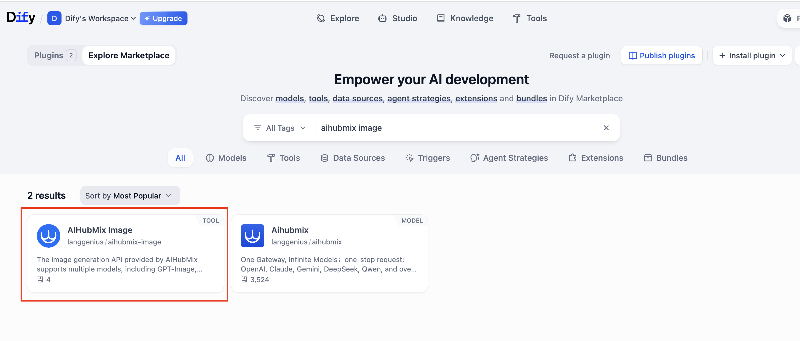
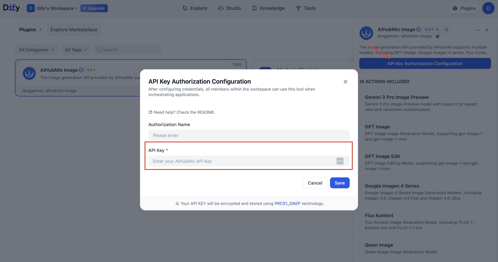
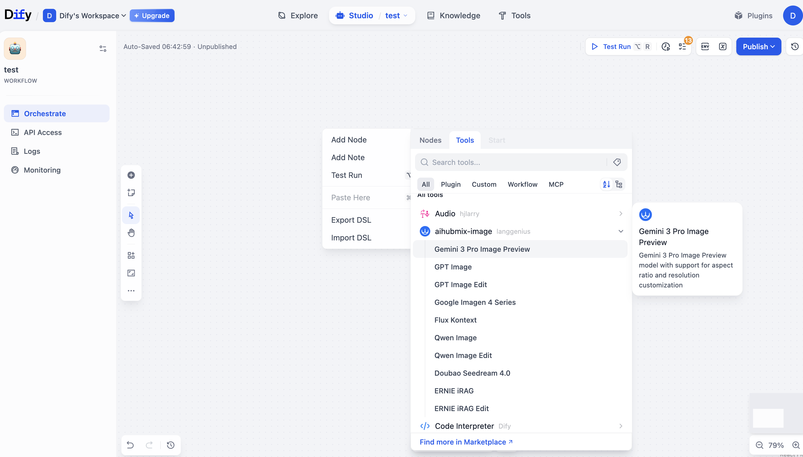

## Large Language Model

## Standard Usage (Using OpenAI Models)

Click your username in the top right corner of the webpage to enter the settings interface.\
Select OpenAI in the model provider section and open settings.


- Enter the [Key from our site](https://aihubmix.com/token) in the API Key field.
- Enter the following in the API Base field:

```
https://aihubmix.com
```



## Using Non-OpenAI Models

In the model provider dropdown, find OpenAI-API-compatible and click to add a model.\\



- Open the website's backend settings page and find the model list.
- Copy the name of the model you want to use (e.g., gemini-pro or claude-3-opus-20240229).
- Enter the [Key from our site](https://aihubmix.com/token) in the API Key field.
- Enter the following in the API endpoint URL field:

```
https://aihubmix.com/v1
```



## Image Generation Models

The platform currently supports the following image generation models:

- **Nano Banana Pro**
- **GPT-Image**
- **Google Imagen 4 Series**
- **Flux Kontext**

### How to Use

#### 1. Install the Plugin

Search for and install the plugin: [**AIHubMix Image**](https://marketplace.dify.ai/plugins/langgenius/aihubmix-image?source=https%253A%252F%252Fcloud.dify.ai&language=en-US&theme=system)



#### 2. Configure the AIHUBMIX API Key

Enter your **API Key** in the plugin configuration page.



#### 3. Add a Node

Go to: **Workspace → Add Node → Tools → aihubmix-image**, then select the model you want to use.



#### 4. Model Configuration

Adjust the parameters based on your use case (e.g., prompt, resolution, aspect ratio, etc.).

#### 5. Run the Workflow

After the configuration is complete, run the workflow to call the **AIHUBMIX Image Generation API** and generate images.

<Tip>
  The API returns images in **URL** and **Base64** formats. Please convert the format based on your use case.
</Tip>