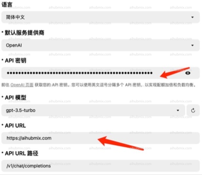
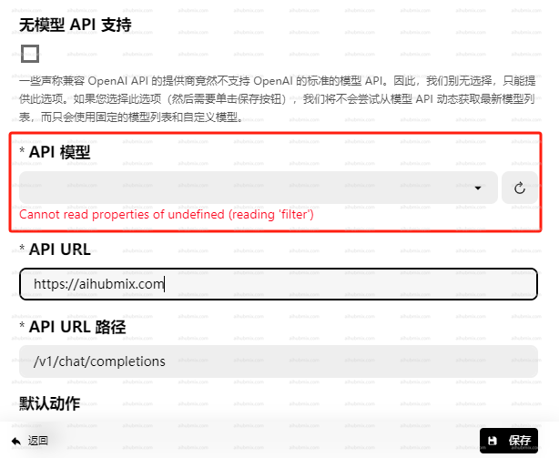
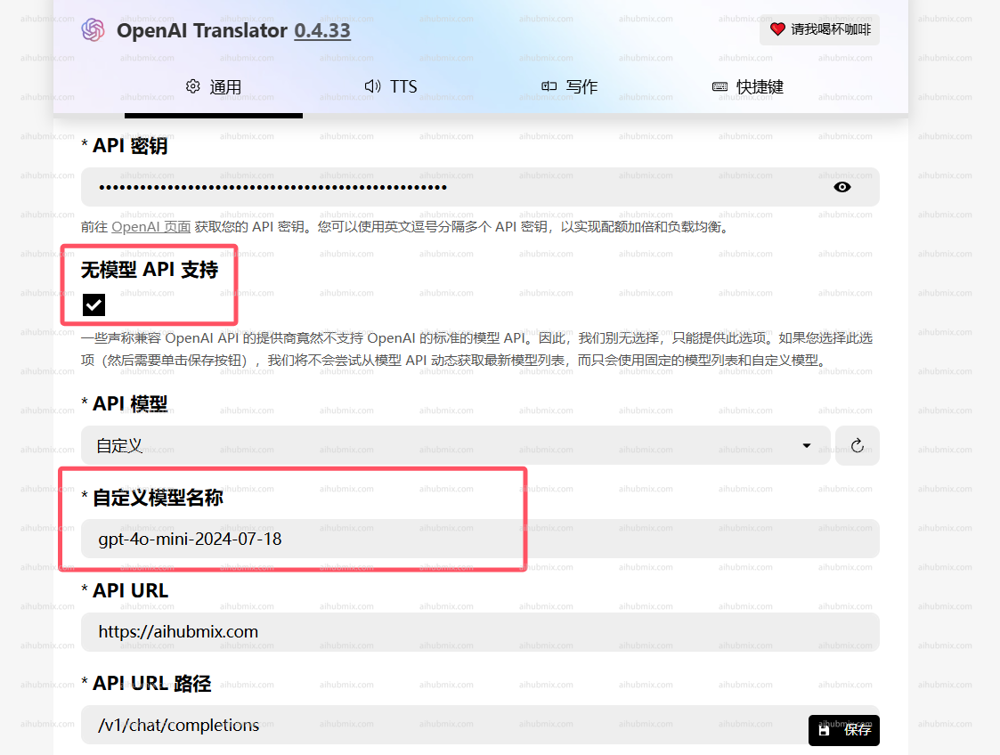

Tip: Translation software is advised not to use OpenAI's O-series and GPT-5 series models.

- For example: OpenAI Translator;  
- Change the API Key to one generated from [our site’s Key](https://aihubmix.com/token).  
- Change the API URL to:
```
https://aihubmix.com
```
(Note: Do not include a "/" at the end of the URL)  
 

## If You Encounter Issues with Models Not Loading
**Note:**
If versions 0.4.33 and 0.4.34 are unable to load models, please revert to the older version.  
Older version link: https://github.com/openai-translator/openai-translator/releases/tag/v0.4.32  
If you encounter issues with OpenAI Translator not allowing API model selection:
  
**You can try the following solutions:**
- Check the "Support for API without models" option.
- Copy the model name from our website's settings page and enter it manually.

