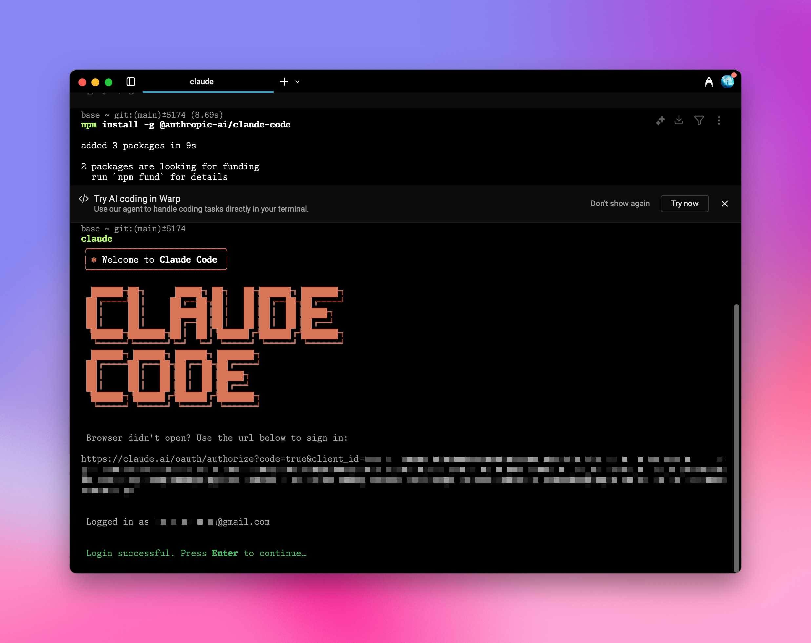
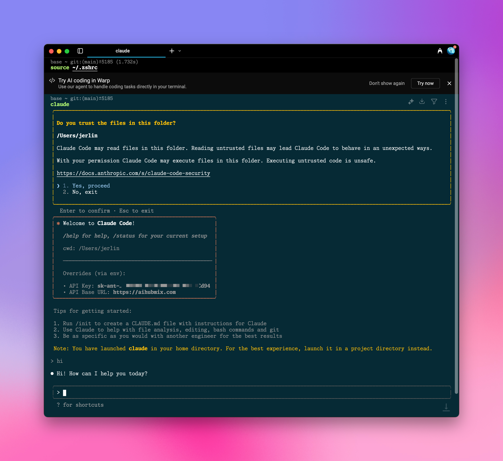

AiHubmixでClaude Codeを強化し、接続の不安定さやクレジット購入の困難さに悩まされることはもうありません。

## クイック設定ガイド：

### 1️⃣ npmパッケージをグローバルインストール

ターミナルで以下を実行します。

```shell
npm install -g @anthropic-ai/claude-code
```

例の図：



### 2️⃣ 環境変数設定

AiHubmixの[「Keys」ページ](https://aihubmix.com/token)でキーを生成し、システム環境変数にこのキーと転送アドレスを入力します。

例えば、~/.zshrcに以下を追加します。

```shell
export ANTHROPIC_API_KEY="sk-***"
export ANTHROPIC_BASE_URL="https://aihubmix.com"
```

<Tip>
  Macユーザーの場合、`ユーザー名`ディレクトリでショートカット `⌘ + ⇧ + .` を使用して隠しファイル.zshrcを表示し、システムの「テキストエディット」アプリで開いて上記の内容を追加できます。
</Tip>

### 3️⃣ 設定を有効にする

設定を追加した後、ターミナルで`source ~/.zshrc`を実行し、Enterキーを押します。

### 4️⃣ ターミナル起動

ターゲットプロジェクトディレクトリに移動します。例えば`cd ~/Desktop/my-project`
`claude`と入力して起動すると、使用できます。

## 初期設定

### 認証

認証ページが表示されたら、Claude公式サイトに移動して確認し、認証が成功したらターミナルに戻ります。認証には有料アカウントは必要ありません。無料のClaudeアカウントを適当に登録するだけで十分です。


### 起動

起動後、Claude Codeは現在の設定情報（APIキーとAPIベースURLを含む）を表示します。
確認が必要な箇所でYesを選択してEnterキーを押すと、すべての設定が完了します。



例えば：Claudeがシステム環境変数にカスタムキーを検出した場合、`Yes`を選択します。

```
環境でカスタムAPIキーが検出されました

ANTHROPIC_API_KEY: sk-***
このAPIキーを使用しますか？

> 1. はい
2. いいえ（推奨）

Enterで確認。Escでキャンセル
```

どうぞお楽しみください！