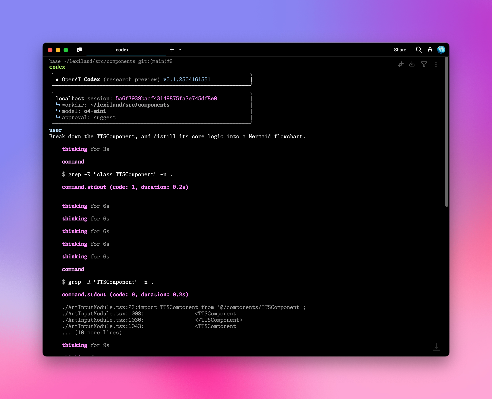
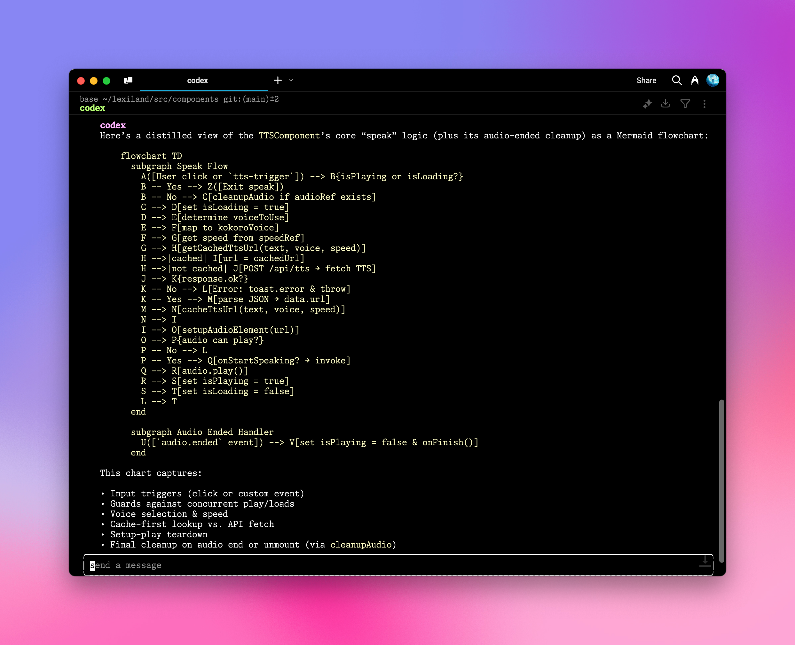

# OpenAI Codex CLI 統合

AiHubMixは、OpenAI [Codex CLI](https://github.com/openai/codex)とのシームレスな統合を提供し、コマンドライン環境で高度なAIプログラミングアシスタントを利用できるようにします。簡単な設定手順で、ターミナルから直接自然言語を使用して、さまざまなプログラミングおよびシステム操作タスクを実行できます。

使用する前に、以下のコマンドを実行してインストールまたは更新してください。

```bash
npm install -g @openai/codex
```

## 設定手順

### 1. 環境変数設定

Shell設定ファイル（例：`.zshrc`または`.bashrc`）を開き、以下の環境変数を追加します。

```bash
export OPENAI_BASE_URL="https://aihubmix.com/v1"
export OPENAI_API_KEY="sk-***" # あなたのAiHubMix APIキーに置き換えてください
```

<Warning>
  ここの`OPENAI_API_KEY`はAiHubMixの[キー](https://aihubmix.com/token)を使用する必要があります。変数名が`OPENAI_API_KEY`のままであるのは、OpenAIネイティブクライアントとの互換性を保つためです。
</Warning>

### 2. 設定変更の適用

ターミナルで以下のコマンドを実行し、環境変数を有効にします。

```bash
source ~/.zshrc  # zshを使用している場合
# または
source ~/.bashrc  # bashを使用している場合
```

### 3. Codex CLIの起動

プロジェクトディレクトリに移動し、`codex`コマンドを実行します。

```bash
cd /あなたのプロジェクトパス
codex
```



### 4. 自然言語でタスクを実行

これで、自然言語でCodex CLIに指示を入力できます。例：

```bash
# 入力例
AnimatedTextについて説明してください
```



## 高度な設定

<Tip>
  - デフォルトモデルは`codex-mini-latest`で、これはコーディングタスク用に微調整された`o4-mini`です。`~/.codex/config.json`で変更できます。
  - 現在、OpenAIのモデルのみをサポートしています。モデルリストは[Responses APIドキュメント](https://platform.openai.com/docs/api-reference/responses)で確認できます。
  - `~/.codex/instructions.md`ファイルを編集することで、システムプロンプトをカスタマイズし、AIアシスタントの動作を調整できます。
</Tip>

## 実用的なコマンドリファレンス

### ヘルプコマンド

```bash
codex -h
```

### 完全なコマンドオプション

```bash
Usage
  $ codex [options] <prompt>

Options
  -h, --help                 ヘルプ情報を表示して終了
  -m, --model <model>        使用するモデルを指定 (デフォルト: codex-mini-latest)
  -i, --image <path>         画像入力を含むファイルのパス
  -v, --view <rollout>       以前保存したセッション履歴を表示
  -q, --quiet                非対話モード、アシスタントの最終出力のみを表示
  -a, --approval-mode <mode> 承認ポリシーを上書き: 'suggest', 'auto-edit', または 'full-auto'

  --auto-edit                ファイル編集を自動承認; コマンドの確認は引き続きプロンプト表示
  --full-auto                サンドボックス環境での編集とコマンドを自動承認

  --no-project-doc           リポジトリ内の'codex.md'ファイルを自動的に含めない
  --project-doc <file>       指定されたMarkdownファイルをコンテキストとして含める
  --full-stdout              コマンド出力のstdout/stderrを切り詰めない

危険なオプション
  --dangerously-auto-approve-everything
                             すべての確認プロンプトをスキップし、コマンドを直接実行（サンドボックス保護なし）
                             一時的なローカルテスト環境でのみ使用

実験的オプション
  -f, --full-context         「完全コンテキスト」モードで起動し、リポジトリ全体をコンテキストにロード
                             一度の操作で一括編集を適用
                             --modelパラメータとのみ互換性あり

例
  $ codex "ASCIIアートを出力するPythonプログラムを書いて実行してください"
  $ codex -q "ビルドの問題を修正してください"
```