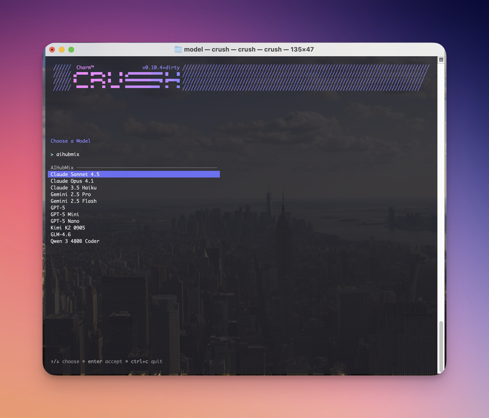
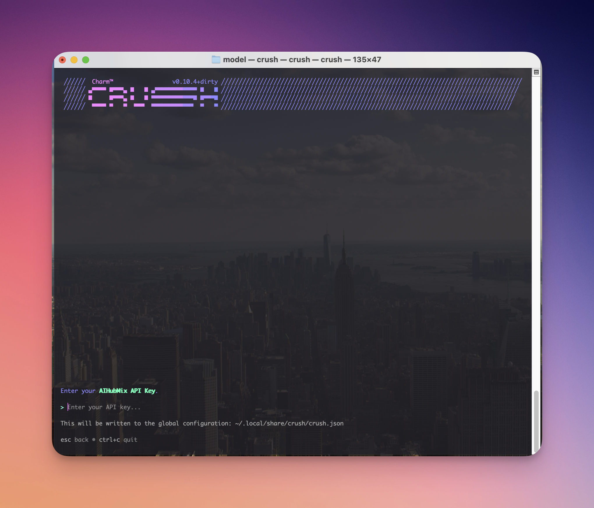

## クイック設定ガイド：

### 1️⃣ インストール先

[公式リポジトリ](https://github.com/charmbracelet/crush)からアプリケーションを入手できます

### 2️⃣ 環境変数の設定

起動後、Aihubmixを入力し、APIキーを入力すれば使用できます。
APIキーは、Aihubmixの[「Keys」ページ](https://aihubmix.com/token)で生成できます。

  
  
  

