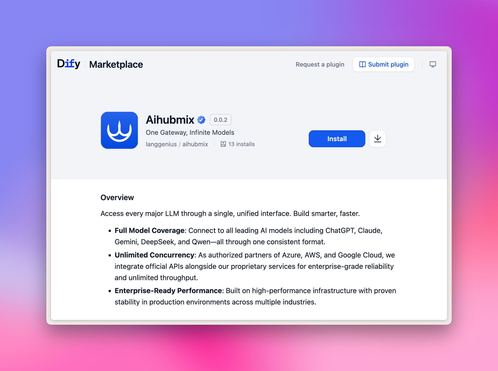
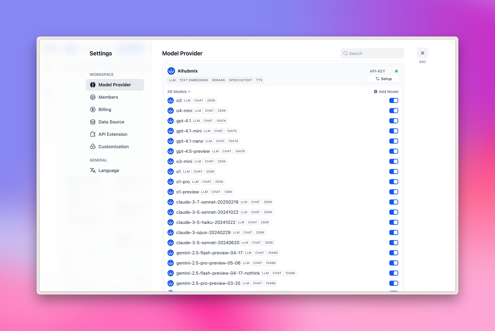
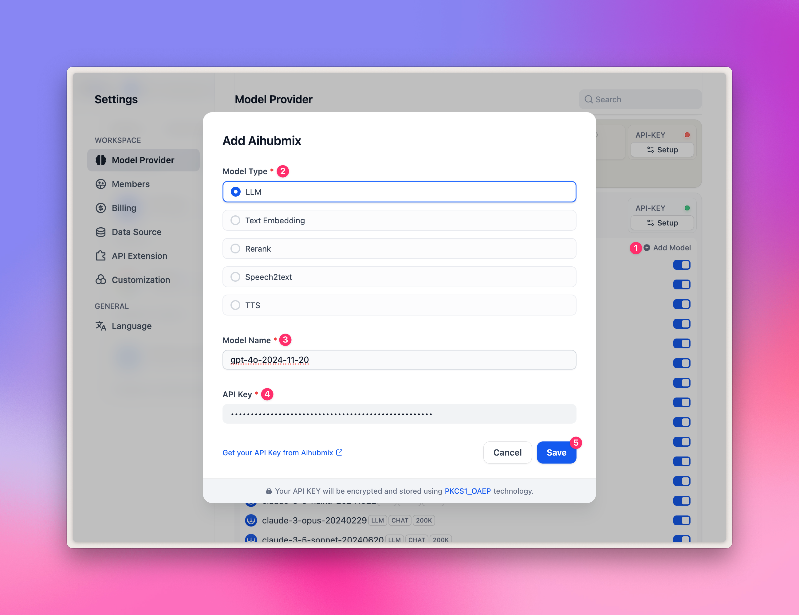
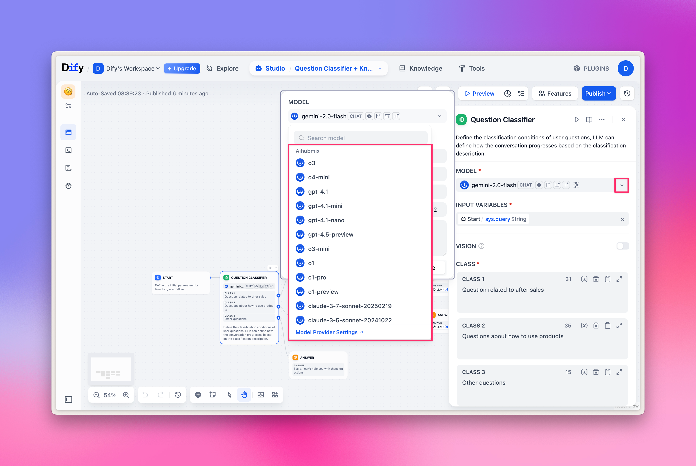

## Aihubmixプラグインをワンクリックでインストール

Dify Marketplaceページで以下のリンクをクリックし、「Install」ボタンをクリックするだけでインストールが完了します。

👉 [Difyプラグインマーケットへ](https://marketplace.dify.ai/plugins/langgenius/aihubmix?language=en-US&theme=system)

**例の図は以下の通りです。**
  

## 設定
1. まず、ページの右上隅にあるアバターをクリック → 「Settings」メニューを選択します。
2. 左側の「Model Provider」タブをクリックします。
3. 右側でAihubmixを見つけ → 「Setup」を展開し、[APIキー](https://aihubmix.com/token)を入力します。

  

**現在、以下の5つの主要なモデルがプリセットされています。**
- LLM：大規模言語モデル
- TEXT EMBEDDING：テキスト埋め込みモデル
- RERANK：再ランキングモデル
- SPEECH2TEXT：音声からテキストへの変換モデル
- TTS：テキストから音声への変換モデル

  

**さらにカスタムモデルを追加する方法は？**

「+ Add model」をクリックし、ポップアップパネルの「Model Name」オプションで：
- モデル広場にある任意の[モデルID](https://aihubmix.com/models)を入力します。例えば、`gpt-4o-2024-11-20`。
- APIキーを入力した後、「Save」をクリックします。

Difyプラグインの設計上の特性により、現在、描画モデルはサポートされていません。したがって、`gpt-image-1`のような描画モデルは追加できません。

  

## LLMの選択

ワークフロー（Workflow）ノードで「LLM」を選択すると、プラグインで設定済みのAihubmixが提供するモデルを選択できます。

**例の図は以下の通りです。**
  

## Embeddings/Rerankerモデルの選択

Embeddings/Rerankerモデルは主にナレッジベースの質問応答に使用されます。上部の「Knowledge」タブで簡単に試すことも、ワークフローノードで対応するモデルを選択することもできます。

**例の図は以下の通りです。**
  

## TTS/SSTの選択

TTS/SSTモデルは主に音声解析と合成に使用されます。ツールを選択する際、通常の「LLM」ではなく、「Tools」タブ内の「Audio」タイプを選択します。
対応関係：
1. TTS テキストから音声： 「Text to Speech」を選択
2. SST 音声からテキスト： 「Speech to Text」を選択

**例の図は以下の通りです。**
