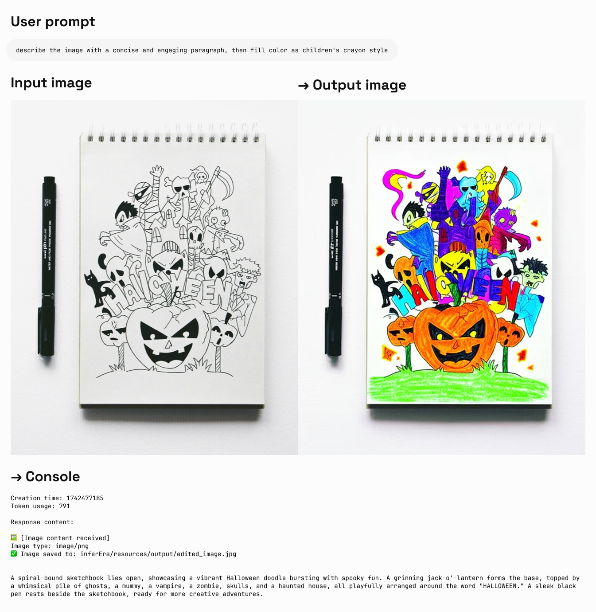
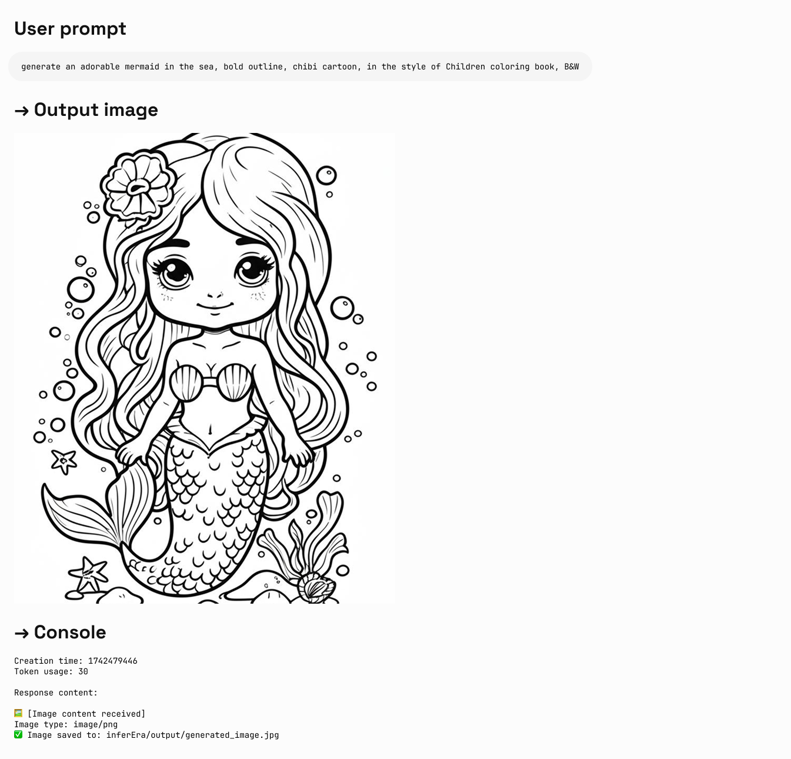

## Imagen 描画

Imagenは、Googleが開発した高度な画像生成AIモデルシリーズで、テキストプロンプトに基づいて高品質でリアルな画像を生成できます。このガイドでは、パラメータ設定、モデル選択、コード例など、ImagenシリーズAPIを使用して画像を生成する方法を説明します。

利用可能なモデルリスト：

- imagen-4.0-ultra-generate-001
- imagen-4.0-generate-001
- imagen-4.0-fast-generate-001
- imagen-4.0-fast-generate-preview-06-06
- imagen-3.0-generate-002

<Tip>
  1. 現在、Imagenは英語のプロンプトのみをサポートしています。統合時には、ユーザーが問題なく使用できるように自動翻訳を追加することをお勧めします。
  2. 大量のテキストの描画は不安定なため、重要なキーワードのみを描画することをお勧めします。
  3. プレビュー期間中、Imagenシリーズモデルは同価格ですが、将来的には公式価格に合わせて調整される可能性があります。
</Tip>

### モデルパラメータ

Imagenは現在、英語のプロンプトのみをサポートしており、以下のパラメータを提供しています。

- **numberOfImages**: 生成する画像の数。1から4（含む）の範囲。デフォルト値は4です。また、`imagen-4.0-ultra-generate-001`は一度に1枚しか生成できないことに注意してください。
- **aspectRatio**: 生成される画像の縦横比を変更します。「1:1」、「3:4」、「4:3」、「9:16」、「16:9」がサポートされています。デフォルト値は「1:1」です。
- **personGeneration**: モデルが人物画像を生成することを許可します。以下の値がサポートされています。
  - 「DONT_ALLOW」：人物画像の生成をブロックします。
  - 「ALLOW_ADULT」：成人画像を生成しますが、子供画像は生成しません。これがデフォルト値です。

### 料金

Imagen APIを使用して画像を生成する費用は**1枚あたり\$0.03**です。1回の呼び出しで1〜4枚の画像を生成でき、費用は実際に生成された画像の数に基づいて計算されます。

### 呼び出し例

以下は、Imagenを使用して画像を生成するPython呼び出しの例です。

<CodeGroup>

```py Imagen
import os
import time
from google import genai
from google.genai import types
from PIL import Image
from io import BytesIO

client = genai.Client(
    api_key="sk-***", # 🔑 AiHubMixで生成したキーに置き換えてください
    http_options={"base_url": "https://aihubmix.com/gemini"},
)

# 現在は英語のプロンプトのみをサポートしており、大量のテキストの描画はパフォーマンスが低い
response = client.models.generate_images(
    model='imagen-3.0-generate-002',
    prompt='A minimalist logo for a LLM router market company on a solid white background. trident in a circle as the main symbol, with ONLY text \'InferEra\' below.',
    config=types.GenerateImagesConfig(
        number_of_images=1,
        aspect_ratio="1:1", # "1:1", "9:16", "16:9", "3:4", または "4:3"をサポート
    )
)

script_dir = os.path.dirname(os.path.abspath(__file__))
output_dir = os.path.join(script_dir, "output")

os.makedirs(output_dir, exist_ok=True)

# ファイル名の衝突を避けるため、タイムスタンプをファイル名のプレフィックスとして生成
timestamp = int(time.time())

# 生成された画像を保存して表示
for i, generated_image in enumerate(response.generated_images):
  image = Image.open(BytesIO(generated_image.image.image_bytes))
  image.show()
  
  file_name = f"imagen3_{timestamp}_{i+1}.png"
  file_path = os.path.join(output_dir, file_name)
  image.save(file_path)
  
  print(f"画像は以下に保存されました：{file_path}")
```

</CodeGroup>

### プロンプトのヒント

理想的な画像を得るためには、効果的なプロンプトを作成することが重要です。

- 主題、スタイル、照明、角度など、詳細な説明を使用します。
- 芸術的なスタイル（映画のような、写実主義、アニメスタイルなど）を指定します。
- 技術的な詳細（DSLR、高解像度、詳細など）を含めます。
- 否定的または禁止されたコンテンツを避けます。
- **プロンプトに大量のテキストを含めないでください**。より安定した結果を得るには、重要なキーワードのみを使用してください。
- キーワードに`girl`が含まれている場合、TypeError: 'NoneType' object is not iterableエラーが発生しやすいです。人物の描画には推奨されません。

## Gemini 2.0 Flash 画像生成

Geminiも画像生成機能を提供しており、代替案として利用できます。Imagen 3.0と比較して、Geminiの画像生成は、究極の芸術的表現や視覚的品質を追求するのではなく、コンテキスト理解と推論が必要なシナリオに適しています。

- より高い視覚的品質 → 実験版と比較して、画像はより鮮明で、より豊かで、よりクリアです。
- より正確なテキスト表現 → 生成されたビジュアル内のテキストは、より正確で、きれいで、読みやすいです。
- フィルタリングによるブロックが大幅に減少 → よりスマートで寛容なフィルタリングメカニズムのおかげで、作成中に中断されることはほとんどありません。

**説明：**

- モデルID：`gemini-2.0-flash-preview-image-generation`
- 料金（入力→出力）：$0.1→$0.4/Mトークン
- 新機能`"modalities":["text","image"]`を体験するには、新しいパラメータを追加する必要があります。
- 画像はBase64エンコード形式で渡され、出力されます。
- 実験モデルであるため、「画像を生成」と明示的に指定することをお勧めします。そうしないと、テキストのみになる可能性があります。
- 出力画像のデフォルトの高さは1024pxです。
- Python呼び出しには最新のOpenAI SDKサポートが必要です。まず`pip install -U openai`を実行してください。
- 詳細については、[Gemini公式ドキュメント](https://ai.google.dev/gemini-api/docs/image-generation)をご覧ください。

<Tip>
  `gemini-2.0-flash-exp`は正式に`gemini-2.0-flash-preview-image-generation`にアップグレードされ、作成プロセスがよりスムーズでエキサイティングになりました。
</Tip>

**入力参照構造：**

```json
"modalities": ["text","image"]
{
    "model": "gemini-2.0-flash-preview-image-generation",
    "messages": [
      {
        "role": "user",
        "content": "Generate a landscape painting and provide a poem to describe it"
      }
    ],
    "modalities":["text","image"], // imageを追加する必要があります
    "temperature": 0.7
  }'
```

**出力参照構造：**

```json
"choices":
    [
        {
            "index": 0,
            "message":
            {
                "role": "assistant",
                "content": "Hello! How can I assist you today?",
                "refusal": null,
                "multi_mod_content": //📍 新規追加
                [
                    {
                        "text": "",
                        "inlineData":
                        {
                          "data":"base64 str",
                          "mimeType":"png"
                        }
                    },
                    {
                        "text": "hello",
                        "inlineData":
                        {
                        }
                    }
                ],
                "annotations":
                []
            },
            "logprobs": null,
            "finish_reason": "stop"
        }
    ],
```

### 画像とテキストの生成

入力：テキスト \+ 画像
出力：テキスト \+ 画像

<CodeGroup>

```shell Curl
IMG_PATH="/your_path/image.jpg"

if [[ "$(base64 --version 2>&1)" = *"FreeBSD"* ]]; then
  B64FLAGS="--input"
else
  B64FLAGS="-w0"
fi

IMG_BASE64=$(base64 "$B64FLAGS" "$IMG_PATH" 2>&1)

curl https://aihubmix.com/v1/chat/completions \
  -H "Content-Type: application/json" \
  -H "Authorization: Bearer sk-***" \
  -d '{
    "model": "gemini-2.0-flash-preview-image-generation",
    "messages": [
      {
        "role": "user",
        "content": [
          {
            "type":"text",
            "text":"describe the image with a concise and engaging paragraph, then fill color as children's crayon style"
          },
          {
            "type": "image_url",
            "image_url": {
              "url": "data:image/jpeg;base64,'$IMG_BASE64'"
            }
          }
        ]
      }
    ],
    "modalities": ["text","image"],
    "temperature": 0.7
}' \
  | grep -o '"data":"[^"]*"' \
  | cut -d'"' -f4 \
  | base64 --decode > /your_path/imageGen.jpg
```


```py Python
import os
from openai import OpenAI
from PIL import Image
from io import BytesIO
import base64

client = OpenAI(
    api_key="sk-***", # あなたのAiHubMixで生成したキーに置き換えてください
    base_url="https://aihubmix.com/v1",
)

# テキストのみの入力を使用
response = client.chat.completions.create(
    model="gemini-2.0-flash-preview-image-generation",
    messages=[
        {
            "role": "user",
            "content": [
                {
                    "type": "text",
                    "text": "generate an adorable mermaid in the sea, bold outline, chibi cartoon, in the style of Children coloring book, B&W",
                }
            ],
        },
    ],
    modalities=["text", "image"],
    temperature=0.7,
)
try:
    # 基本的な応答情報を出力
    print(f"作成時間: {response.created}")
    print(f"トークン使用量: {response.usage.total_tokens}")
    
    # multi_mod_contentフィールドが存在するかどうかを確認
    if (
        hasattr(response.choices[0].message, "multi_mod_content")
        and response.choices[0].message.multi_mod_content is not None
    ):
        print("\n応答コンテンツ:")
        for part in response.choices[0].message.multi_mod_content:
            if "text" in part and part["text"] is not None:
                print(part["text"])
            
            # 画像コンテンツを処理
            elif "inline_data" in part and part["inline_data"] is not None:
                print("\n🖼️ [画像コンテンツを受信しました]")
                image_data = base64.b64decode(part["inline_data"]["data"])
                mime_type = part["inline_data"].get("mime_type", "image/png")
                print(f"画像タイプ: {mime_type}")
                
                image = Image.open(BytesIO(image_data))
                image.show()
                
                # 画像を保存
                output_dir = os.path.join(os.path.dirname(os.path.abspath(__file__)), "output")
                os.makedirs(output_dir, exist_ok=True)
                output_path = os.path.join(output_dir, "generated_image.jpg")
                image.save(output_path)
                print(f"✅ 画像は以下に保存されました: {output_path}")
            
    else:
        print("有効なマルチモーダル応答が受信されませんでした。応答構造を確認してください")
except Exception as e:
    print(f"応答の処理中にエラーが発生しました: {str(e)}")
```

</CodeGroup>

**出力例：**



### 画像編集

入力：テキスト \+ 画像
出力：テキスト \+ 画像

<CodeGroup>

```py Python
import os
from openai import OpenAI
from PIL import Image
from io import BytesIO
import base64

client = OpenAI(
    api_key="sk-***", # あなたのAiHubMixで生成したキーに置き換えてください
    base_url="https://aihubmix.com/v1",
)

project_root = os.path.dirname(os.path.dirname(os.path.abspath(__file__)))

image_path = os.path.join(os.path.dirname(os.path.abspath(__file__)), "resources", "filled.jpg")
if not os.path.exists(image_path):
    raise FileNotFoundError(f"画像 {image_path} が存在しません")

def encode_image(image_path):
    with open(image_path, "rb") as image_file:
        return base64.b64encode(image_file.read()).decode("utf-8")

base64_image = encode_image(image_path)

response = client.chat.completions.create(
    model="gemini-2.0-flash-preview-image-generation",
    messages=[
        {
            "role": "user",
            "content": [
                {
                    "type": "text",
                    "text": "describe the image with a concise and engaging paragraph, then fill color as children's crayon style",
                },
                {
                    "type": "image_url", 
                    "image_url": {"url": f"data:image/jpeg;base64,{base64_image}"},
                },     
            ],
        },
    ],
    modalities=["text", "image"],
    temperature=0.7,
)
try:
    # base64データなしで基本的な応答情報を出力
    print(f"作成時間: {response.created}")
    print(f"トークン使用量: {response.usage.total_tokens}")
    
    # multi_mod_contentフィールドが存在するかどうかを確認
    if (
        hasattr(response.choices[0].message, "multi_mod_content")
        and response.choices[0].message.multi_mod_content is not None
    ):
        print("\n応答コンテンツ:")
        for part in response.choices[0].message.multi_mod_content:
            if "text" in part and part["text"] is not None:
                print(part["text"])
            
            # 画像コンテンツを処理
            elif "inline_data" in part and part["inline_data"] is not None:
                print("\n🖼️ [画像コンテンツを受信しました]")
                image_data = base64.b64decode(part["inline_data"]["data"])
                mime_type = part["inline_data"].get("mime_type", "image/png")
                print(f"画像タイプ: {mime_type}")
                
                image = Image.open(BytesIO(image_data))
                image.show()
                
                # 画像を保存
                output_dir = os.path.join(os.path.dirname(image_path), "output")
                os.makedirs(output_dir, exist_ok=True)
                output_path = os.path.join(output_dir, "edited_image.jpg")
                image.save(output_path)
                print(f"✅ 画像は以下に保存されました: {output_path}")
            
    else:
        print("有効なマルチモーダル応答が受信されませんでした。応答構造を確認してください")
except Exception as e:
    print(f"応答の処理中にエラーが発生しました: {str(e)}")
```

</CodeGroup>

**出力例：**



## 正しい描画モデルの選択

### Geminiを選択する場合：

- 世界の知識と推論能力を活用して、コンテキストに関連する画像を生成する必要がある場合。
- テキストと画像をシームレスに組み合わせる必要がある場合。
- 長いテキストシーケンスに正確な視覚コンテンツを埋め込む必要がある場合。
- コンテキストを維持しながら、対話形式で画像を編集したい場合。

### Imagenを選択する場合：

- 画像の品質、写真のようなリアルさ、芸術的な詳細、または特定のスタイル（印象派、アニメなど）が最優先事項である場合。
- 製品の背景更新や画像の拡大など、プロフェッショナルな編集タスクを実行する場合。
- ブランド、スタイルを注入したり、ロゴや製品デザインを生成したりする場合。

### ベストプラクティス

1. **プロンプトの最適化**：高品質な出力を得るための鍵となるプロンプトを慎重に設計します。
2. **パラメータの実験**：さまざまなアスペクト比と設定を試して、ニーズに最適な構成を見つけます。
3. **バッチ生成**：複数の画像を生成して、理想的な結果を得る可能性を高めます。
4. **メタデータの保存**：プロンプトとタイムスタンプを画像と一緒に保存して、成功した結果を追跡および複製できるようにします。
5. **使用ポリシーの遵守**：使用がGoogleのコンテンツポリシーと利用規約に準拠していることを確認します。

## Veo 3.0 ビデオ生成

VEO 3.0は、Google DeepMindが開発した最新の高度なビデオ生成モデルです。[VEO 3.0](https://aihubmix.com/models?model=veo-3.0-generate-preview)を使用すると、以下の特徴を持つビデオを生成できます。

- テキストと画像プロンプトから生成される品質の向上
- 音声、例えば会話やナレーション
- 音声、例えば音楽や効果音

<Tip>
  1. 現在、VEO 3.0は英語のプロンプトのみをサポートしています。統合時には自動翻訳を追加することをお勧めします。
  2. ビデオの生成には通常数分かかりますが、ピーク時にはさらに時間がかかる場合があります。
  3. 現在、画像を使用した会話生成ビデオはサポートされていません。
</Tip>

### 既知の制限

現在、VEO 3.0のパラメータは固定されており、変更できません。

- **解像度**: 720p（横長）
- **フレームレート**: 24fps
- **ビデオ長**: 8秒

### 料金

VEO 3.0 APIの使用料は**1秒あたり\$0.675**です（Aihubmixは10%の期間限定割引を提供）。

### 呼び出し例

VEO 3.0は現在、curlコマンド呼び出しのみをサポートしており、2段階の処理方法を採用しています。
`sk-***`は、AiHubMixで生成したキーに置き換えてください。

<CodeGroup>

```shell ステップ1：生成リクエストを開始
curl "https://aihubmix.com/gemini/v1beta/models/veo-3.0-generate-preview:predictLongRunning?key=sk-***" \
  -H "Content-Type: application/json" \
  -X "POST" \
  -d '{
    "instances":
    [
        {
            "prompt": "A cat playing with a ball"
        }
    ],
    "parameters":
    {
        "numberOfVideos": 1,
        "durationSeconds": 8,
        "aspectRatio": "16:9",
        "personGeneration": "dont_allow"
    }
}'
```


```shell ステップ2：生成結果を取得
# ステップ1で返されたnameフィールドの操作IDを使用
curl "https://aihubmix.com/gemini/v1beta/models/veo-3.0-generate-preview/operations/ff5***?key=sk-***"
```


```py ビデオ抽出スクリプト
import json
import base64

# 1. 応答JSONファイルを読み込む
with open('yourpath/response.json', 'r') as f:
    data = json.load(f)

# 2. base64エンコードされたビデオ文字列を取得
b64_str = data['response']['videos'][0]['bytesBase64Encoded']

# 3. デコードしてmp4ファイルに書き込む
with open('output.mp4', 'wb') as f:
    f.write(base64.b64decode(b64_str))

print("ビデオはoutput.mp4として保存されました")
```

</CodeGroup>

### 戻り値の例

**ステップ1の戻り値：**

```json
{
  "name": "models/veo-3.0-generate-preview/operations/ff5***"
}
```

**ステップ2の戻り値（生成完了）：**

```json
{
  "name": "projects/ahm-gemini-03/locations/us-central1/publishers/google/models/veo-3.0-generate-preview/operations/ff5***",
  "done": true,
  "response": {
    "@type": "type.googleapis.com/cloud.ai.large_models.vision.GenerateVideoResponse",
    "raiMediaFilteredCount": 0,
    "videos": [
      {
        "bytesBase64Encoded": "AAA...2xl",
        "mimeType": "video/mp4"
      }
    ]
  }
}
```

**ステップ2の戻り値（処理中）：**

```json
{
  "name": "projects/ahm-gemini-03/locations/us-central1/publishers/google/models/veo-3.0-generate-preview/operations/777***"
}
```

処理中の戻り値を受け取った場合は、数分待ってからステップ2のリクエストを再送信してください。

**ビデオ効果：**

<video controls className="w-full aspect-video rounded-2xl" src="../../public/en/veo-3-output.mp4" />

### ベストプラクティス

1. **辛抱強く待つ**：ビデオ生成には通常数分かかりますが、ピーク時にはさらに時間がかかる場合があります。
2. **ステータスの確認**：戻り値に`done: true`がない場合、まだ処理中です。
3. **操作IDの保存**：後続のクエリのために、ステップ1で返された操作IDを必ず保存してください。
4. **使用ポリシーの遵守**：使用がGoogleのコンテンツポリシーと利用規約に準拠していることを確認してください。

詳細については、[Vertex AI公式ドキュメント](https://cloud.google.com/vertex-ai/generative-ai/docs/video/generate-videos)を参照してください。

## Veo 3.0 逆方向インターフェース呼び出し方法

AIhubmixは、公式と同じ効果を持ちながら、より低料金の逆方向呼び出し方法を提供しています。1回の生成にかかる総費用は\$0.41です。ただし、逆方向の呼び出し方法は安定した生成を保証するものではないため、開発環境での早期実験または個人的な体験のみに推奨されます。

既知の制限は公式の正式インターフェースと同じです。上記の「Veo 3.0 ビデオ生成」セクションを参照してください。

### 呼び出し例

VEO 3.0の逆方向インターフェースはOpenAI互換方式を使用しており、モデルID`veo-3`とビデオプロンプトを渡すだけで済みます。

<CodeGroup>

```py Pthon
from openai import OpenAI

client = OpenAI(
    api_key="sk-***", # 🔑 AiHubMixで生成したキーに置き換えてください
    base_url="https://aihubmix.com/v1",
)

completion = client.chat.completions.create(
    model="veo-3",
    messages=[
        {
            "role": "user",
            "content": "a mechanical butterfly flying in the futuristic garden"
        }
    ],
    stream=False
)

print(completion.choices[0].message.content)
```

</CodeGroup>

### 戻り値の例

生成結果はリンクなので、ローカルに保存してください。

```json
{
  "prompt": "A sleek, metallic mechanical butterfly with intricate, glowing blue circuitry patterns on its wings flies gracefully through a futuristic garden. The garden is filled with bioluminescent plants, floating orbs of light, and holographic flowers that change colors. The butterfly's wings reflect the ambient light, creating a mesmerizing shimmer as it. The background features a sleek, minimalist cityscape with towering glass structures and hovering drones. The scene is bathed in a soft, ethereal glow from a setting sun, casting long shadows and enhancing the futuristic ambiance. The camera follows the butterfly in a smooth, cinematic motion, capturing the delicate movements of its wings and the vibrant, otherworldly beauty of the garden."
}
```

```json
> ビデオ生成タスクが作成されました
> タスクID: `8167db37-2b7c-4794-9232-891d02ca7fa3`
> タスクの中断を防ぐため、以下のリンクから継続的に進捗を追跡できます。
> [データプレビュー](https://asyncdata.net/web/8167db37-2b7c-4794-9232-891d02ca7fa3) | [ソースデータ](https://asyncdata.net/source/8167db37-2b7c-4794-9232-891d02ca7fa3)
> 処理を待機中

> タイプ: テキストからビデオ生成
> 🎬 ビデオ生成を開始しています...................

> ⚠️ 再試行中 (0/3)

> タイプ: テキストからビデオ生成
> 🎬 ビデオ生成を開始しています.....................

> 🔄 ビデオ品質を最適化中.................

> 🎉 高品質ビデオが生成されました

[▶️ オンラインで視聴](https://filesystem.site/cdn/20250615/T7yfqW229fox4gJA1ys0eMAGLkcSfd.mp4) | [⏬ ビデオをダウンロード](https://filesystem.site/cdn/download/20250615/T7yfqW229fox4gJA1ys0eMAGLkcSfd.mp4)
```

## Veo 2.0 ビデオ生成

VEO 2.0は、Googleが開発した高度なビデオ生成AIモデルで、テキストプロンプトに基づいて高品質でリアルな短いビデオを生成できます。以下のガイドでは、パラメータ設定、モデル選択、コード例など、VEO 2.0 APIを使用してビデオを生成する方法を説明します。

<Tip>
  1. 現在、VEO 2.0は英語のプロンプトのみをサポートしています。統合時には、ユーザーが問題なく使用できるように自動翻訳を追加することをお勧めします。
  2. ビデオの生成には2〜3分かかりますので、辛抱強くお待ちください。
</Tip>

### モデルパラメータ

VEO 2.0は以下のパラメータを提供しています。

- **numberOfVideos**: 生成するビデオの数。1または2を選択できます。デフォルト値は2です。
- **aspectRatio**: 生成されるビデオの縦横比。「16:9」と「9:16」がサポートされています。
- **durationSeconds**: ビデオの長さ。5秒または8秒を選択できます。デフォルト値は8秒です。
- **personGeneration**: 人物を含むビデオの生成を許可するかどうかを制御します。以下の値がサポートされています。
  - 「dont_allow」：人物を含むビデオの生成をブロックします。
  - 「allow_adult」：成人を含むビデオの生成を許可しますが、子供のビデオは生成しません。

### 料金

VEO 2.0 APIの使用料は1秒あたり\$0.35です。

### 呼び出し例

以下は、VEO 2.0を使用してビデオを生成するPython呼び出しの例です。

<CodeGroup>

```py テキストからビデオ
import os
import time
from google import genai
from google.genai import types

client = genai.Client(
    api_key="sk-***", # あなたのAiHubMixで生成したキーに置き換えてください
    http_options={"base_url": "https://aihubmix.com/gemini"},
)

operation = client.models.generate_videos(
    model="veo-2.0-generate-001",
    prompt="Panning wide shot of a calico kitten sleeping in the sunshine",
    config=types.GenerateVideosConfig(
        person_generation="dont_allow",  # "dont_allow" または "allow_adult"
        aspect_ratio="16:9",  # "16:9" または "9:16"
        number_of_videos=1, # 整数、1、2を選択可能、デフォルトは2
        durationSeconds=5, # 整数、5、8を選択可能、デフォルトは8
    ),
)

# 2〜3分かかります。ビデオの長さは5〜8秒
while not operation.done:
    time.sleep(20)
    operation = client.operations.get(operation)

for n, generated_video in enumerate(operation.response.generated_videos):
    client.files.download(file=generated_video.video)
    generated_video.video.save(f"video{n}.mp4")  # ビデオを保存
```


```py 参照画像駆動
import os
import time
from google import genai
from google.genai import types

def load_image(path):
    with open(path, "rb") as image_file:
        return image_file.read()
    
client = genai.Client(
    api_key="sk-***", # あなたのAiHubMixで生成したキーに置き換えてください
    http_options={"base_url": "https://aihubmix.com/gemini"},
)

operation = client.models.generate_videos(
    model="veo-2.0-generate-001",
    prompt="The waves in the background keep flowing",
    image=types.Image(
        mime_type="image/png", 
        image_bytes=load_image("img/inferbanner.png")  # あなたの画像パスを使用
    ),
    config=types.GenerateVideosConfig(
        person_generation="dont_allow",
        aspect_ratio="16:9",
        numberOfVideos=1,
        durationSeconds=5,
    ),
)

while not operation.done:
    time.sleep(20)
    operation = client.operations.get(operation)

for n, generated_video in enumerate(operation.response.generated_videos):
    client.files.download(file=generated_video.video)
    generated_video.video.save(f"video{n}.mp4")
```

</CodeGroup>

### プロンプトのヒント

理想的なビデオを得るためには、効果的なプロンプトを作成することが重要です。

- シーン、アクション、雰囲気を明確に記述します。
- 撮影スタイル（パノラマ、クローズアップ、トラッキングショットなど）を指定します。
- 照明条件（晴れ、夕暮れ、室内照明など）を記述します。
- 主題とそのアクションを指示します（例：「猫が日差しの中で眠っている」）。
- 複雑すぎる物語や急速に変化するシーンは避けます。
- 否定的または禁止されたコンテンツは避けます。

### ベストプラクティス

1. **簡潔で明確なプロンプト**：明確で具体的な説明を使用してビデオ生成をガイドします。
2. **辛抱強く待つ**：ビデオ生成には2〜3分かかりますので、完了まで辛抱強くお待ちください。
3. **異なるパラメータをテスト**：さまざまなアスペクト比と長さを試して、ニーズに最適な設定を見つけます。
4. **生成記録を保存**：プロンプトと生成されたビデオを一緒に記録して、成功した結果を追跡できるようにします。
5. **使用ポリシーの遵守**：使用がGoogleのコンテンツポリシーと利用規約に準拠していることを確認してください。