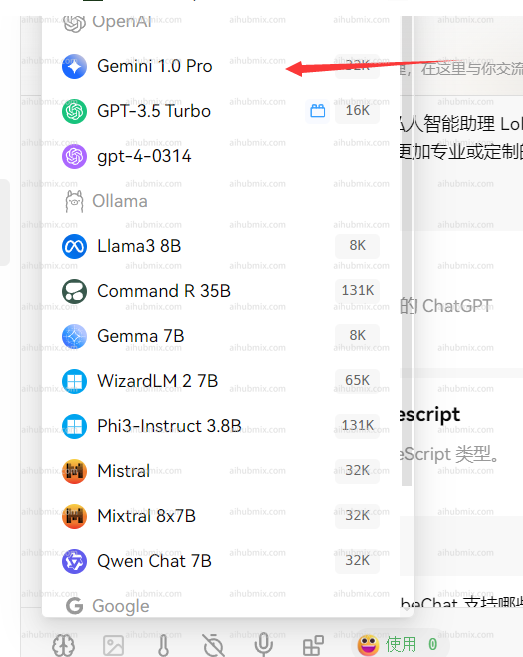

## 原理

当サイトはOpenAIモデルの呼び出しインターフェースを標準とし、GoogleのGemini-2.0-flash、Claude Sonnet 3.7など、OpenAI以外の複数のモデルを統合しています。非OpenAIモデルの呼び出しは、OpenAIモデルの呼び出しと同様に、対応する`モデルID`を変更するだけで済みます。モデルIDはウェブサイトの管理画面設定ページで確認できます。
  

## アプリケーションシナリオ（Lobe-chatを例に）

通常、当サイトが提供するキーはOpenAIモデル（GPT-3.5など）のみを呼び出すことができます。
  

統合されたモデルを呼び出したい場合は、カスタムモデル名を使用することで実現できます。  
1. まず設定画面を開き、モデルリストの欄を見つけます。  
2. - ウェブサイトのモデル広場ページを開きます。
   - 使用したいモデル名（例：o3-miniまたはgemini-2.0-flash）をコピーします。  
  
  
3. - 使用したいモデル名を入力して選択します。
   - 手動で追加したモデルがOpenAIの欄の下に表示されていることを確認します。  
   
4. OpenAIの欄から使用したいモデル（例：gpt-4o-mini）を選択すると、以下のようになります。
   

## 開発呼び出し - 公式ライブラリを例に
   - 公式ライブラリのサンプルコードを使用して呼び出します。以下はPythonのサンプルコードです。  

```py Python
from openai import OpenAI

client = OpenAI(
    api_key="sk-***", # あなたのAiHubMixで生成したキーに置き換えてください
    base_url="https://aihubmix.com/v1"
)

chat_completion = client.chat.completions.create(
    messages=[
        {
            "role": "user",
            "content": "Say this is a test",
        }
    ],
    model="gpt-4o-mini",
)

print(chat_completion)
```
## 特殊な状況（Next Webクライアント）  
Next Webクライアントを使用している場合は、最新バージョン（v2.13.0）にアップグレードしていることを確認してください。このバージョンでは、カスタムモデルの追加方法が追加されています：  
1. **カスタムモデル名の入力：**
   - Next Webクライアントは、入力されたモデル名に基づいてモデルサービスプロバイダーを自動的に判断しますが、当サイトが提供するキーはOpenAIインターフェースにのみ適用されます。   
   - したがって、カスタムモデル名を入力する際は、「+‘使用したいモデル名’@OpenAI」の形式にする必要があります。
   - 例えば、gemini-proモデルを使用したい場合は、「+gemini-pro@OpenAI」と入力します。
   - この方法により、モデルサービスプロバイダーを手動でOpenAIに指定できます。  
2. **選択の確認：**
   - モデル選択画面で、手動で追加したモデル（OpenAI）が下部に表示されていることを確認します。  
