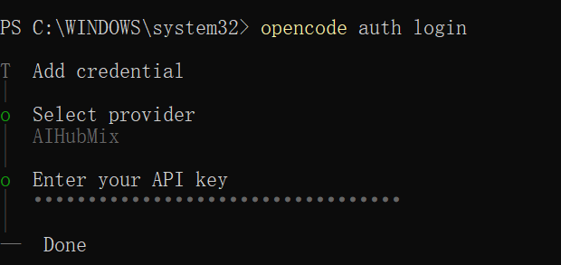

OpenCodeは新しいモデルプロバイダーとしてAiHubMixをサポートしました。OpenCode内でAiHubMixのAPIキーを使用して、そのモデルサービスにアクセスできます。

AiHubMixは現在、GPT、Claude、DeepSeek、Gemini、Qwenを含む主要なモデルファミリーをサポートしています。OpenCodeで最適なパフォーマンスを得るために、以下のモデルが推奨されます：

- `claude-sonnet-4-5`
- `glm-4.6`
- `gpt-5`
- `gpt-5-codex`

このガイドでは、異なるオペレーティングシステム上でOpenCodeをインストール、設定、起動し、AiHubMix APIに接続するための段階的な手順を説明します。

---

## システム要件

インストール前に、システムが以下の要件を満たしていることを確認してください：

- Node.js ≥ 18.0.0
- パッケージマネージャー（OS により任意）：
  - macOS / Linux: `brew`
  - Arch Linux: `paru`
  - Windows: `choco`、`winget`、または `scoop`

---

1. OpenCodeのインストール

以下のいずれかの方法でOpenCodeをインストールできます：

**Node.jsを使用**

```
# CURLを使用 
curl -fsSL https://opencode.ai/install | bash

# NPMを使用
npm install -g opencode-ai

# Bunを使用
bun install -g opencode-ai

# PNPMを使用
pnpm install -g opencode-ai

# Yarnを使用
yarn global add opencode-ai
```

---

**Homebrewを使用 (macOS / Linux)**

```
brew install sst/tap/opencode
```

---

**Paruを使用 (Arch Linux)**

```
paru -S opencode-bin
```

---

**Windows**

```
# Chocolateyを使用
choco install opencode

# WinGetを使用
winget install opencode

# Scoopを使用
scoop bucket add extras
scoop install extras/opencode

# NPMを使用 (Node.jsと管理者権限が必要)
npm install -g opencode-ai
```

---

2. OpenCodeの起動とログイン

インストール後、以下の手順でログインし、OpenCodeを設定します。

### ステップ 1. ログイン

ターミナルで以下のコマンドを実行します：

```
opencode auth login
```

---

### ステップ 2. AIプロバイダーの選択

ログインインターフェースで、モデルプロバイダーとしてAiHubMixを選択します。


---

### ステップ 3. APIキーで認証

AiHubMixアカウントにログインしてAPIキーを取得します。OpenCodeのログイン画面でそれを入力して認証を完了します。




---

3. インストールの確認

OpenCodeが正常にインストールされ設定されたことを確認するには、以下を実行します：

```
opencode
```

  

コンソールが有効なモデル応答を返す場合、セットアップは完了です。


---

4. 問題とヒント

- APIキーの検証が失敗した場合は、AiHubMixで再認証し、キーのステータスを確認してください。
- アプリ内ヘルプの表示：`opencode` -\> `/help`
- 公式ドキュメント：https://opencode.ai/docs/