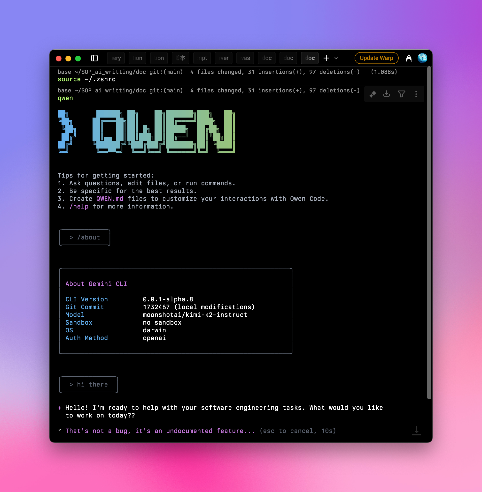

## クイックセットアップガイド：

### 1️⃣ npm パッケージをグローバルにインストール

Node.js のバージョンが 20 以上であることを確認し、ターミナルで以下を実行してください：

```shell
npm install -g @qwen-code/qwen-code
qwen --version
```

詳細については、[公式リポジトリ](https://github.com/QwenLM/qwen-code) を参照してください。

### 2️⃣ 環境変数を設定

Aihubmix キーと転送アドレスをシステム環境変数に追加します。キーは Aihubmix の [キーページ](https://aihubmix.com/token) で生成できます。

例えば、~/.zshrc に以下を追加します：

```shell
export OPENAI_API_KEY="your_aihubmix_key"
export OPENAI_BASE_URL="https://aihubmix.com/v1"
export OPENAI_MODEL="your_model"
```

<Tip>
  Mac ユーザーの場合、ショートカット `⌘ + ⇧ + .` を使用して、ホームディレクトリにある隠しファイル `.zshrc` を表示できます。システムの「テキストエディット」アプリで開き、上記を追加してください。
</Tip>

### 3️⃣ 設定を適用

設定を追加した後、ターミナルで `source ~/.zshrc` を実行し、Enter キーを押します。

### 4️⃣ 起動と使用

ターミナルで以下を入力します：

```shell
qwen
```

起動後、`/about` と入力して Enter キーを押し、設定を確認します。現在のバージョンと選択したラージ言語モデルが表示されます：



<Note>
  一部のユーザーから、Qwen Code が時々フリーズする可能性があるとの報告があります。[トークン ↗](https://aihubmix.com/token) には制限付きのクォータを設定し、不必要な浪費を避けることをおすすめします。
</Note>

これで、通常通り Qwen Code を使用する準備が整いました。
