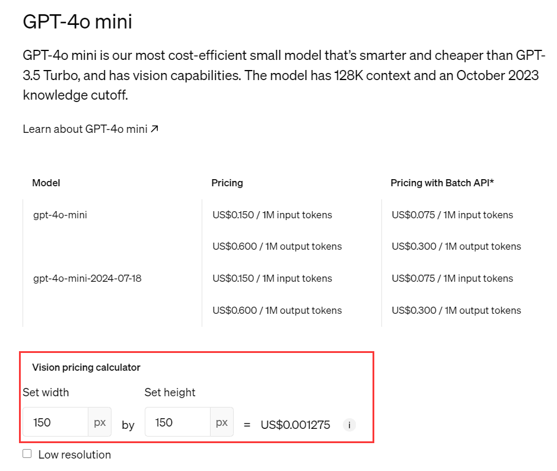
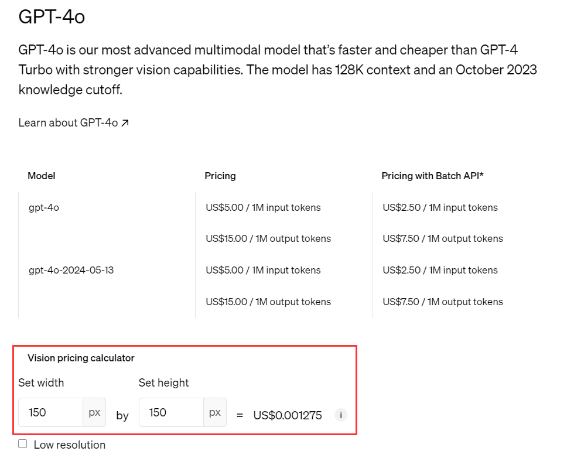

<Update label="6月29日">
  - 新たに [Gemini Cli](/jp/api/Gemini-Cli) の転送機能を追加し、多様な利用方法で柔軟にコントロール可能になりました。
  - OpenAI Responses API にコード解析器と Remote MCP 呼び出し機能を追加しました。
</Update>

<Update label="6月26日">
  - [汎用グラフィックインターフェース](/jp/api/Image-Gen) を新規対応。OpenAI、Ideogram、Stability、Google Imagen など主要モデルを幅広くサポートしています。
</Update>

<Update label="6月23日">
  - 開発者向けに全モデル10％割引の [アプリ識別コード APP-Code](/jp/api/App-code) をリリースしました。
</Update>

<Update label="6月18日">
  - 利用者がエラーコードを理解しやすいように、[HTTPステータスコード](/jp/FAQs/HTTP-Codes) のドキュメントを新設しました。
</Update>

<Update label="6月15日">
  - Veo3.0の逆呼び出し方式を導入し、1回の動画生成費用をわずか\$0.41に抑えました。
</Update>

<Update label="6月13日">
  - [Veo3.0](https://aihubmix.com/models?model=veo-3.0-generate-preview) の動画生成対応を追加し、クリエイティブの幅を拡げました。
</Update>

<Update label="6月12日">
  - 国内でも安定して利用可能な Claude Code を統合しました。
</Update>

<Update label="6月9日">
  - OpenAIのResponses APIで推論サマリー表示をサポートしました。
</Update>

<Update label="6月5日">
  - Geminiのインパシットキャッシュ機能を追加。自動ヒット判定とフィードバックが可能で、usage_metadataでヒット状況を確認できます。コスト削減は保証されませんが、リクエスト構造や利用状況により効果が異なります。
</Update>

<Update label="5月31日">
  **Claude 4の新機能をフルサポート開始**

  - ⏳ 新しいキャッシュサイクル（1時間単位、ベータ版）
  - 🎉 Claude 4モデルで新テキスト編集ツール `text_editor_20250429` と `str_replace_based_edit_tool` を導入
  - 🚫 セキュリティ上の理由で生成拒否時に使う新しい停止理由 `refusal` を追加
  - 🧠 Claude 4は思考過程の要約を返し、拡張思考の知能を活用可能に
  - 🔄 ツール利用と拡張思考を交差させる自然な対話体験をベータ提供
  - ⚠️ サポート終了機能：
    - Claude 4のテキスト編集ツールで `undo_edit` コマンドの非対応化
    - `token-efficient-tools-2025-02-19` と `output-128k-2025-02-19` のサポートを削除（Claude 3.7限定）
  - 📚 移行ガイドとコード例を更新し、Claude 3.7からのスムーズな移行を支援
</Update>

<Update label="5月22日">
  - Difyプラグイン対応を追加し、AihubmixモデルをDify上でシームレスに利用可能に。APIキー1つで200以上のモデルを拡張・管理できます。
</Update>

<Update label="5月17日">
  - プログラミング特化型の codex-mini-latest を Responses API または Codex CLI から利用可能に。
  - Google Imagen 3.0の画像生成と Veo 2.0の動画生成をサポートし、クリエイティブ表現を強化。
  - gemini-2.0-flash-exp を正式プレビュー版 gemini-2.0-flash-preview-image-generation にアップグレード。
</Update>

<Update label="5月9日">
  - [Ideogram AI V3](/jp/api/IdeogramAI) インターフェースを追加し、最先端の画像生成モデル Ideogram を利用可能に。
</Update>

<Update label="5月6日">
  - [実用管理スクリプト](/jp/api/Cli) を新規追加し、CLIでAPIキー管理やアカウント・利用可能モデルの一覧確認が可能に。
</Update>

<Update label="4月26日">
  1. 待望の OpenAI画像生成インターフェース `gpt-image-1` を正式リリース。テキストから画像、画像から画像の両方に対応。  
  2. Geminiのネイティブ呼び出しに対応し、Flash 2.5の推論予算を精密にコントロール可能。
</Update>

<Update label="4月24日">
  - Jina AIの3つの主要インターフェース（Embeddings、Rerank、DeepSearch）を統合し、高機能なエージェント構築を支援。
</Update>

<Update label="4月22日">
  - GPT 4o画像生成インターフェースの先行体験（逆呼び出し）を開始。
</Update>

<Update label="4月20日">
  - OpenAI Responses APIエンドポイントをサポートし、ツールの対応範囲を拡大。
</Update>

<Update label="4月17日">
  - OpenAI [CodeX CLI対応](/jp/api/Codex-CLI) を追加し、コマンドラインで自然言語プログラミングが可能に。
</Update>

<Update label="4月12日">
  - モデルIDに `:surfing` を付加することで、[任意モデルに検索機能を付与（Beta）](/jp/api/LLM-Search) できるようになりました。
</Update>

<Update label="4月9日">
  - Claudeのプロンプトキャッシュをサポート。頻出するフレーズの再利用で最大76%のコスト削減が可能です。
</Update>

<Update label="4月7日">
  - Ideogram AI画像生成インターフェースに対応。テキスト描画に強みがあり、生画像、ミックス、部分編集、拡大など多彩な機能を提供。
</Update>

<Update label="4月5日">
  - ドキュメントを全面刷新し、より良いユーザー体験を実現しました。
</Update>

<Update label="3月30日">
  - Claudeのテキスト編集ツール（Claude Text Edit Tool）に対応しました。
</Update>

<Update label="3月24日">
  - 新しい三叉戟ロゴを導入しました。
</Update>

<Update label="3月16日">
  - OpenAIとGoogle Geminiモデルのネイティブ検索対応を追加。今後、第三者検索の拡張も予定しています。
</Update>

<Update label="3月15日">
  - 新モデル `gpt-4o-mini-search-preview` と `gpt-4o-search-preview` を追加しました。
</Update>

<Update label="3月7日">
  - o1 と o3-mini モデルの価格を10%引き下げ、公式価格に合わせました。
</Update>

<Update label="3月6日">
  - aihubmix-DeepSeek-R1 はMicrosoftの価格が7倍に上昇したため、同様に価格改定。代わりに火山の DeepSeek-R1 を推奨します。  
  - 新モデル `qwen-qwq-32b` と `qwen2.5-vl-72b-instruct` を追加。
</Update>

<Update label="2月28日">
  - Claudeモデルを15%値下げ。新モデル `gpt-4.5-preview` を追加。価格が非常に高いためご注意ください。
</Update>

<Update label="2月26日">
  - Deepseekの安定性を向上。Byte社の安定モデル DeepSeek-R1 と DeepSeek-V3 を推奨しています。
</Update>

<Update label="2月25日">
  - 新モデル `claude-3-7-sonnet-20250219` を追加。
</Update>

<Update label="2月24日">
  - gpt-4oモデルで稀に応答が遅くなる問題が発生（ベンダー側の問題）。当面は `gpt-4o-2024-11-20` の利用を推奨。  
  - Perplexity API は一時停止。複雑な課金体系のため、価格調整後に再開予定。  
  - Byte社の期間限定割引終了に伴い DeepSeek-R1 の価格が戻りました。  
  - モデル詳細ページとパラメータ情報を新設。
</Update>

<Update label="2月23日">
  - Byte社の期間限定割引終了により DeepSeek-V3 の価格が戻りました。R1モデルも近日中に価格改定予定です。
</Update>

<Update label="2月18日">
  - 新モデル `kimi-latest` を追加（公式課金は入力長に応じて3段階ですが、当サイトは中間の32kプランで固定。価格に敏感な方はご注意ください）。  
  - サイト構造を最適化。  
  - ログページを使用量統計ページに統合。  
  - お知らせをモデル広場ページに移動。  
  - 設定メニューをアバター下に移設。  
  - aihubmix-DeepSeek-R1 の価格を50%引き下げ。  
  - 新モデル `gemini-2.0-pro-exp-02-05-search` と `gemini-2.0-flash-exp-search` でGoogle公式検索連携を実装。  
  - 新モデル `gemini-2.0-flash`、`gemini-2.0-pro-exp-02-05`、`gemini-2.0-flash-lite-preview-02-05`、および `o3-mini`、`o1` を追加（後者2つは公式価格より約10%高価、アカウント数制限あり）。
</Update>

<Update label="2月4日">
  - o1モデルはOpenAI公式で `stream` パラメータ非対応。  
  - o3-miniは `temperature` パラメータ非対応。代わりに `Reasoning effort` パラメータ（"low", "medium", "high"）を追加。未指定時は "medium" がデフォルト。
</Update>

<Update label="2月1日">
  - 新機能：OpenAIの音声モデルの入出力対応を追加。api.aihubmix.comサーバーで利用可能。主サーバーは約1週間後に対応予定。  
  - バックエンド課金は公式と同等。ログにはテキスト部分のみ表示、音声料金は現時点で未表示ですが利用には影響ありません。  

  新モデル一覧：  
  - o3-mini、o1（公式価格より約10%高い、アカウント数制限あり）  
  - aihubmix-DeepSeek-R1（推奨、安定版）  
  - qwen-max-0125（Qwen2.5-Max）、sonar-reasoning  
  - deepseek-ai/DeepSeek-R1-Zero、deepseek-ai/DeepSeek-R1、deepseek-r1-distill-llama-70b  
  - aihub-Phi-4  
  - Doubao-1.5-pro-256k、Doubao-1.5-pro-32k、Doubao-1.5-lite-32k、Doubao-1.5-vision-pro-32k  
  - sonar、sonar-pro（Perplexity AI最新モデル）  
  - gemini-2.0-flash-thinking-exp-01-21  
  - deepseek-reasoner（DeepSeek-R1）  
  - MiniMax-Text-01  
  - codestral-latest（Mistralの新コードモデル Codestral 25.01）
</Update>

<Update label="1月23日">
  - 新モデル追加：  
    - aihub-Phi-4  
    - Doubao-1.5シリーズ各種（pro-256k、pro-32k、lite-32k、vision-pro-32k）  
    - sonar、sonar-pro（Perplexity AI最新モデル）  
    - gemini-2.0-flash-thinking-exp-01-21  
    - deepseek-reasoner（DeepSeek-R1）
</Update>

<Update label="1月19日">
  - Perplexity AI APIモデルを追加。現在は api.aihubmix.com のプレビューサーバーのみ対応。問題なければ主サーバー aihubmix.com に順次展開予定。  
  - 新モデル：  
    - MiniMax-Text-01  
    - codestral-latest（Mistralの新コードモデル Codestral 25.01）  
    - gpt-4o-zh：多言語入力を英語に自動翻訳し、出力は日本語に自動翻訳するモデル。テスト段階で高負荷時のリクエストは非対応。
</Update>

<Update label="1月6日">
  - gemini-2.0-flash-exp-search を追加し、Google純正のネット検索機能をサポート。モデル名に `search` を付けるだけで利用可能。  
  - 新モデル deepseek-ai/DeepSeek-V3 を追加。
</Update>

<Update label="1月1日">
  - モデル/価格ページを廃止し、新たにモデル広場ページを開設しました。
</Update>

<Update label="12月30日">
  - gemini-2.0-flash-thinking-exp-1219モデルの思考のみ出力される問題を修正。  
  - 残高通知メールが届かない問題を解消しました。
</Update>

<Update label="12月22日">
  - 利用状況統計ページとチャージ履歴ページを新設。  
  - 豆包シリーズモデル（Doubao-lite-128k、32k、4k、pro-128k、256k、32k、4k）を追加。  
  - 新モデル：gemini-2.0-flash-thinking-exp-1219、gemini-2.0-flash-exp、aihubmix-Mistral-Large-2411、aihubmix-Llama-3-3-70B-Instruct、grok-2-1212、grok-2-vision-1212、gemini-exp-1206、llama-3.3-70b-versatile、learnlm-1.5-pro-experimental。
</Update>

<Update label="12月14日">
  - 新モデル：gemini-2.0-flash-exp、aihubmix-Mistral-Large-2411、aihubmix-Llama-3-3-70B-Instruct を追加しました。
</Update>

<Update label="12月8日">
  - 新モデル：gemini-exp-1206、llama-3.3-70b-versatile、learnlm-1.5-pro-experimental を追加。  
  - 利用状況統計ページを新設。
</Update>

<Update label="11月21日">
  - 最近追加されたモデル：gpt-4o-2024-11-20、step-2-16k、grok-vision-beta。  
  - 千問2.5turbo百万コンテキストモデル：qwen-turbo-2024-11-01。
</Update>

<Update label="11月7日">
  - ClaudeのネイティブSDKに対応し、v1/messagesエンドポイントが利用可能に。  
  - ただし、プロンプトキャッシュとコンピューター機能はまだ未対応で、今後2週間以内に対応予定です。
</Update>

<Update label="11月5日">
  - 新モデル：claude-3-5-haiku-20241022 を追加。  
  - マスクのx.ai最新モデル grok-beta を追加。
</Update>

<Update label="10月23日">
  - 新モデル：claude-3-5-sonnet-20241022 を追加。
</Update>

<Update label="10月10日">
  - OpenAIの最新キャッシュ機能が利用可能になりました。対応モデルは以下の通り：  
    - GPT-4o  
    - GPT-4o-mini  
    - o1-preview  
    - o1-mini  
  - ただし、gpt-4o-2024-05-13バージョンは公式非対応です。  
  - キャッシュヒット時はバックエンドログにキャッシュトークンデータが表示されます。  
  - 詳細と利用ルールはOpenAI公式サイトをご参照ください：[OpenAI キャッシュ機能詳細](https://openai.com/index/api-prompt-caching/)
</Update>

<Update label="10月3日">
  - gpt-4oモデルのバックエンド料金を公式価格に合わせて引き下げ。  
  - 新モデル：aihubmix-Llama-3-2-90B-Vision、aihubmix-Llama-3-70B-Instruct。  
  - 最新のCohereモデル aihubmix-command-r-08-2024、aihubmix-command-r-plus-08-2024 を追加。
</Update>

<Update label="9月19日">
  - 新モデル：whisper-large-v3 と distil-whisper-large-v3-en を追加。  
  - Whisperモデルの課金は入力秒数に基づきますが、価格表示に一部不具合があり、今後修正予定です。課金はOpenAI公式に完全準拠しています。
</Update>

<Update label="9月13日">
  - 新モデル o1-mini と o1-preview を追加。  
  - 注意点：これらのモデルはパラメータ仕様が変更されており、古いクライアントではエラーが発生する可能性があります。  

  #### ご注意ください  

  o1モデルは以下の利用がサポートされておらず、使用するとエラーになります：  
  - systemフィールド（400エラー）  
  - toolsフィールド（400エラー）  
  - 画像入力（400エラー）  
  - json_object出力（500エラー）  
  - structured出力（400エラー）  
  - logprobs出力（403エラー）  
  - stream出力（400エラー）  
  - o1シリーズは20 RPM、1億5千万 TPMの低制限で、頻繁に429エラーが発生します。  
  - temperature、top_p、nは固定で1、presence_penaltyとfrequency_penaltyは0に固定されています。
</Update>

<Update label="9月10日">
  - 新モデル：mattshumer/Reflection-Llama-3.1-70B を追加。llama3.1-70bの最強微調整版とされています。  
  - Claude-3モデルの価格を引き上げ。安定供給のため当サイトでは公式より約10%高い価格で提供し、今後徐々に下げる予定です。  
  - OpenAIシリーズの同時実行性能を強化し、理論上無制限の並列処理が可能になりました。
</Update>

<Update label="8月11日">
  - 新モデル：Phi3medium128k、ahm-Phi-3-medium-4k、ahm-Phi-3-small-128k を追加。  
  - Llama関連モデルの安定性を向上。  
  - Claudeモデルの互換性をさらに最適化しました。
</Update>

<Update label="8月7日">
  - OpenAIの最新4oモデル gpt-4o-2024-08-06 を追加（詳細は https://platform.openai.com/docs/guides/structured-outputs を参照）。  
  - Googleの最新モデル gemini-1.5-pro-exp-0801 を追加。
</Update>

<Update label="8月4日">
  - オンライン決済によるチャージ機能を強化。  
  - Claudeの多層対話フォーマットのエラー（役割の連続不整合）を修正。  
  - Claudeモデルのfunction利用時のインデックス問題を改善。  
  - https://orisound.cn のバックアップサーバーは9月7日に廃止予定。使用中の方は https://aihubmix.com または https://api.aihubmix.com に切り替えてください。
</Update>

<Update label="7月27日">
  - Mistral Large 2（モデル名：Mistral-large-2407 または aihubmix-Mistral-large-2407）を新規対応。  
  - システム全体の最適化を実施。
</Update>

<Update label="7月24日">
  - 最新の llama-3.1シリーズ（llama-3.1-405b-instruct、llama-3.1-70b-versatile、llama-3.1-8b-instant）を追加。ぜひお試しください。
</Update>

<Update label="7月20日">
  - gpt-4o-miniモデルの価格計算問題を修正。  
    - テキスト入力価格はOpenAI公式のgpt-4o-miniがgpt-4oの約1/33。  
    - 画像入力価格はgpt-4oと同等。  
  - gpt-4o-miniの画像入力トークン数は33倍に換算し、公式価格と整合させています。  
  - 詳細は [Open AI公式価格](https://openai.com/api/pricing/) をご覧ください。  

      

    
</Update>

<Update label="7月19日">
  - gpt-4o-miniモデルのサポートを開始し、バックエンド課金を公式価格に同期しました。
</Update>

<Update label="7月15日 公告">
  - OpenAIのAPIパラメータ `include_usage` に対応。ストリームモードでの使用量情報が返却可能になりました。詳細は [公式ドキュメント](https://platform.openai.com/docs/api-reference/chat/create#chat-create-stream_options) をご参照ください。
</Update>

<Update label="7月14日 公告">
  - 新バージョンのnextwebで非OpenAIモデルの呼び出しをサポートしました。[非OpenAIモデルの呼び出し方法](https://doc.aihubmix.com/%E5%A6%82%E4%BD%95%E8%B0%83%E7%94%A8%E6%9C%AC%E7%AB%99%E9%9D%9EOpenAI%E6%A8%A1%E5%9E%8B)をご覧ください。  
  - Alibabaの千問モデルのバックエンド課金を追加し、当サイト経由のコストは公式より約10%高くなっています。  
  - Azure OpenAIの出力互換性を改善。  
  - Claude-3のツールコーリングに対応。  
  - 多数の新モデルを設定画面の利用可能モデルに追加しました。
</Update>

<Update label="7月3日 公告">
  - 管理画面のUIを全面刷新。  
  - ログの各リクエストに当時のモデル単価を表示。  
  - モデルと価格ページを新設しました。[モデル/価格](https://doc.aihubmix.com/%E5%A6%82%E4%BD%95%E8%B0%83%E7%94%A8%E6%9C%AC%E7%AB%99%E9%9D%9EOpenAI%E6%A8%A1%E5%9E%8B)
</Update>

<Update label="6月20日 公告">
  - 最新の claude-3-5-sonnet-20240620 をサポート開始。利用方法は [非OpenAIモデル呼び出しガイド](https://doc.aihubmix.com/%E5%A6%82%E4%BD%95%E8%B0%83%E7%94%A8%E6%9C%AC%E7%AB%99%E9%9D%9EOpenAI%E6%A8%A1%E5%9E%8B) をご参照ください。
</Update>

<Update label="6月18日 公告">
  - 管理画面のログページで利用履歴のダウンロード機能を追加しました。
</Update>

<Update label="6月16日 公告">
  - Azure OpenAIへのランダム割り当て確率を低減し、ほぼ発生しないレベルにしました。
</Update>

<Update label="6月13日 公告">
  - Claude-3関連モデル（Haiku、Sonnet、Opus）の料金を引き下げ、公式価格の約86%相当で提供中です。
</Update>

<Update label="6月10日 公告">
  - サービス基盤を全面Azureへ移行。  
  - 今後はOne APIのオープンソース版をベースに二次開発・最適化を進めます。  
  - ログデータが膨大（1億件超）なため、過去ログの移行は困難。必要な方はお問い合わせください。  
  - gpt-4oのトークン課金方式を改善し、中国語・韓国語・日本語のストリームリクエストのトークン数が従来より減少しました。
</Update>

<Update label="6月8日 公告">
  - Alibabaの最新オープンモデル Qinwen2 を追加。  
  - alibaba/Qwen2-7B-Instruct、alibaba/Qwen2-57B-A14B-Instruct、alibaba/Qwen2-72B-Instruct を対応。
</Update>

<Update label="5月20日 公告">
  - 新モデル：gemini-1.5-flash、gpt-4o を追加。  
  - 江蘇省でチャージページにアクセスできない問題が発生。電信によるドメイン乗っ取りのため、[サポートにお問い合わせ](https://doc.aihubmix.com/%E5%85%85%E5%80%BC%E4%B8%8E%E4%BA%BA%E5%B7%A5%E5%AE%A2%E6%9C%8D) の上チャージをお願いいたします。  
  - llama3シリーズ（llama3-70b-8192、llama3-8b-8192）、gemini-1.5-pro、command-r、command-r-plus を追加。  
  - Claude-3モデルは供給再開し、AWSとGoogle Cloudに展開中。  
  - サーバーコストと運営費用維持のため、Claude-3モデルは公式より約10%高い価格で提供。  
  - 今後、利用増加に応じて価格を5%以下まで段階的に引き下げ予定。  
  - 同時実行数はテスト中で、利用増加に伴い上限引き上げを申請予定です。
</Update>