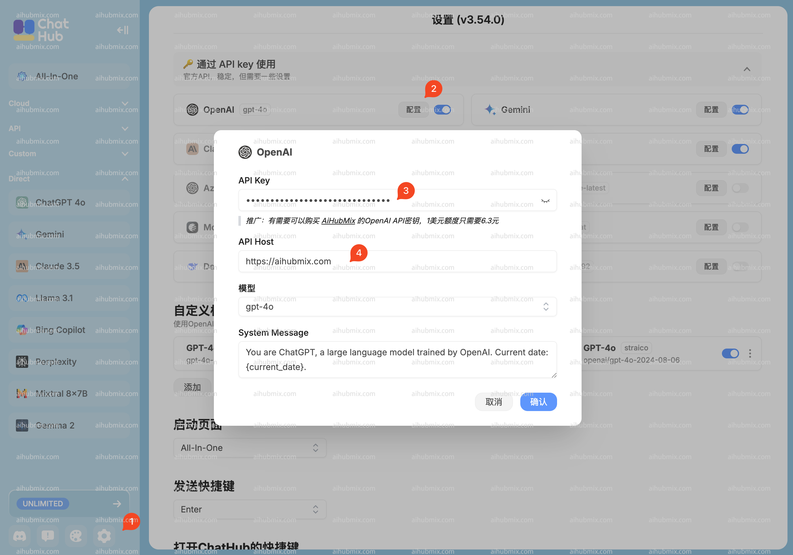

1. ChatHub公式サイトからChrome拡張機能をインストールします：https://chathub.gg  

2. ChatHub拡張機能の左下にある歯車アイコンをクリックして設定を行います（図中の赤1）  

3. 「APIキーで利用」リストのOpenAIの「設定」ボタンをクリックします（図中の赤2）  

4. AiHubMix APIキーを入力します。[当サイトのキー](https://aihubmix.com/token)で生成できます（キーの形式はsk-xxxxxxxx）。生成後、コピーして入力します（図中の赤3）  

5. API HostをAiHubMixウェブサイトのアドレスに変更します：（図中の赤4）  
```
https://aihubmix.com
``` 
