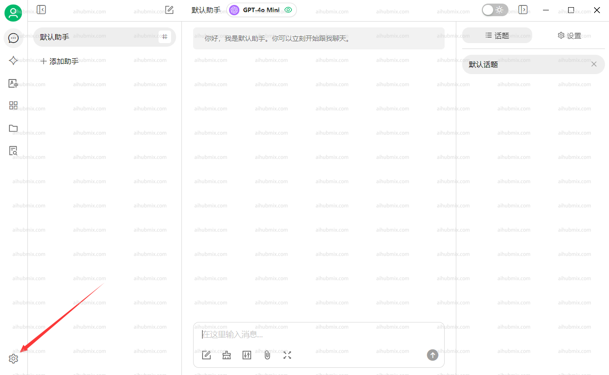
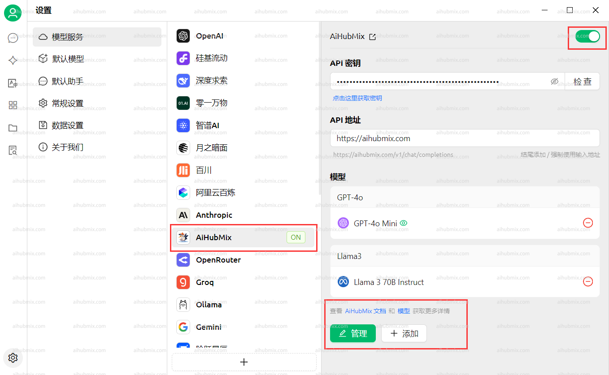
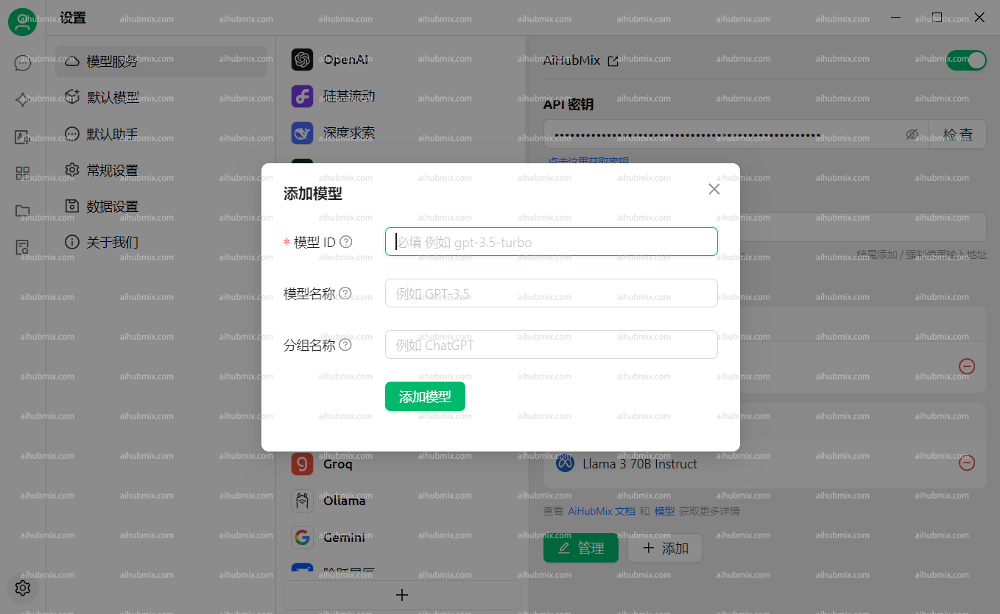
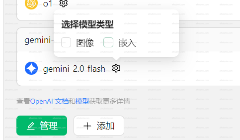

**[Cherry Studio AI ダウンロードアドレス](https://easys.run/cherry-studio/)**

## 通常の使用方法
1. アプリケーションの左下隅から設定を開きます。  
  
2. モデルプロバイダー画面で当社のAiHubMixを選択し、右上隅のボタンをクリックして有効にします。  
3. APIキーの欄には[当サイトのキー](https://aihubmix.com/token)を入力し、APIアドレスの欄は変更しないでください。  
**注：チェックが通らない場合は、VPNをオフにしてみてください**  
 
4. 下の「モデルを追加」をクリックし、モデルIDは当サイトの設定画面から使用したいモデルの名前をコピー＆ペーストします。  
 

## モデルが画像を見ることができない問題が発生した場合
一部の新しいモデルでは、画像を挿入してもモデルが画像を見ることができない問題が発生する場合があります。設定ページで手動で画像オプションをチェックする必要があります。  
