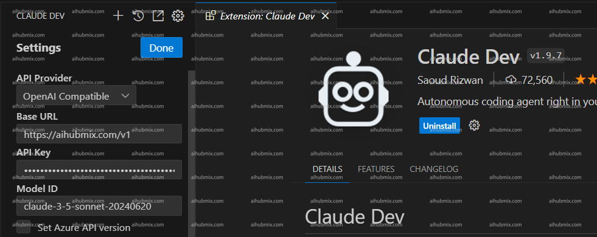

> Clineは以前のClaude Devです

- プラグインをダウンロードし、設定ページに入ります。  
- API Providerの欄で「OpenAl Compatible」を選択します。  
- Base URLの欄に次のように入力します：
```
https://aihubmix.com/v1
```
- API Keyの欄には[当サイトのキー](https://aihubmix.com/token)から生成したものを入力します。  
- モデル名を入力して設定を保存すれば使用できます。
- **注：モデル名は当サイトの設定ページからコピー＆ペーストすることをお勧めします。画像例はclaude-3-5モデルですが、gpt-4oも使用できます。**
