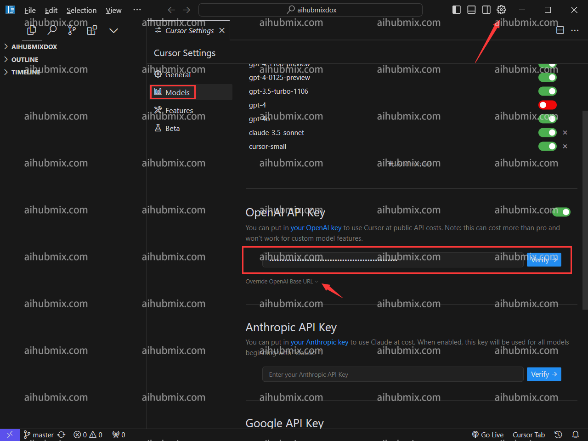
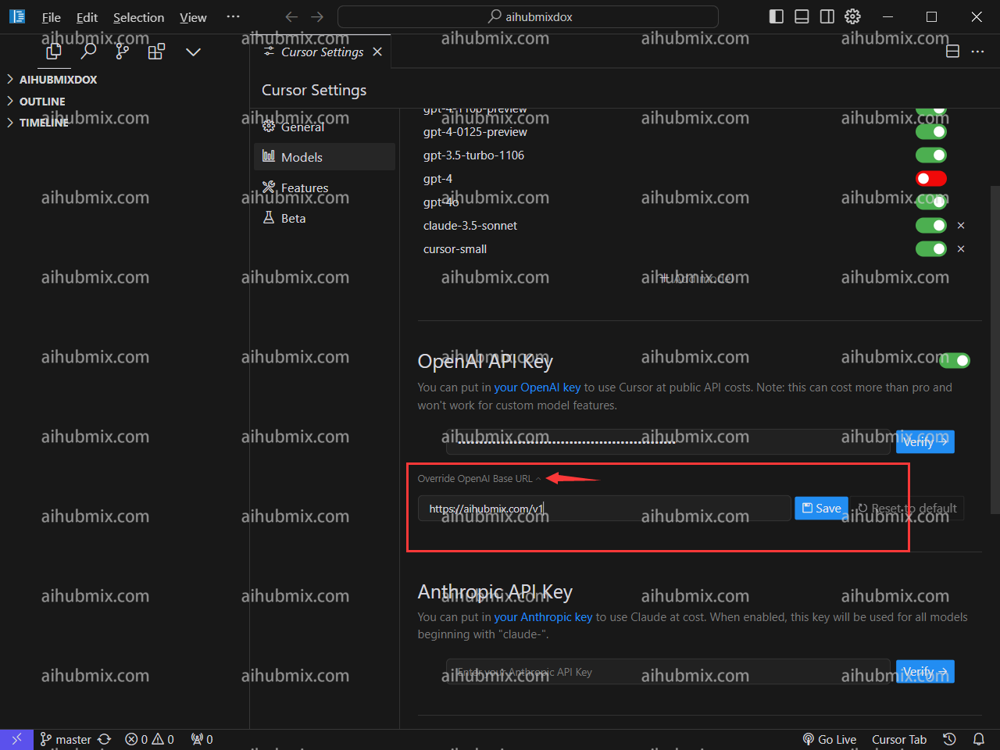
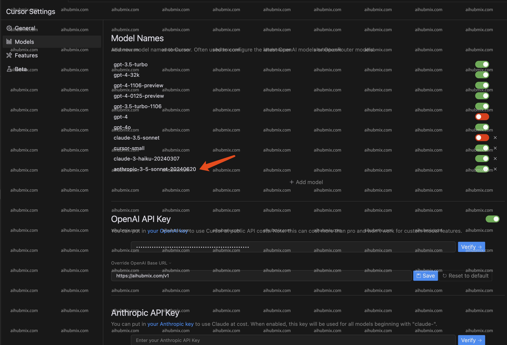

## 通常の使用方法
- 右上隅の歯車アイコンをクリックして設定ページに入り、Modelsを選択します。  
- Open APIキーの下に[当サイトのキー](https://aihubmix.com/token)を入力します。  

- Override OpenAl Base URLをクリックし、次のように入力します：  
```
https://aihubmix.com/v1
```  

- 最後にVerifyをクリックして認証が成功すれば完了です。

## 特記事項（CursorでClaude-3.5を使用する方法）
Cursorはリクエスト名に基づいてClaudeのAPIインターフェースを自動的にリクエストするため、当社のサービスを通じてClaude-3.5モデルを正常に使用できるように、  
Claude-3.5-sonnet-20240620にマッピングする**anthropic-3-5-sonnet-20240620**という名前を新たに追加しました。  
これにより、Cursorの自動リクエストを回避し、当社を介してClaudeインターフェースを使用できるようになります。  
- 具体的な使用方法は、モデルリストに**anthropic-3-5-sonnet-20240620**という名前のモデルを追加し、そのモデルを有効にするだけです。  
