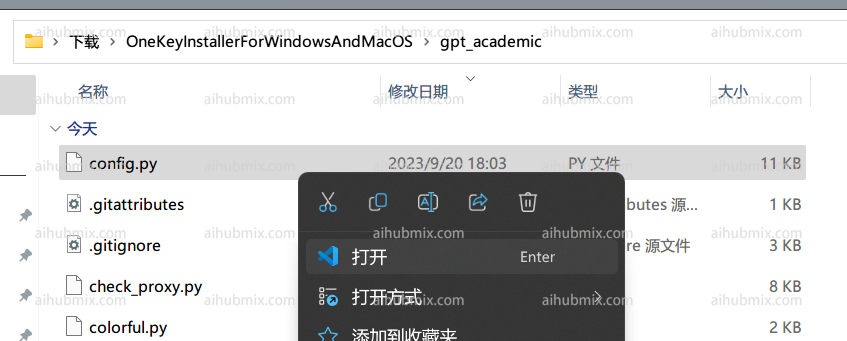
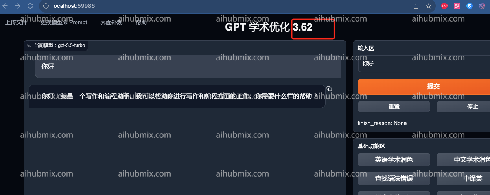

1. gpt_academic/config.pyファイルを開きます：  
 
1. config.py内のAPI_KEY変数を見つけ、[当サイトのキー](https://aihubmix.com/token)を入力するだけです：  
 
2. 下にスクロールし、config.py内のAPI_URL_REDIRECT変数を見つけ、次のように変更します（以下のコードブロックをそのままコピーして貼り付けてください）：  
```
API_URL_REDIRECT = {"https://api.openai.com/v1/chat/completions": "https://aihubmix.com/v1/chat/completions"}
```
 
3. これで使用できます。  
