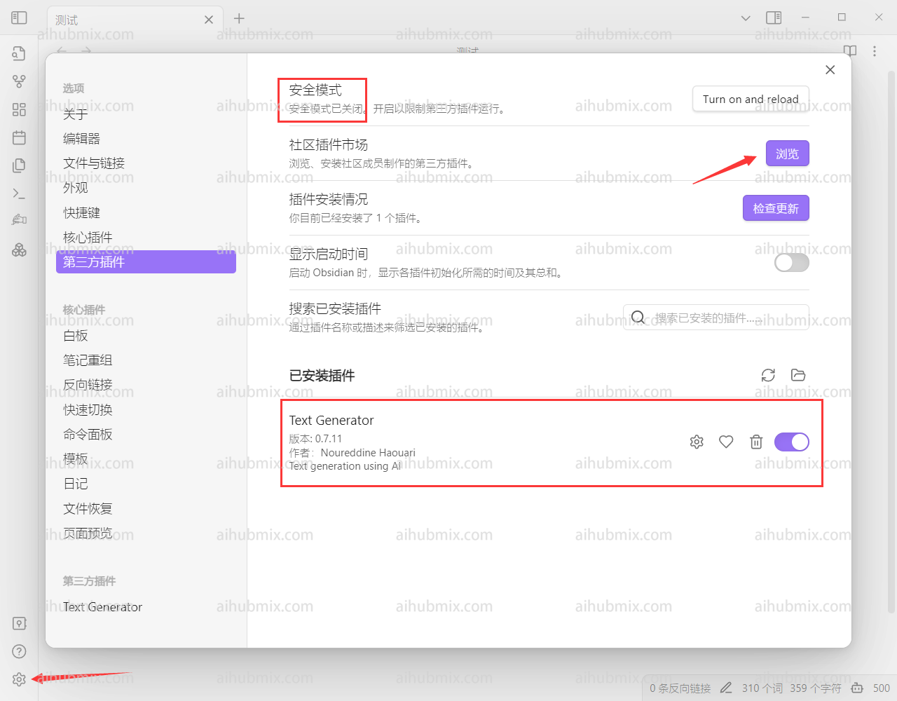
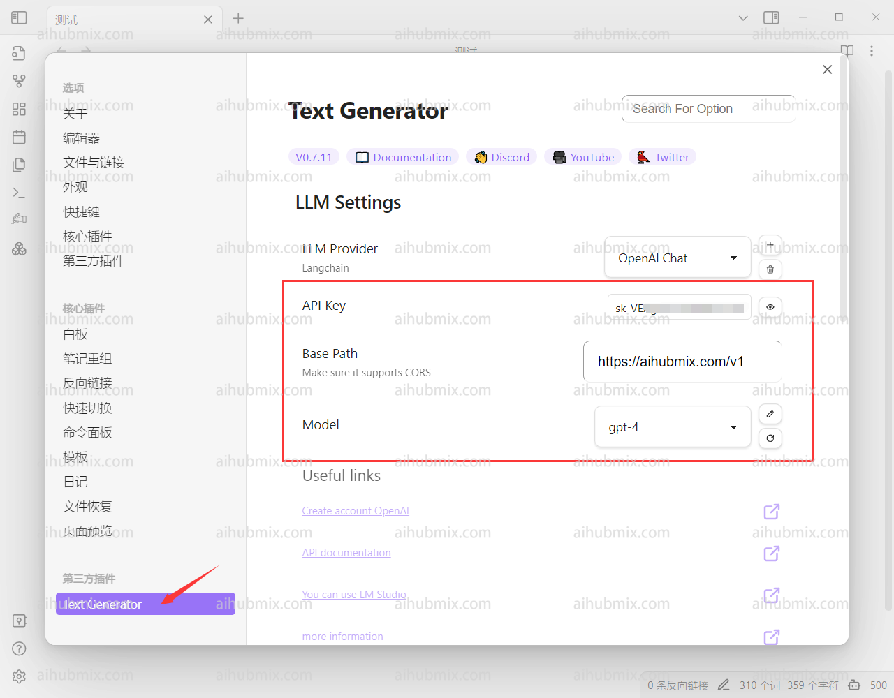

> text generator プラグインが必要です

1. ソフトウェアの左下隅にある設定に入り、サードパーティのプラグインを選択します。  
セーフモードをオフにした後、コミュニティプラグインマーケットでtext generatorを検索してインストールし、有効にします。  
  
2. text generatorの設定ページに入ります。  
3. 上部のAPI KEY欄には[当サイトのキー](https://aihubmix.com/token)から生成したものを入力します。  
4. 下部のBase Pathには次のように入力します：
```
https://aihubmix.com/v1
```
5. 最後に、使用するモデルを選択します。  
  
6. テキストを入力した後、左側にある手の形のボタンをクリックします。  
