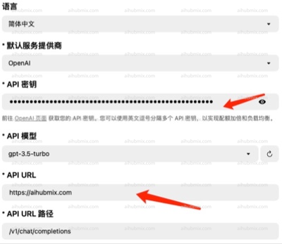
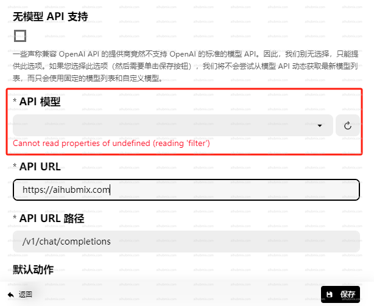
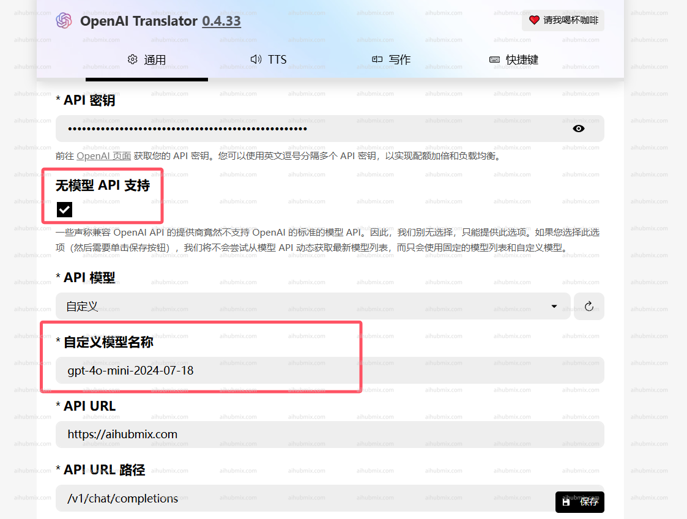

- 例：OpenAI Translator；  
- APIキーを、[当サイトのキー](https://aihubmix.com/token)から生成したものに変更します。  
- API URLを次のように変更します：
```
https://aihubmix.com
```
(注意：URLの末尾に「/」を付けないでください)  
 

## モデルが読み込めない問題が発生した場合
**注：**
バージョン0.4.33および0.4.34でモデルが読み込めない場合は、古いバージョンに戻してください。
古いバージョンのアドレス：https://github.com/openai-translator/openai-translator/releases/tag/v0.4.32  
OpenAI TranslatorでAPIモデルを選択できない問題が発生した場合。
  
**以下の方法で解決を試みることができます：**
- 「モデルAPIサポートなし」オプションにチェックを入れます。
- 当サイトの設定ページからモデル名をコピーし、手動で入力します。
