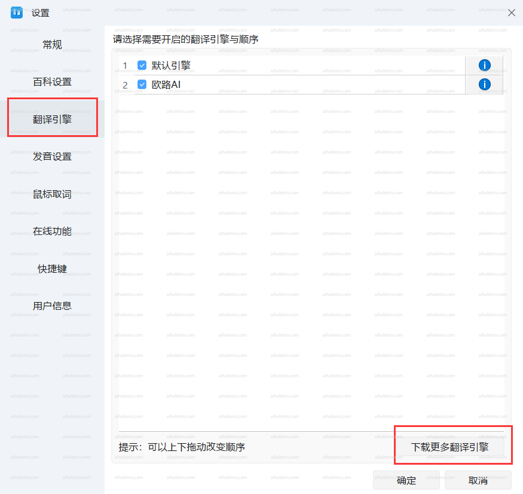
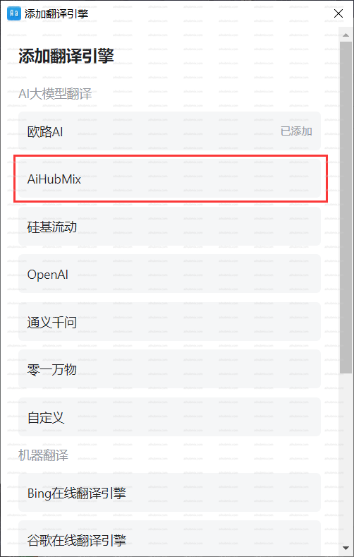
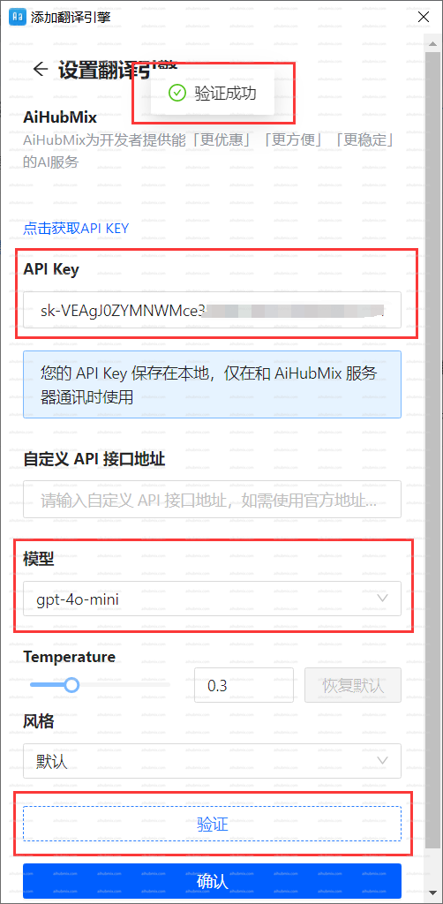

- 左下隅の歯車アイコンをクリックして設定ページに入り、「翻訳エンジン」、「その他の翻訳エンジンをダウンロード」を選択します。  
  
- 翻訳エンジンの追加でAiHubMixを選択します。  
  
- 「API Key」に[当サイトのキー](https://aihubmix.com/token)を入力します。  
- モデルを選択した後、認証をクリックし、成功したら確定します。  
