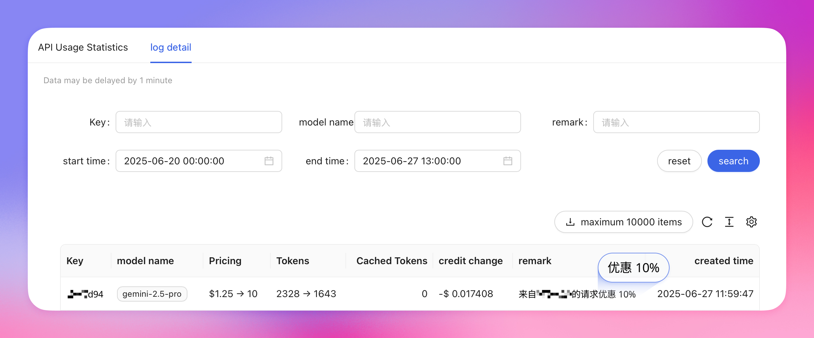

주로 API 호출 비용을 최적화하는 데 사용되며, 유효한 도메인 이름을 기반으로 고유 식별자가 생성됩니다. 이 식별자를 헤더에 추가하면 즉시 적용됩니다.

- **플랫폼의 경우:** 플랫폼에 대한 모든 Aihubmix API 호출 비용이 절감되지만, 개별 사용자는 할인을 받지 못합니다.
- **개발자 또는 일반 사용자의 경우:** 귀하의 도구를 통해 이루어진 모든 Aihubmix API 호출은 사용자가 시작한 경우에도 할인을 받습니다.

통합하여 사용하면 할인된 요청이 사용량 로그에 반영되는 것을 볼 수 있습니다.



## 1️⃣ 호출 방법:

<CodeGroup>

```shell Curl 방법
curl https://aihubmix.com/v1/responses \       
  -H "Content-Type: application/json" \
  -H "Authorization: Bearer sk-***" \
  -H "APP-Code:***" \
  -d '{
    "model": "gpt-4o-2024-11-20",
    "input": "Hello! Please say Hello back to me."
  }'
```


```py Openai SDK 방법
completion = client.chat.completions.create(
  extra_headers={
    "APP-Code":"***"
  },
  model="gpt-4o",
  messages=[
    {
      "role": "user",
      "content": "삶의 의미는 무엇인가요?"
    }
  ]
)
```

</CodeGroup>

## 2️⃣ 참고 사항

1. Gemini의 헤더는 약간 특별하므로 다음과 같이 추가하세요:

```py Python
    client = genai.Client(
        api_key="sk-***", # 🔑 AiHubMix에서 생성한 API 키로 바꾸세요
        http_options={
            "base_url": "https://api.aihubmix.com/gemini",
            "headers": {
                "APP-Code": "***"
            }
        },
    )
```

2. Claude 네이티브 호출도 extra_headers를 추가합니다:

```py Python
import os
import anthropic

client = anthropic.Anthropic(
    api_key="sk-***", # 🔑 AiHubMix에서 생성한 API 키로 바꾸세요
    base_url="https://aihubmix.com"
)

message = client.messages.create(
    extra_headers={"APP-Code":"***"},
    model="claude-3-7-sonnet-20250219",
    max_tokens=1024,
    messages=[
        {"role": "user", "content": "안녕하세요, Claude"}
    ]
)

print(message.content) 
```

## 3️⃣ 할인 이용 약관

**APP-Code**를 사용하여 할인을 받으시면 다음 약관에 동의하는 것입니다. **AiHubMix는** 아래 나열된 모든 약관에 대한 최종 해석권을 가집니다.

<Note>
  **오픈 소스 제품 가이드라인**

  제품이 오픈 소스인 경우, 제품 기능 내에서 **AiHubMix를 AI 모델 제공업체 중 하나로 인정**하는 것으로 충분합니다.
  인정 형식은 유연합니다.
</Note>

<Note>
  **클로즈드 소스 제품 가이드라인**

  제품이 클로즈드 소스인 경우, 제품 인터페이스, 사용자 계약 또는 관련 문서에 **AiHubMix를 모델 서비스의 출처로 명시적으로 언급**해야 합니다.

  예시 문구:

  - "AI services powered by AiHubMix"
  - "AI services provided by AiHubMix"
  - 제품의 정보 페이지 또는 도움말 섹션에 관련 정보 포함
</Note>

<Note>
  **프로모션 유효 기간**

  APP-Code 할인은 **2025년 12월 31일**까지 유효합니다.
  할인 정책은 변경될 수 있으니 공식 공지를 통해 최신 정보를 확인하시기 바랍니다.
</Note>