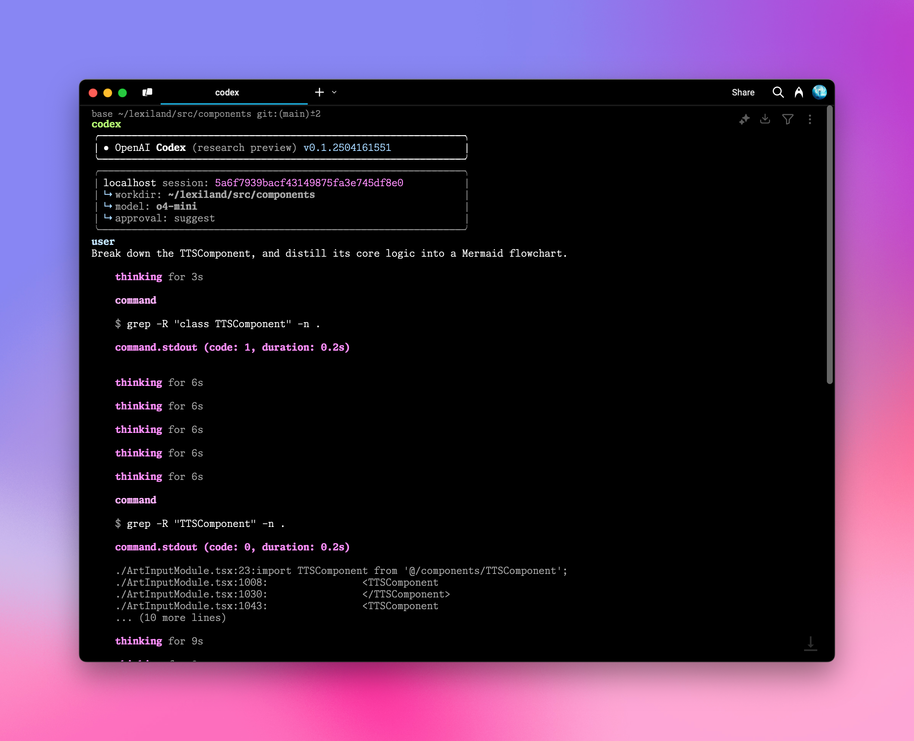

# OpenAI Codex CLI 통합

AiHubMix는 OpenAI [Codex CLI](https://github.com/openai/codex)와의 원활한 통합을 제공하여 명령줄 환경에서 직접 고급 AI 프로그래밍 지원을 활용할 수 있도록 합니다. 간단한 구성 단계를 통해 자연어를 사용하여 터미널에서 다양한 프로그래밍 및 시스템 작업을 수행할 수 있습니다.  
사용하기 전에 다음 명령을 실행하여 설치하거나 업데이트하십시오:  
```bash
npm install -g @openai/codex
```

## 구성 단계

### 1. 환경 변수 설정

셸 구성 파일(예: `.zshrc` 또는 `.bashrc`)을 열고 다음 환경 변수를 추가합니다:

```bash
export OPENAI_BASE_URL="https://api.aihubmix.com/v1"
export OPENAI_API_KEY="sk-***"
```

<Warning>
`OPENAI_API_KEY`는 [AiHubMix 키](https://aihubmix.com/token)여야 합니다. 변수 이름은 OpenAI 네이티브 클라이언트와의 호환성을 위해 `OPENAI_API_KEY`로 유지됩니다.
</Warning>

### 2. 구성 변경 사항 적용

터미널에서 다음 명령을 실행하여 환경 변수를 적용합니다:

```bash
source ~/.zshrc  # zsh를 사용하는 경우
# 또는
source ~/.bashrc  # bash를 사용하는 경우
```

### 3. Codex CLI 실행

프로젝트 디렉토리로 이동하여 `codex` 명령을 실행합니다:

```bash
cd /your_project_path
codex
```
  

### 4. 자연어를 사용하여 작업 실행

이제 다음과 같이 자연어를 사용하여 Codex CLI에 지침을 입력할 수 있습니다:

```bash
# 샘플 입력
TTSComponent를 분해하고 핵심 로직을 Mermaid 순서도로 추출하세요.
```
  

## 고급 구성

<Tip>
- 기본 모델은 `codex-mini-latest`이며, 이는 Codex CLI에서 사용하기 위해 특별히 미세 조정된 `o4-mini` 버전으로 `~/.codex/config.json`에서 수정할 수 있습니다.
- 현재 OpenAI 모델만 지원되며, 모델 목록은 [응답 API 문서](https://platform.openai.com/docs/api-reference/responses)에서 찾을 수 있습니다.
- `~/.codex/instructions.md` 파일을 편집하여 시스템 프롬프트를 사용자 지정하여 AI 어시스턴트의 동작을 조정할 수 있습니다.
</Tip>

## 유용한 명령 참조

### 도움말 명령
```bash
codex -h
```

### 전체 명령 옵션
```bash
  사용법
    $ codex [옵션] <프롬프트>

  옵션
    -h, --help                 사용법을 표시하고 종료합니다
    -m, --model <모델>        완료에 사용할 모델 (기본값: codex-mini-latest)
    -i, --image <경로>         입력으로 포함할 이미지 파일 경로
    -v, --view <롤아웃>       세션을 시작하는 대신 이전에 저장된 롤아웃을 검사합니다
    -q, --quiet                어시스턴트의 최종 출력만 인쇄하는 비대화형 모드
    -a, --approval-mode <모드> 승인 정책을 재정의합니다: 'suggest', 'auto-edit' 또는 'full-auto'

    --auto-edit                파일 편집을 자동으로 승인합니다. 여전히 명령에 대한 프롬프트가 표시됩니다
    --full-auto                샌드박스에서 실행될 때 편집 및 명령을 자동으로 승인합니다

    --no-project-doc           리포지토리의 'codex.md'를 자동으로 포함하지 않습니다
    --project-doc <파일>       <파일>에 있는 추가 마크다운 파일을 컨텍스트로 포함합니다
    --full-stdout              명령 출력에서 stdout/stderr를 자르지 않습니다

  위험한 옵션
    --dangerously-auto-approve-everything
                               모든 확인 프롬프트를 건너뛰고 샌드박스 없이 명령을 실행합니다.
                               일시적인 로컬 테스트용으로만 사용됩니다.

  실험적 옵션
    -f, --full-context         전체 리포지토리를 컨텍스트에 로드하고 한 번에
                               편집 배치를 적용하는 "전체 컨텍스트" 모드로 시작합니다. --model을 제외한
                               모든 다른 플래그와 호환되지 않습니다.

  예제
    $ codex "ASCII 아트를 인쇄하는 파이썬 프로그램을 작성하고 실행하세요"
    $ codex -q "빌드 문제 수정"
```