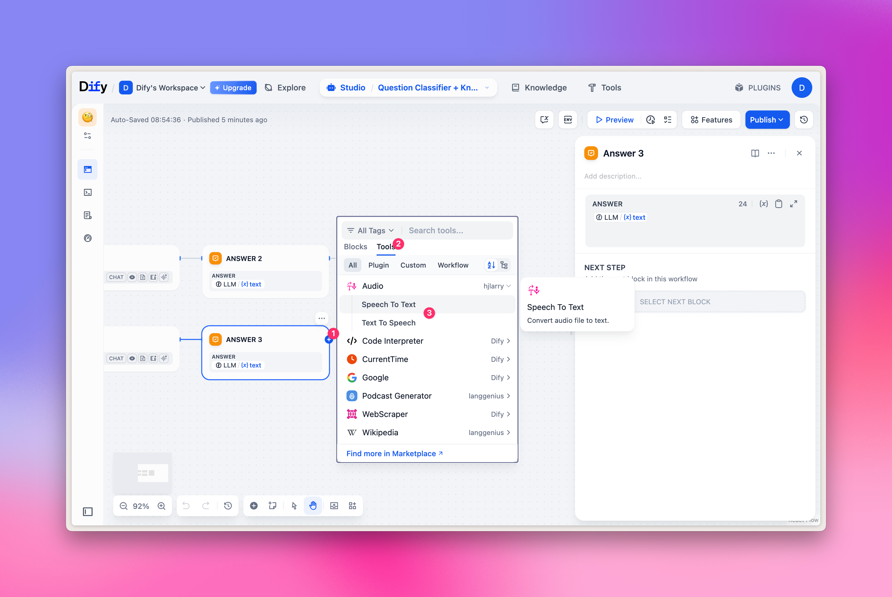

## Aihubmix 플러그인 원클릭 설치

아래 링크를 클릭하고 Dify 마켓플레이스 페이지에서 **설치** 버튼을 누르기만 하면 됩니다:

👉 [Dify 플러그인 페이지로 이동](https://marketplace.dify.ai/plugins/langgenius/aihubmix?language=en-US&theme=system)

**예시 이미지:**
  

## 구성
1. 페이지 오른쪽 상단의 아바타 클릭 → '설정' 선택
2. '모델 공급자' 탭 클릭
3. 오른쪽에서 Aihubmix 찾기 → 설정 확장, 그리고 [API 키](https://aihubmix.com/token) 입력

  

**현재 다음 5가지 카테고리의 모델이 사전 구성되어 있습니다:**
- LLM: 대규모 언어 모델
- TEXT EMBEDDING: 벡터 임베딩 모델
- RERANK: 재순위 모델
- SPEECH2TEXT: 음성-텍스트 변환 모델
- TTS: 텍스트-음성 변환 모델

  

**더 많은 사용자 지정 모델을 추가하는 방법은?**

'+ 모델 추가'를 클릭하고 모델 이름 옵션을 채웁니다:
- 모델 갤러리의 모든 [모델 ID](https://aihubmix.com/models)를 입력합니다(예: `gpt-4o-2024-11-20`).
- API 키를 입력하고 '저장'을 클릭합니다.

참고: Dify 플러그인의 특수한 설계로 인해 현재 이미지 생성 모델을 지원하지 않으므로 `gpt-image-1`과 같은 모델은 추가할 수 없습니다.

  

## LLM 선택

워크플로우 노드에서 'LLM'을 선택하면 Aihubmix에서 제공하는 모델을 선택할 수 있습니다.

**예시 이미지:**
  

## 임베딩/재순위 모델 선택

임베딩/재순위 모델은 주로 지식 기반 질문 답변에 사용되며, 상단 지식 탭에서 빠르게 경험할 수 있으며 워크플로우 노드에서 해당 모델을 선택할 수도 있습니다.

**예시 이미지:**
  

## TTS/SST 선택

TTS/SST 모델은 주로 음성 구문 분석 및 합성에 사용되며, 도구를 선택할 때 해당 항목은 일반적인 'LLM'이 아니라 '도구' 탭의 '오디오' 유형입니다.
대응 관계:
1. TTS 텍스트-음성 변환: 'Text to Speech' 선택
2. SST 음성-텍스트 변환: 'Speech to Text' 선택

**예시 이미지:**
