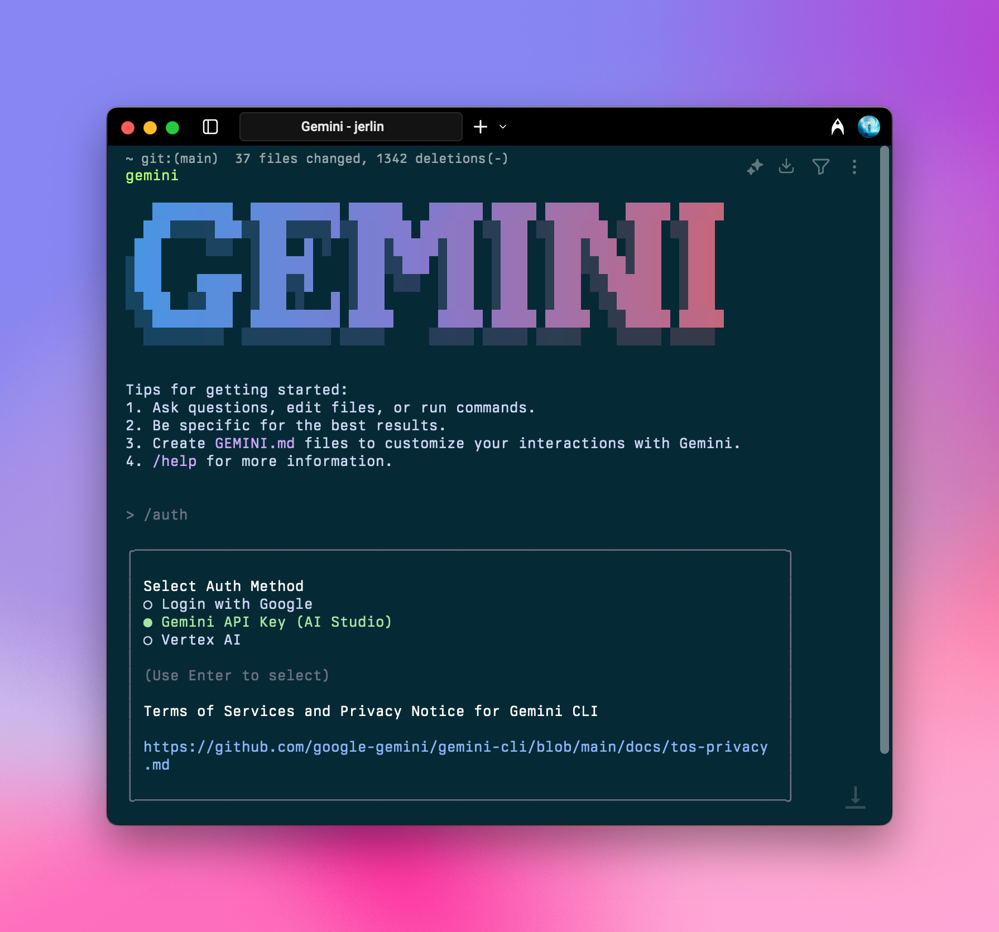
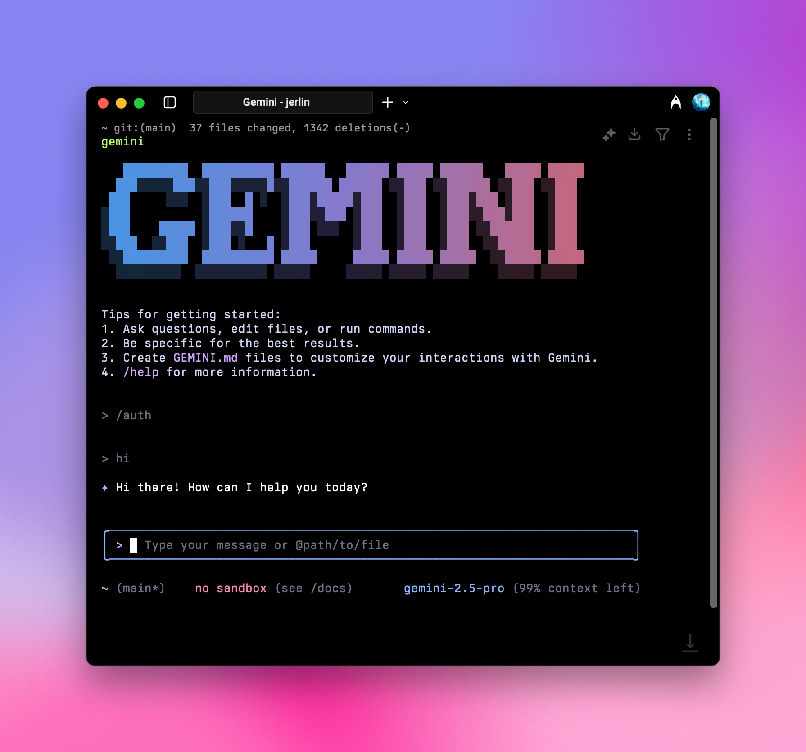

Aihubmix로 Gemini CLI를 구동하여 안정적이고 효율적인 Gemini 모델 서비스를 이용하세요.

## 빠른 설정 가이드:

### 1️⃣ 전역 npm 패키지 설치

터미널에서 실행하세요

```shell
npm install -g @google/gemini-cli
```

Node.js 버전이 18 이상인지 확인하세요.

자세한 정보는 다음을 참조하세요:

1. [공식 저장소](https://github.com/google-gemini/gemini-cli)
2. [상세 구성](https://github.com/google-gemini/gemini-cli/blob/main/docs/cli/configuration.md)

### 2️⃣ 환경 변수 구성

Aihubmix API 키와 전달 주소를 시스템 환경 변수에 추가하세요. Aihubmix [「키」 페이지](https://aihubmix.com/token)에서 API 키를 생성할 수 있습니다.

예를 들어, ~/.zshrc에 추가하세요:

```shell
export GOOGLE_GEMINI_BASE_URL="https://aihubmix.com/gemini"
export GEMINI_API_KEY="sk-***"
```

<Tip>
  Mac 사용자의 경우, `사용자 이름` 디렉토리에서 단축키 `⌘ + ⇧ + .`를 사용하여 숨겨진 .zshrc 파일을 표시한 다음, 시스템의 "텍스트 편집기" 앱으로 열어 위 내용을 추가할 수 있습니다.
</Tip>

### 3️⃣ 구성 적용

구성을 추가한 후, 터미널에서 `source ~/.zshrc`를 실행하고 Enter 키를 누르세요.

### 4️⃣ 터미널 실행

터미널에 입력하세요:

```shell
gemini
```

## 초기화 설정

### 연결 방법 선택



실행 후, `/auth`를 입력하고 Enter 키를 누른 다음 `Gemini API Key (AI Studio)`를 선택하세요.

```shell
○ Google로 로그인
● Gemini API Key (AI Studio)
○ vertex AI
```

<Note>
  언제든지 `/auth` 명령을 사용하여 인증 방법을 전환할 수 있습니다.
</Note>

### 실행 성공

위의 초기화를 완료하면 정상적으로 사용할 수 있습니다.



즐겁게 사용하세요\!
