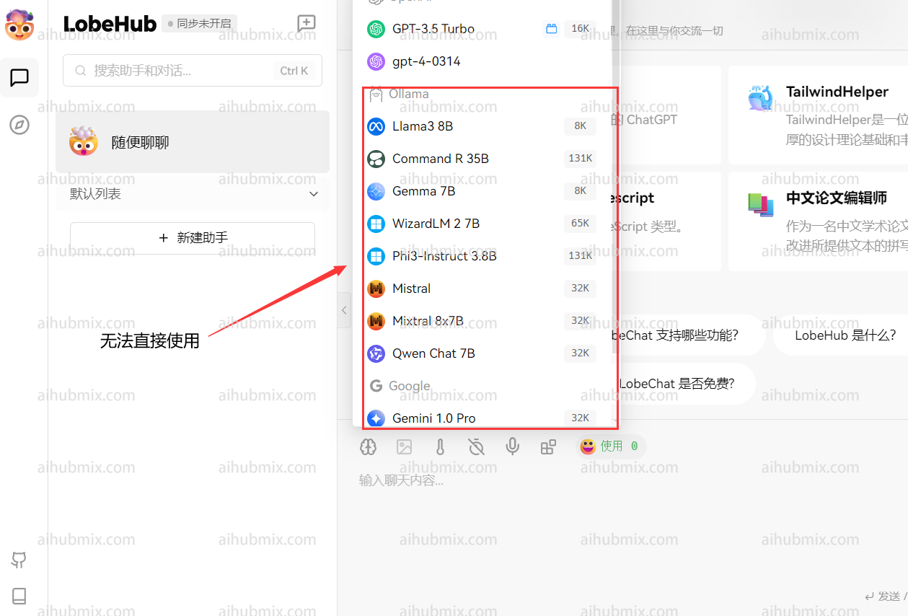
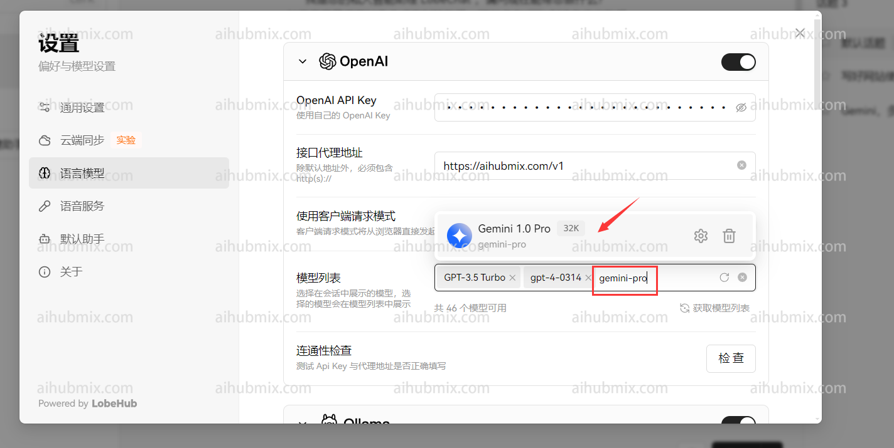

## 작동 원리

저희 플랫폼은 OpenAI 모델 API를 표준 인터페이스로 사용하여 Google의 **Gemini** 시리즈 및 Anthropic Claude를 포함한 여러 비 OpenAI 모델을 통합합니다. 비 OpenAI 모델을 사용하려면 OpenAI 모델을 호출할 때와 마찬가지로 **모델 이름을 변경**하기만 하면 됩니다. 사용 가능한 모델 이름은 저희 웹사이트의 설정 페이지에서 찾을 수 있습니다.


## 애플리케이션에서 사용하기 - Lobe Chat 예시

일반적으로 저희 웹사이트에서 제공하는 API 키는 OpenAI 모델(예: GPT-3.5)에만 접근할 수 있습니다.


저희의 통합 모델을 사용하려면 사용자 정의 모델 이름을 추가할 수 있습니다. 방법은 다음과 같습니다:

1. 설정 인터페이스를 열고 "모델 목록" 섹션을 찾습니다.
2. - 웹사이트 모델 스퀘어 페이지를 엽니다.
   - 사용하고자 하는 모델의 이름을 복사합니다(예: gemini-pro 또는 claude-3-opus-20240229).


3. - 원하는 모델 이름을 입력하고 선택합니다.
   - 수동으로 추가된 모델이 OpenAI 섹션 아래에 나타나는지 확인합니다.

4. OpenAI 섹션에서 사용하고자 하는 모델을 선택합니다(예: gemini-pro). 결과는 다음과 같아야 합니다:


## 개발자 통합 - 공식 라이브러리 예시

공식 Python 라이브러리와 함께 저희 API를 사용하는 방법의 예시입니다:

```python
from openai import OpenAI

client = OpenAI(
    api_key="AIHUBMIX_API_KEY", # AiHubMix에서 생성한 키로 교체하세요
    base_url="https://aihubmix.com/v1"
)

chat_completion = client.chat.completions.create(
    messages=[
        {
            "role": "user",
            "content": "테스트라고 말해주세요",
        }
    ],
    model="gemini-2.0-flash",
)

print(chat_completion)
```

## 특수 사례: Next Web 클라이언트

Next Web 클라이언트를 사용하는 경우, 최신 버전(v2.13.0)으로 업그레이드했는지 확인하세요. 이 버전은 사용자 정의 모델을 추가하는 새로운 방법을 도입합니다:

1. **사용자 정의 모델 이름 입력하기**:
   - Next Web 클라이언트는 입력된 모델 이름에 따라 모델 제공업체를 자동으로 결정합니다. 하지만 저희 웹사이트의 API 키는 OpenAI 인터페이스와만 호환됩니다.
   - 사용자 정의 모델 이름을 입력할 때 "+원하는 모델 이름@OpenAI" 형식을 사용하세요.
   - 예를 들어, gemini-pro 모델을 사용하려면 "+gemini-pro@OpenAI"를 입력하세요.
   - 이 방법은 모델 제공업체를 수동으로 OpenAI로 지정합니다.

2. **선택 확인하기**:
   - 모델 선택 화면에서 수동으로 추가한 모델(OpenAI)이 하단에 나타나는지 확인하세요.
