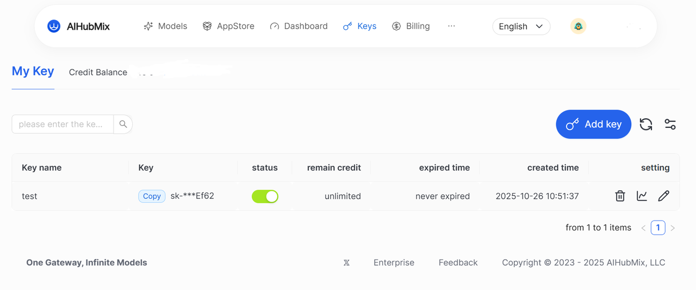
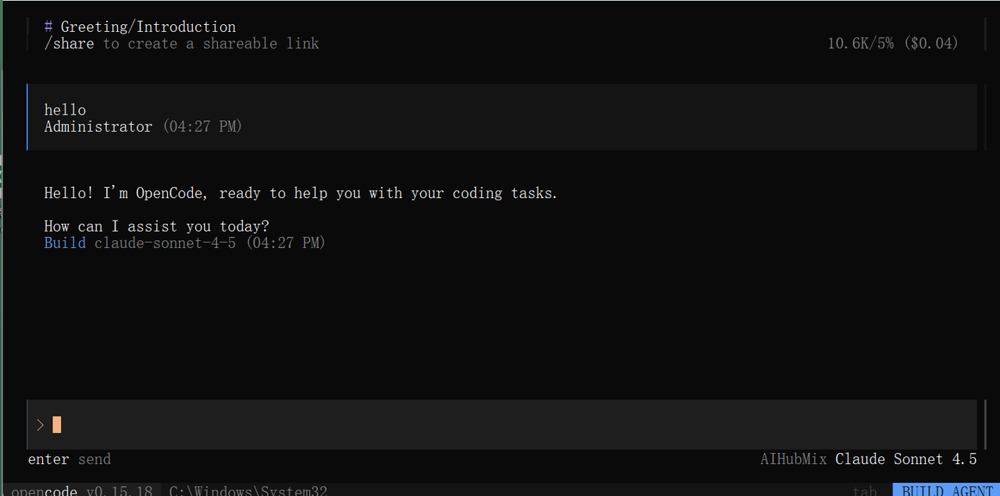

OpenCode는 이제 새로운 모델 제공자로 AiHubMix를 지원합니다. OpenCode 내에서 AiHubMix API 키를 사용하여 해당 모델 서비스에 액세스할 수 있습니다.

AiHubMix는 현재 GPT, Claude, DeepSeek, Gemini, Qwen을 포함한 주요 모델 패밀리를 지원합니다. OpenCode에서 최적의 성능을 위해 다음 모델이 권장됩니다:

- `claude-sonnet-4-5`
- `glm-4.6`
- `gpt-5`
- `gpt-5-codex`

이 가이드는 다양한 운영 체제에서 OpenCode를 설치, 구성 및 실행하고 AiHubMix API에 연결하는 단계별 지침을 제공합니다.

---

## 시스템 요구사항

설치 전에 시스템이 다음 요구사항을 충족하는지 확인하세요:

- Node.js ≥ 18.0.0
- 패키지 매니저(OS에 따라 선택사항):
  - macOS / Linux: `brew`
  - Arch Linux: `paru`
  - Windows: `choco`, `winget`, 또는 `scoop`

---

1. OpenCode 설치

다음 방법 중 하나를 사용하여 OpenCode를 설치할 수 있습니다:

**Node.js 사용**

```
# CURL 사용 
curl -fsSL https://opencode.ai/install | bash

# NPM 사용
npm install -g opencode-ai

# Bun 사용
bun install -g opencode-ai

# PNPM 사용
pnpm install -g opencode-ai

# Yarn 사용
yarn global add opencode-ai
```

---

**Homebrew 사용 (macOS / Linux)**

```
brew install sst/tap/opencode
```

---

**Paru 사용 (Arch Linux)**

```
paru -S opencode-bin
```

---

**Windows에서**

```
# Chocolatey 사용
choco install opencode

# WinGet 사용
winget install opencode

# Scoop 사용
scoop bucket add extras
scoop install extras/opencode

# NPM 사용 (Node.js 및 관리자 권한 필요)
npm install -g opencode-ai
```

---

2. OpenCode 실행 및 로그인

설치 후 다음 단계에 따라 로그인하고 OpenCode를 구성하세요.

### 단계 1. 로그인

터미널에서 다음 명령을 실행하세요:

```
opencode auth login
```

---

### 단계 2. AI 제공자 선택

로그인 인터페이스에서 모델 제공자로 AiHubMix를 선택하세요.


---

### 단계 3. API 키로 인증

AiHubMix 계정에 로그인하여 API 키를 획득하세요. OpenCode 로그인 화면에서 입력하여 인증을 완료하세요.




---

3. 설치 확인

OpenCode가 성공적으로 설치되고 구성되었는지 확인하려면 다음을 실행하세요:

```
opencode
```

  

콘솔이 유효한 모델 응답을 반환하면 설정이 완료된 것입니다.



---

4. 문제 및 팁

- API 키 검증이 실패하면 AiHubMix에서 재인증하고 키의 상태를 확인하세요.
- 앱 내 도움말 보기: `opencode` -\> `/help`
- 공식 문서: https://opencode.ai/docs/