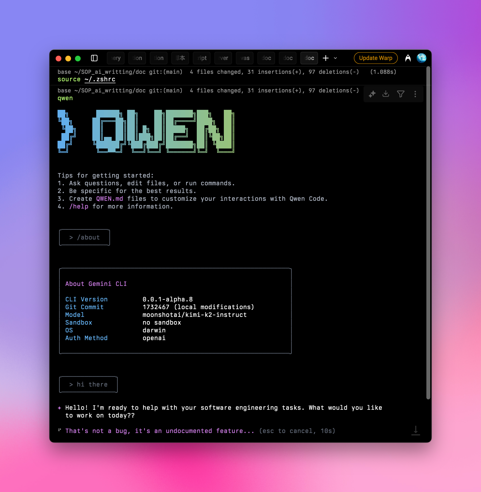

## 빠른 설정 가이드:

### 1️⃣ npm 패키지 전역 설치

Node.js 버전이 20 이상인지 확인한 후, 터미널에서 다음을 실행하세요:

```shell
npm install -g @qwen-code/qwen-code
qwen --version
```

자세한 내용은 [공식 저장소](https://github.com/QwenLM/qwen-code)를 참조하세요.

### 2️⃣ 환경 변수 구성

Aihubmix 키와 전달 주소를 시스템 환경 변수에 추가하세요. Aihubmix [키 페이지](https://aihubmix.com/token)에서 키를 생성할 수 있습니다.

예를 들어, ~/.zshrc에 다음을 추가하세요:

```shell
export OPENAI_API_KEY="your_aihubmix_key"
export OPENAI_BASE_URL="https://aihubmix.com/v1"
export OPENAI_MODEL="your_model"
```

<Tip>
  Mac 사용자의 경우, 단축키 `⌘ + ⇧ + .`를 사용하여 홈 디렉토리에서 숨겨진 `.zshrc` 파일을 표시할 수 있습니다. 시스템의 "텍스트 편집기" 앱으로 열고 위의 줄을 추가하세요.
</Tip>

### 3️⃣ 구성 적용

구성을 추가한 후, 터미ナル에서 `source ~/.zshrc`를 실행하고 Enter를 누르세요.

### 4️⃣ 실행 및 사용

터미널에 다음을 입력하세요:

```shell
qwen
```

실행 후, `/about`을 입력하고 Enter를 눌러 설정을 확인하세요. 현재 버전과 선택된 대규모 언어 모델이 표시됩니다:



이제 평소처럼 Qwen Code를 사용할 준비가 되었습니다.