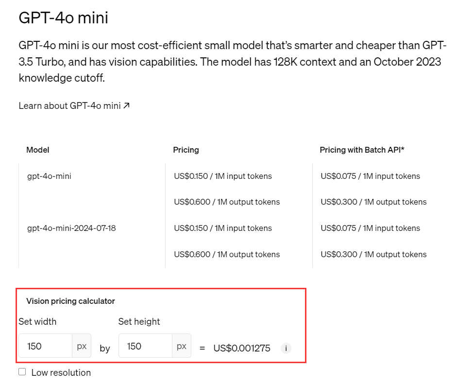
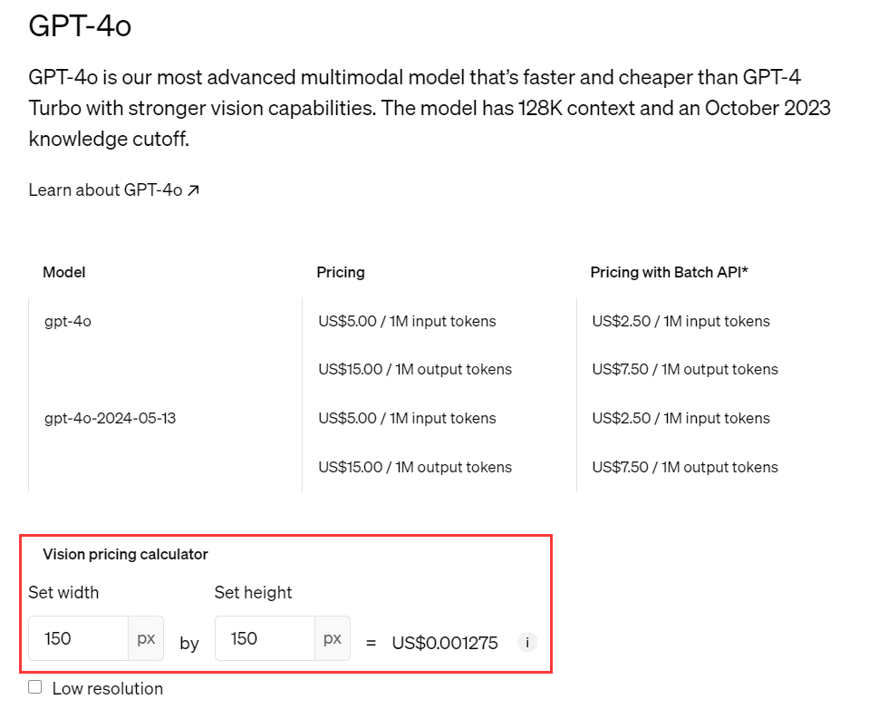

<Update label="8월 10일">
- 개발자가 이미지 생성 서비스를 쉽게 연동할 수 있도록 [Aihubmix 이미지 생성 MCP](/ko/clients/AHM-mcp) 출시
</Update>

<Update label="8월 1일">
  - AiHubMix 플랫폼에서 모든 대형 모델을 [Claude Code](/ko/api/CC-any) 내에서 사용할 수 있습니다
</Update>

<Update label="7월 29일">
  - [AI SDK](/ko/clients/AISDK) 지원이 추가되어, 하나의 키로 다양한 모델에 접속할 수 있습니다.
</Update>

<Update label="7월 23일">
  - [Qwen Code](/ko/api/Qwen-code) 지원이 추가되었으며, Aihubmix 플랫폼의 모든 대형 언어 모델을 활용합니다.
</Update>

<Update label="7월 4일">
  - [llms.txt](/en/llms) 지원 추가 — LLM 어시스턴트가 주요 모델 생태계를 빠르게 탐색할 수 있는 단일 링크입니다.
</Update>

<Update label="2025년 6월 29일">
  - [Gemini Cli](/en/api/Gemini-Cli) 문서가 추가되어 터미널에서 Gemini 모델 사용을 지원합니다.
  - OpenAI Responses API가 이제 Code Interpreter와 Remote MCP 호출을 지원합니다.
</Update>

<Update label="2025년 6월 26일">
  - OpenAI, Ideogram, Stability, Google Imagen을 포함한 여러 주류 모델을 지원하는 [범용 이미지 생성 API](/en/api/Image-Gen)가 추가되었습니다.
</Update>

<Update label="2025년 6월 23일">
  - 개발자를 위해 모든 모델에 10% 할인을 제공하는 [APP-Code](/en/api/App-code)가 도입되었습니다.
</Update>

<Update label="2025년 6월 18일">
  - 사용자가 오류 정보를 더 잘 이해할 수 있도록 [HTTP 상태 코드](/en/FAQs/HTTP-Codes) 문서가 추가되었습니다.
</Update>

<Update label="2025년 6월 15일">
  - 비디오 생성당 총 비용이 $0.41에 불과한 Veo 3.0 역방향 액세스 방법이 추가되었습니다.
</Update>

<Update label="2025년 6월 13일">
  - [Veo3.0](https://aihubmix.com/models?model=veo-3.0-generate-preview) 생성 지원이 추가되어 더 다양한 창작 형식을 가능하게 합니다.
</Update>

<Update label="2025년 6월 12일">
  - Claude가 통합되어 중국에서 안정적인 사용이 가능합니다.
</Update>

<Update label="2025년 6월 9일">
  - OpenAI Reasoning 요약 표시를 지원하며, responses API에 적용됩니다.
</Update>

<Update label="2025년 6월 5일">
  - Gemini 암시적 캐싱 기능이 추가되어 자동 히트 및 히트 피드백을 지원합니다. 개발자는 usage_metadata를 통해 히트 상태를 확인할 수 있습니다. 비용 절약은 보장되지 않으며, 실제 효과는 요청 구조와 사용 시나리오에 따라 달라집니다.
</Update>

<Update label="2025년 5월 31일">
  **포괄적인 Claude 4 새로운 기능 지원**

  - ⏳ **새로운 캐시 지속 시간**: Claude 1시간 캐시 지속 시간베타 지원.
  - 🎉 **새로운 텍스트 편집기 도구**: Claude 4 모델이 새로운 `text_editor_20250429` 도구 유형과 `str_replace_based_edit_tool` 도구 이름을 지원합니다
  - 🚫 **거부 중단 이유**: 모델이 안전상의 이유로 생성을 거부하는 콘텐츠에 대한 새로운 `refusal` 중단 이유가 도입되었습니다
  - 🧠 **확장된 사고**: Claude 4 모델이 전체 사고 과정의 요약을 반환하여 확장된 사고의 완전한 지능적 이점을 제공합니다
  - 🔄 **인터리브된 사고**: 확장된 사고와 도구 사용을 인터리브하는 것을 지원하여 더 자연스러운 대화 경험을 가능하게 합니다 (베타 기능)
  - ⚠️ **폐기된 기능**:
    - Claude 4 텍스트 편집기 도구는 더 이상 `undo_edit` 명령을 지원하지 않습니다
    - `token-efficient-tools-2025-02-19` 지원 제거 (Claude 3.7 전용)
    - `output-128k-2025-02-19` 지원 제거 (Claude 3.7 전용)
  - 📚 사용자가 Claude 3.7에서 Claude 4로 원활하게 마이그레이션할 수 있도록 포괄적인 마이그레이션 가이드와 코드 예제가 업데이트되었습니다
</Update>

<Update label="2025년 5월 22일">
  - Dify 플러그인 지원이 추가되어 Dify에서 Aihubmix 모델을 원활하게 통합할 수 있습니다.
</Update>

<Update label="2025년 5월 17일">
  - 프로그래밍 작업을 위해 특별히 설계된 codex-mini-latest 모델이 이제 지원되며 Responses API 엔드포인트 또는 Codex CLI를 통해 액세스할 수 있습니다.
  - 이미지 생성을 위한 Google Imagen 3.0과 비디오 생성을 위한 Veo 2.0을 지원하여 창작 형식을 풍부하게 합니다.
  - gemini-2.0-flash-exp가 gemini-2.0-flash-preview-image-generation으로 업그레이드되었습니다
</Update>

<Update label="2025년 5월 9일">
  가장 진보된 이미지 생성 모델인 [Ideogram AI V3](/en/api/IdeogramAI) 인터페이스가 추가되었습니다.
</Update>

<Update label="2025년 5월 6일">
  키, 계정 정보, 사용 가능한 모델 목록의 명령줄 관리를 지원하는 [AiHubMix CLI](/en/api/Cli)가 추가되었습니다.
</Update>

<Update label="2025년 4월 26일">
  1. 오랫동안 기다려온 OpenAI 이미지 생성 인터페이스가 공식 출시되어 텍스트-이미지 생성과 이미지-이미지 편집을 지원합니다.
  2. Gemini 모델의 네이티브 호출을 지원합니다
</Update>

<Update label="2025년 4월 24일">
  강력한 지능형 에이전트를 쉽게 구축할 수 있도록 Jina AI의 3가지 핵심 API와 통합되었습니다. 세 가지 API는 Vector Embeddings, Rerank, Deep Search입니다.
</Update>

<Update label="2025년 4월 22일">
  GPT 4o Image 역방향 인터페이스 얼리 액세스.
</Update>

<Update label="2025년 4월 20일">
  OpenAI Responses API가 지원되어 더 포괄적인 도구 통합을 제공합니다.
</Update>

<Update label="2025년 4월 17일">
  OpenAI CodeX Cli 지원이 추가되었습니다. Codex CLI에게 무엇을 만들고, 수정하고, 설명할지 말해주면 [아이디어를 현실로 만드는 것](/en/api/Codex-CLI)을 지켜볼 수 있습니다.
</Update>

<Update label="2025년 4월 12일">
  모델 ID에 `:surfing`을 추가하여 [모든 모델에 대한 검색 기능 활성화 베타](/en/api/LLM-Search)
</Update>

<Update label="2025년 4월 9일">
  Claude 프롬프트 캐싱을 지원하여 고빈도 프롬프트에서 최대 76%의 비용을 절약할 수 있습니다!
</Update>

<Update label="2025년 4월 7일">
  이미지 생성, 리믹스, 부분 편집 및 업스케일링을 포함한 강력한 텍스트-이미지 기능을 특징으로 하는 Ideogram AI 그리기 인터페이스 지원이 추가되었습니다.
</Update>

<Update label="2025년 4월 5일">
  더 나은 경험을 제공하는 새로운 문서가 게시되었습니다
</Update>

<Update label="2025년 3월 30일">
  Claude Text Edit Tool 지원이 추가되었습니다
</Update>

<Update label="2025년 3월 24일">
  새로운 트라이던트 로고가 활성화되었습니다
</Update>

<Update label="2025년 3월 16일">
  OpenAI와 Google Gemini 모델에 대한 네이티브 검색 기능 지원이 추가되었습니다; 향후 계획에는 타사 검색 지원을 위한 이 인터페이스 확장이 포함됩니다
</Update>

<Update label="2025년 3월 15일">
  새로운 모델이 추가되었습니다: gpt-4o-mini-search-preview 및 gpt-4o-search-preview
</Update>

<Update label="2025년 3월 7일">
  o1 및 o3-mini 가격이 10% 인하되어 이제 공식 가격과 일치합니다
</Update>

<Update label="2025년 3월 6일">
  Microsoft 가격 인상으로 인해 aihubmix-DeepSeek-R1 가격이 7배 인상되었습니다; 안정성과 경제성을 위해 Volcano의 DeepSeek-R1 사용을 권장합니다. 새로운 모델이 추가되었습니다: qwen-qwq-32b 및 qwen2.5-vl-72b-instruct
</Update>

<Update label="2025년 2월 28일">
  Claude 모델 가격이 15% 인하되었습니다; 새로운 모델 gpt-4.5-preview가 추가되었습니다 (참고: 매우 비싸니 주의해서 사용하세요)
</Update>

<Update label="2025년 2월 26일">
  Deepseek 안정성이 개선되었습니다; ByteDance에서 가장 안정적이며, 권장 모델: DeepSeek-R1 및 DeepSeek-V3
</Update>

<Update label="2025년 2월 25일">
  모델 claude-3-7-sonnet-20250219가 추가되었습니다
</Update>

<Update label="2025년 2월 24일">
  - 벤더 문제로 인해 gpt-4o가 때때로 느린 응답을 경험하고 있습니다; 임시로 gpt-4o-2024-11-20 사용을 권장합니다
  - 복잡한 공식 가격 구조가 플랫폼의 가격 구조를 초과하여 Perplexity API가 일시적으로 오프라인되었습니다; 가격 조정 후 재출시 예정
  - ByteDance 공식 한정 할인이 종료되어 DeepSeek-R1 가격이 인상되었습니다
  - 모델 세부 정보 페이지와 매개변수 정보가 추가되었습니다
</Update>

<Update label="2025년 2월 23일">
  - ByteDance 공식 한정 할인이 종료되어 DeepSeek-V3 가격이 인상되었습니다; R1 가격도 곧 인상될 것으로 예상되며, 그에 따라 조정할 예정입니다
</Update>

<Update label="2025년 2월 18일">
  - 새로운 모델이 추가되었습니다: kimi-latest (입력 길이 계층 8k/32k/128k에 기반한 공식 가격, 저희 플랫폼은 32k 계층을 표준으로 사용하며, 가격에 민감한 사용자는 주의하세요)
  - 웹사이트 구조가 최적화되었습니다
  - 로그 페이지가 사용 통계 페이지로 병합되었습니다
  - 공지사항이 모델 마켓플레이스 페이지로 이동되었습니다
  - 설정이 프로필 사진 아래로 이동되었습니다
  - aihubmix-DeepSeek-R1 가격이 50% 인하되었습니다
  - Google 공식 검색 기능이 통합된 새로운 모델이 추가되었습니다: gemini-2.0-pro-exp-02-05-search, gemini-2.0-flash-exp-search
  - 새로운 모델이 추가되었습니다: gemini-2.0-flash, gemini-2.0-pro-exp-02-05, gemini-2.0-flash-lite-preview-02-05
  - 새로운 모델이 추가되었습니다: o3-mini, o1 (참고: 제한된 계정으로 인해 백엔드 청구가 공식보다 ~10% 높음)
</Update>

<Update label="2025년 2월 4일">
  - o1 모델: OpenAI 공식에서 stream 매개변수를 지원하지 않음
  - o3-mini는 temperature 매개변수를 지원하지 않습니다; "low, medium, high"를 허용하는 새로운 매개변수 "Reasoning effort"가 추가되었습니다 (기본값은 medium)
</Update>

<Update label="2025년 2월 1일">
  기능: OpenAI 음성 모델 입력/출력 기능 지원이 추가되었습니다. api.aihubmix.com 서버에서 사용 가능하며, 메인 서버 지원은 1주일의 안정성 확인 후 제공됩니다. 전체 백엔드 청구는 공식 요금과 일치합니다. 현재 로그는 텍스트 토큰만 표시하며; 음성 비용은 아직 표시되지 않지만 기능에는 영향이 없습니다.

  새로운 모델이 추가되었습니다:

  - o3-mini, o1 (참고: 제한된 계정으로 인해 백엔드 청구가 공식보다 ~10% 높음)
  - aihubmix-DeepSeek-R1 (권장, 더 안정적)
  - qwen-max-0125 (Qwen2.5-Max), sonar-reasoning
  - deepseek-ai/DeepSeek-R1-Zero 및 deepseek-ai/DeepSeek-R1, deepseek-r1-distill-llama-70b
  - aihub-Phi-4
  - Doubao-1.5-pro-256k, Doubao-1.5-pro-32k, Doubao-1.5-lite-32k, Doubao-1.5-vision-pro-32k
  - sonar, sonar-pro (Perplexity AI 최신)
  - gemini-2.0-flash-thinking-exp-01-21
  - deepseek-reasoner (DeepSeek-R1이라고도 함)
  - MiniMax-Text-01
  - codestral-latest (Mistral의 새로운 코드 모델 - Codestral 25.01)
</Update>

<Update label="2025년 1월 23일">
  새로운 모델이 추가되었습니다:

  - aihub-Phi-4
  - Doubao-1.5-pro-256k, Doubao-1.5-pro-32k, Doubao-1.5-lite-32k, Doubao-1.5-vision-pro-32k
  - sonar, sonar-pro (Perplexity AI 최신)
  - gemini-2.0-flash-thinking-exp-01-21
  - deepseek-reasoner (DeepSeek-R1이라고도 함)
</Update>

<Update label="2025년 1월 19일">
  - Perplexity AI API 모델이 추가되었습니다; 현재 프리뷰 서버 api.aihubmix.com에서만 사용 가능하며, 안정적이면 메인 서버 aihubmi.com으로 업데이트될 예정입니다
  - api.aihubmix.com은 프리뷰 서버로, 새로운 기능이 여기서 먼저 업데이트되며, 일반적으로 1주일의 안정성 확인 후 메인 서버 aihubmix.com으로 이동됩니다

  새로운 모델이 추가되었습니다:

  - MiniMax-Text-01
  - codestral-latest (Mistral의 새로운 코드 모델 - Codestral 25.01)
  - gpt-4o-zh: 모든 언어 입력을 자동으로 영어로 번역하여 모델에 전달하고, 모델 출력을 자동으로 중국어로 번역; 테스트 단계의 기능으로 제한된 동시 요청만 가능하며, gpt-4o 모델만 지원
</Update>

<Update label="2025년 1월 6일">
  - Google 네이티브 웹 검색 기능이 있는 gemini-2.0-flash-exp-search가 추가되었습니다; 공식 gemini 2.0 flash 모델의 웹 검색은 추가 매개변수가 필요하지만, aihubmix가 이를 통합했습니다 - 모델 이름에 'search'를 추가하기만 하면 사용할 수 있습니다
  - 새로운 모델 deepseek-ai/DeepSeek-V3이 추가되었습니다
</Update>

<Update label="2025년 1월 1일">
  - 기존 모델/가격 페이지를 대체하는 모델 마켓플레이스 페이지가 추가되었습니다
</Update>

<Update label="2024년 12월 30일">
  - gemini-2.0-flash-thinking-exp-1219 모델이 답변 없이 사고만 출력하는 문제가 수정되었습니다
  - 잔액 알림 이메일을 받지 못하는 문제가 수정되었습니다
</Update>

<Update label="2024년 12월 22일">
  - 사용 통계 페이지와 충전 기록 페이지가 추가되었습니다
  - Doubao 시리즈 모델이 추가되었습니다: Doubao-lite-128k, Doubao-lite-32k, Doubao-lite-4k, Doubao-pro-128k, Doubao-pro-256k, Doubao-pro-32k, Doubao-pro-4k
  - 새로운 모델이 추가되었습니다: gemini-2.0-flash-thinking-exp-1219, gemini-2.0-flash-exp, aihubmix-Mistral-Large-2411, aihubmix-Llama-3-3-70B-Instruct, grok-2-1212, grok-2-vision-1212
  - 새로운 모델이 추가되었습니다: gemini-exp-1206, llama-3.3-70b-versatile, learnlm-1.5-pro-experimental
</Update>

<Update label="2024년 12월 14일">
  - 새로운 모델이 추가되었습니다: gemini-2.0-flash-exp, aihubmix-Mistral-Large-2411, aihubmix-Llama-3-3-70B-Instruct
</Update>

<Update label="2024년 12월 8일">
  - 새로운 모델이 추가되었습니다: gemini-exp-1206, llama-3.3-70b-versatile, learnlm-1.5-pro-experimental
  - 사용 통계 페이지가 추가되었습니다
</Update>

<Update label="2024년 11월 21일">
  - 최근 추가된 모델: gpt-4o-2024-11-20, step-2-16k, grok-vision-beta
  - Qwen 2.5 Turbo Million Context 모델: qwen-turbo-2024-11-01
</Update>

<Update label="2024년 11월 7일">
  - Claude 네이티브 SDK와 호환되며, v1/messages 인터페이스가 이제 지원됩니다
  - Claude 네이티브 인터페이스용 캐시 및 컴퓨터 사용 기능은 아직 지원되지 않습니다 (프롬프트 캐싱 및 컴퓨터 사용); 향후 2주 내에 이러한 기능을 계속 개선할 예정입니다
</Update>

<Update label="2024년 11월 5일">
  - 새로운 모델이 추가되었습니다: claude-3-5-haiku-20241022
  - Elon Musk의 x.ai 최신 모델 grok-beta가 추가되었습니다
</Update>

<Update label="2024년 10월 23일">
  - 새로운 모델이 추가되었습니다: claude-3-5-sonnet-20241022
</Update>

<Update label="2024년 10월 10일">
  OpenAI의 최신 캐싱 기능이 온라인에 출시되었습니다. 현재 지원됩니다:

  - GPT-4o
  - GPT-4o-mini
  - o1-preview
  - o1-mini

  참고: gpt-4o-2024-05-13 버전은 공식적으로 지원되지 않습니다.

  요청이 캐시에 히트되면 백엔드 로그에서 관련 캐시 토큰 데이터를 볼 수 있습니다.

  자세한 정보와 사용 규칙은 다음을 방문하세요: [OpenAI 캐싱 기능 세부사항](https://openai.com/index/api-prompt-caching/)
</Update>

<Update label="2024년 10월 3일">
  - gpt-4o 모델의 백엔드 청구가 감소하여 공식 가격과 동기화되었습니다
  - 새로운 모델이 추가되었습니다: aihubmix-Llama-3-2-90B-Vision, aihubmix-Llama-3-70B-Instruct
  - Cohere의 최신 모델이 추가되었습니다: aihubmix-command-r-08-2024, aihubmix-command-r-plus-08-2024
</Update>

<Update label="2024년 9월 19일">
  - 새로운 모델이 추가되었습니다: whisper-large-v3 및 distil-whisper-large-v3-en
  - 참고: Whisper 모델 청구는 입력 초를 기준으로 합니다; 현재 페이지 가격 표시 문제가 수정될 예정입니다. 백엔드 청구는 정확하며, OpenAI 공식 요금과 완전히 동기화되어 있습니다
</Update>

<Update label="2024년 9월 13일">
  - 모델 o1-mini 및 o1-preview가 추가되었습니다
    참고: 이러한 최신 모델은 입력 매개변수 변경이 필요합니다. 기본 매개변수가 업데이트되지 않으면 일부 래퍼 소프트웨어에서 오류가 보고될 수 있습니다.

  중요한 참고사항:
  테스트 결과 o1 모델은 다음을 지원하지 않습니다:

  - system 필드: 400 오류
  - tools 필드: 400 오류
  - 이미지 입력: 400 오류
  - json_object 출력: 500 오류
  - 구조화된 출력: 400 오류
  - logprobs 출력: 403 오류
  - stream 출력: 400 오류
  - o1 시리즈: 20 RPM, 150,000,000 TPM, 매우 낮아서 언제든지 429 오류가 발생할 수 있습니다
  - 기타: temperature, top_p, n이 1로 고정; presence_penalty 및 frequency_penalty가 0으로 고정
</Update>

<Update label="2024년 9월 10일">
  - 새로운 모델이 추가되었습니다: mattshumer/Reflection-Llama-3.1-70B (llama3.1-70b의 가장 강력한 미세 조정 버전으로 보고됨)
  - 안정적인 공급을 유지하기 위해 Claude-3 모델 가격이 인상되었으며, 현재 직접 공식 API 사용보다 10% 비쌉니다; 가격은 점진적으로 감소할 예정입니다
  - OpenAI 시리즈 모델의 동시 처리 능력이 향상되어 이론적으로 무제한 동시 처리를 지원합니다
</Update>

<Update label="2024년 8월 11일">
  - 새로운 모델이 추가되었습니다: Phi3medium128k, ahm-Phi-3-medium-4k, ahm-Phi-3-small-128k
  - Llama 관련 모델의 안정성이 개선되었습니다
  - Claude 모델의 호환성이 더욱 최적화되었습니다
</Update>

<Update label="2024년 8월 7일">
  - OpenAI의 새로 업데이트된 4o 버전 gpt-4o-2024-08-06이 추가되었습니다, https://platform.openai.com/docs/guides/structured-outputs 참조
  - Google의 최신 모델이 추가되었습니다: gemini-1.5-pro-exp-0801
</Update>

<Update label="2024년 8월 4일">
  - 온라인 직접 결제 충전이 추가되었습니다
  - Claude 멀티턴 대화 형식 오류가 수정되었습니다: 메시지 역할은 "user"와 "assistant" 사이에서 번갈아 나타나야 하지만 연속적인 여러 "user" 역할이 발견되었습니다
  - Claude 모델의 함수 기능 사용 시 인덱스 문제가 최적화되었습니다
  - 백업 서버 https://orisound.cn은 9월 7일에 완전히 폐기될 예정입니다; 메인 서버 https://aihubmix.com 또는 백업 서버 https://api.aihubmix.com으로 전환하세요
</Update>

<Update label="2024년 7월 27일">
  - Mistral Large 2 지원이 추가되었습니다, 모델 이름: Mistral-large-2407 또는 aihubmix-Mistral-large-2407
  - 시스템 최적화
</Update>

<Update label="2024년 7월 24일">
  - 최신 llama-3.1 모델이 추가되었습니다: llama-3.1-405b-instruct, llama-3.1-70b-versatile, llama-3.1-8b-instant
</Update>

<Update label="2024년 7월 20일">
  - gpt-4o-mini 모델의 가격 계산 문제가 수정되었습니다:
    텍스트 입력 가격: 공식 gpt-4o-mini 모델 텍스트 입력 가격은 gpt-4o 모델 가격의 1/33입니다
    이미지 입력 가격: 공식 gpt-4o-mini 모델 이미지 입력 가격은 gpt-4o 모델 가격과 같습니다
  - 정확한 가격 계산을 위해 gpt-4o-mini 모델 이미지 입력의 토큰 수에 33배를 곱하여 공식 가격과 일치시킵니다
  - 자세한 내용은 [**OpenAI 공식 가격**](https://openai.com/api/pricing/)에서 확인하세요

    

    
</Update>

<Update label="2024년 7월 19일">
  - gpt-4o-mini 모델 지원이 추가되었으며, 백엔드 청구가 공식과 동기화되었습니다
</Update>

<Update label="2024년 7월 15일">
  - 공식 API 매개변수 include_usage를 지원하며, 매개변수를 전달하면 스트림 모드에서 사용량을 반환할 수 있습니다, [**공식 문서**](https://platform.openai.com/docs/api-reference/chat/create#chat-create-stream_options) 참조
</Update>

<Update label="2024년 7월 14일">
  - 새로운 nextweb 버전이 비 OpenAI 모델 호출을 지원합니다 [**저희 사이트에서 비 OpenAI 모델 호출**](https://doc.aihubmix.com/%E5%A6%82%E4%BD%95%E8%B0%83%E7%94%A8%E6%9C%AC%E7%AB%99%E9%9D%9EOpenAI%E6%A8%A1%E5%9E%8B)
  - Alibaba Qwen 모델의 백엔드 청구가 추가되었으며, 전체 비용은 Alibaba Cloud 공식보다 ~10% 높습니다
  - Azure OpenAI 출력과 OpenAI 인터페이스의 호환성이 최적화되었습니다
  - Claude-3의 도구 호출을 지원합니다
  - 많은 새로운 모델이 추가되었습니다, 사용 가능한 모델은 설정에서 확인하세요
</Update>

<Update label="2024년 7월 3일">
  - 전체 백엔드 인터페이스가 최적화되었습니다
  - 각 로그 요청 기록이 요청 시점의 모델 단가를 표시합니다
  - 모델 및 가격 페이지가 추가되었습니다 [**모델/가격**](https://doc.aihubmix.com/%E5%A6%82%E4%BD%95%E8%B0%83%E7%94%A8%E6%9C%AC%E7%AB%99%E9%9D%9EOpenAI%E6%A8%A1%E5%9E%8B)
</Update>

<Update label="2024년 6월 20일">
  - 최신 claude-3-5-sonnet-20240620이 이제 지원됩니다, 사용 지침은 [**저희 사이트에서 비 OpenAI 모델 호출 방법**](https://doc.aihubmix.com/%E5%A6%82%E4%BD%95%E8%B0%83%E7%94%A8%E6%9C%AC%E7%AB%99%E9%9D%9EOpenAI%E6%A8%A1%E5%9E%8B)에서 확인하세요
</Update>

<Update label="2024년 6월 18일">
  - 백엔드 로그 페이지가 이제 사용량 요청 기록 다운로드를 지원합니다
</Update>

<Update label="2024년 6월 16일">
  - 무작위로 Azure OpenAI에 히트될 확률이 감소하여 이제 거의 무시할 수 있는 수준입니다
</Update>

<Update label="2024년 6월 13일">
  - Claude-3 관련 모델(Claude 3 Haiku, Claude 3 Sonnet, Claude 3 Opus)의 수수료가 공식 백엔드 요금과 일치하도록 인하되었습니다; 현재 소매 가격은 공식 가격의 ~14% 할인입니다
</Update>

<Update label="2024년 6월 10일">
  - 전체 서비스 아키텍처 업그레이드, 모든 서버와 데이터가 Microsoft Azure로 마이그레이션되었습니다
  - 향후 계획에는 원 API의 오픈 소스 버전을 기반으로 한 2차 심화 개발 및 최적화가 포함됩니다 (후원을 통해 상업적 라이선스 획득)
  - 로그 데이터가 너무 큽니다 (1억 개 이상의 요청 로그) 임시 마이그레이션을 위해; 이전 로그 조회는 고객 서비스에 문의하세요
  - gpt-4o의 토큰 청구가 최적화되었으며, 토크나이저가 cI100k_base에서 0200k_base로 변경되었습니다; 결과적으로 중국어, 한국어, 일본어의 스트리밍 요청에서 토큰 수가 감소했습니다
</Update>

<Update label="2024년 6월 8일">
  - Alibaba의 최신 오픈 소스 모델이 추가되었습니다:
    - alibaba/Qwen2-7B-Instruct
    - alibaba/Qwen2-57B-A14B-Instruct
    - alibaba/Qwen2-72B-Instruct
</Update>

<Update label="2024년 5월 20일">
  - 새로운 모델 gemini-1.5-flash가 추가되었습니다
  - 새로운 모델 gpt-4o가 추가되었습니다
  - 통신 하이재킹으로 인한 장쑤 지역의 충전 페이지 액세스 오류, 충전을 위해 [**고객 서비스에 문의**](https://doc.aihubmix.com/%E5%85%85%E5%80%BC%E4%B8%8E%E4%BA%BA%E5%B7%A5%E5%AE%A2%E6%9C%8D)하세요
  - llama3 (llama3-70b-8192, llama3-8b-8192) gemini-1.5-pro, command-r, command-r-plus가 추가되었습니다
  - Claude-3 모델 공급이 복원되었습니다; 현재 AWS와 Google Cloud에 배포된 Claude-3 엔드포인트에 연결됩니다
  - Claude-3 모델 및 가격 백엔드 청구가 서버 비용과 팀 비용을 충당하기 위해 공식보다 10% 비쌉니다
  - 호출량이 증가하면 가격이 점진적으로 ~5% 또는 더 낮게 감소할 예정입니다
  - 현재 동시 처리는 테스트가 필요합니다; 사용량이 증가하면 더 높은 동시 호출을 신청할 예정입니다
</Update> 