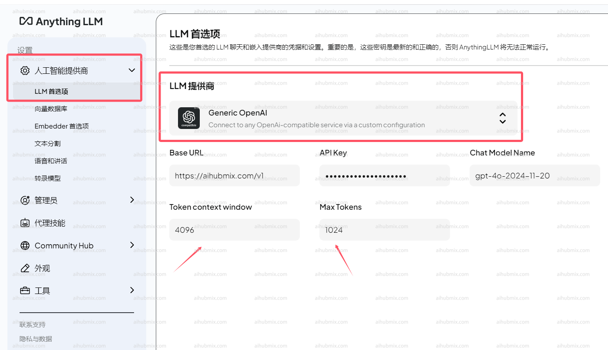

## 일반적인 사용 방법

AnythingLLM 공식 웹사이트: [AnythingLLM](https://anythingllm.com/)  

아래 이미지와 같이 설정 페이지로 이동합니다.    

LLM 제공업체로 Generic OpenAI를 선택합니다.  
- 기본 URL 필드에 다음 URL을 입력합니다:
```
https://aihubmix.com/v1
```
- API 키 필드에 [이 사이트의 키](https://aihubmix.com/token)를 입력합니다.  
- 채팅 모델 이름 필드에 필요한 모델 이름을 입력합니다.  
- **참고: 토큰 컨텍스트 창과 최대 토큰은 모델에 따라 크기가 다를 수 있습니다.**  

## 비 OpenAI 모델 사용 방법

모델 제공업체로 Generic OpenAI를 계속 선택하고, 채팅 모델 이름 필드에서 원하는 모델 이름을 수동으로 수정합니다.  
웹사이트의 모델 스퀘어 페이지에서 사용하려는 모델 이름을 복사할 수 있습니다.